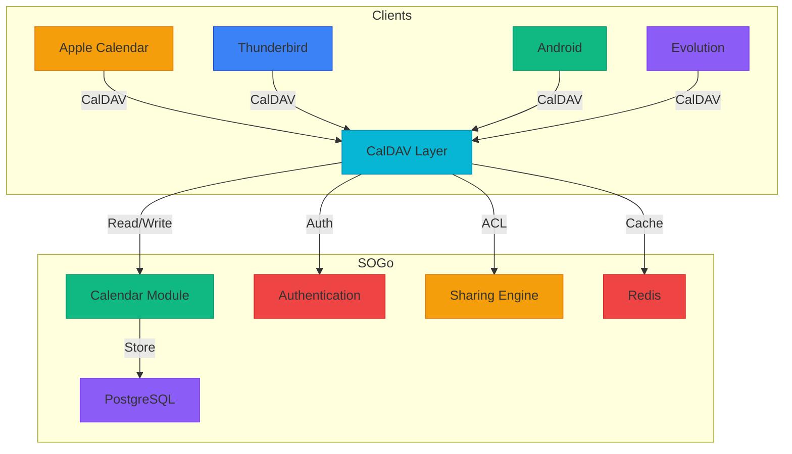
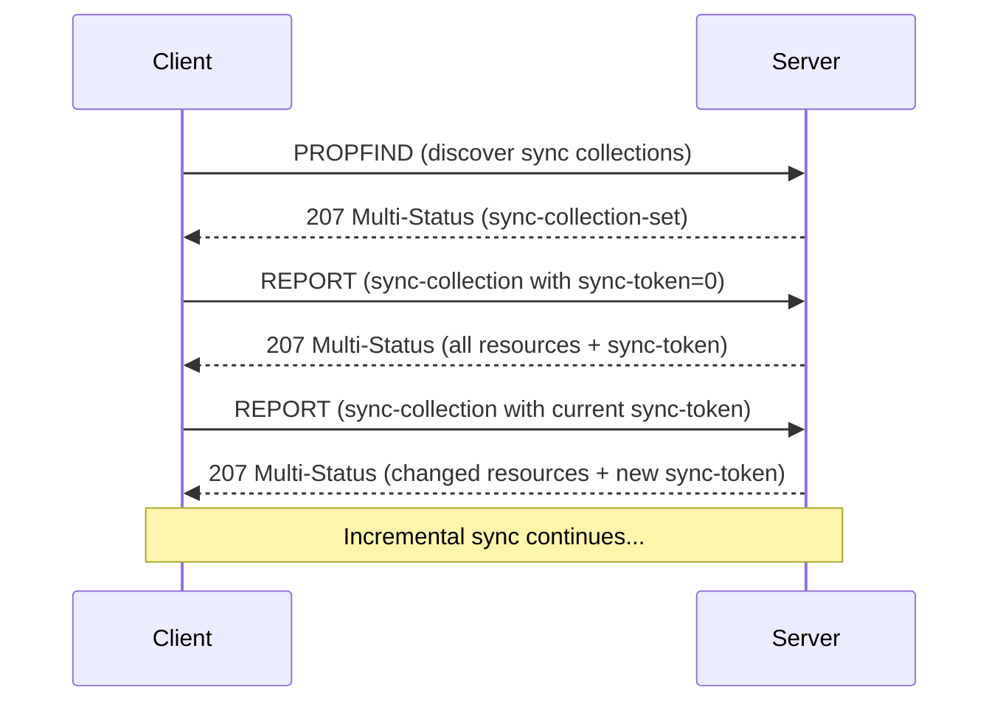

# CalDAV Sync Specification

## Overview

This specification defines the **CalDAV Sync** feature for SOGo 6, providing bi-directional calendar synchronization for Apple, Thunderbird, Android, and other CalDAV-compatible clients. This feature complements the existing CardDAV implementation and unlocks the full calendar ecosystem for desktop and mobile clients.

**Status**: 📋 Draft / Specified
**Version**: 1.0.0
**Priority**: Tier 0 (Foundation)
**Effort**: High
**Dependencies**: 
- Calendar module (✅ complete)
- Sharing & Permissions (✅ complete)
- Authentication system (✅ complete)

---

## Table of Contents

1. [Features](#features)
2. [Architecture](#architecture)
3. [CalDAV Protocol Support](#caldav-protocol-support)
4. [Data Models](#data-models)
5. [API Endpoints](#api-endpoints)
6. [Client Compatibility](#client-compatibility)
7. [Synchronization Behavior](#synchronization-behavior)
8. [Conflict Resolution](#conflict-resolution)
9. [Performance](#performance)
10. [Security](#security)
11. [Implementation Tasks](#implementation-tasks)
12. [Testing](#testing)
13. [Deployment](#deployment)

---

## Features

### Core CalDAV Features

#### Calendar Discovery
- [ ] CalDAV root path discovery (`/caldav/`)
- [ ] Principal resource discovery (`/caldav/principals/`)
- [ ] Calendar home set discovery
- [ ] Calendar collection discovery
- [ ] Calendar proxies for shared calendars
- [ ] Free/busy URL discovery

#### Calendar Operations
- [ ] Calendar CRUD (CREATE, READ, UPDATE, DELETE)
- [ ] Calendar properties (name, color, description, timezone)
- [ ] Calendar subscription (read-only external calendars)
- [ ] Calendar sharing (via existing sharing engine)
- [ ] Calendar timezone handling
- [ ] Calendar access control (ACLs)

#### Event Operations
- [ ] Event CRUD (CREATE, READ, UPDATE, DELETE)
- [ ] Event recurrence (RRULE, EXDATE, RDATE)
- [ ] Event exceptions (single occurrence overrides)
- [ ] Event attachments
- [ ] Event alarms/reminders
- [ ] Event timezone handling
- [ ] Event transparency (busy/free)
- [ ] Event status (confirmed/tentative/cancelled)

#### Synchronization Features
- [ ] Sync collection support (RFC 6578)
- [ ] Delta synchronization (sync-token based)
- [ ] Range-based synchronization
- [ ] Batch property retrieval
- [ ] ETag-based change detection
- [ ] Conditional requests (If-Match, If-None-Match)

#### Advanced Features
- [ ] Calendar filtering (CALDAV:filter)
- [ ] Free/busy query (CALDAV:free-busy-query)
- [ ] Calendar availability (CALDAV:calendar-availability)
- [ ] Event expansion (recurring event instances)
- [ ] Timezone service
- [ ] Scheduling extensions (iTIP compatible)

#### WebDAV Foundation
- [ ] PROPFIND (property retrieval)
- [ ] PROPPATCH (property modification)
- [ ] REPORT (custom reports)
- [ ] MKCALENDAR (calendar creation)
- [ ] MKCOL (collection creation)
- [ ] DELETE (resource deletion)
- [ ] PUT (resource creation/update)
- [ ] GET (resource retrieval)
- [ ] HEAD (resource metadata)
- [ ] OPTIONS (capabilities discovery)
- [ ] COPY (resource copying)
- [ ] MOVE (resource moving)

---

## Architecture

### Component Diagram



### Layer Architecture

```
┌─────────────────────────────────────────────────────────────┐
│                    CalDAV Protocol Layer                     │
│  ┌──────────────┐  ┌──────────────┐  ┌──────────────┐      │
│  │ XML Parsing  │  │ HTTP Handler │  │  iCalendar   │      │
│  │ & Generation │  │  (RFC 4918)  │  │  Parser      │      │
│  │  (lxml)      │  │              │  │  (icalendar)  │      │
│  └──────────────┘  └──────────────┘  └──────────────┘      │
├─────────────────────────────────────────────────────────────┤
│                    CalDAV Business Logic                     │
│  ┌──────────────┐  ┌──────────────┐  ┌──────────────┐      │
│  │ Sync Engine  │  │ Change Track │  │  ACL Engine  │      │
│  │  (RFC 6578)  │  │    er        │  │  (RFC 3744)  │      │
│  └──────────────┘  └──────────────┘  └──────────────┘      │
├─────────────────────────────────────────────────────────────┤
│                    Calendar Module                           │
│  ┌──────────────┐  ┌──────────────┐  ┌──────────────┐      │
│  │ Event Store  │  │ Recurrence   │  │ Free/Busy    │      │
│  │  (Postgres)  │  │  Engine      │  │  Calculator  │      │
│  └──────────────┘  └──────────────┘  └──────────────┘      │
└─────────────────────────────────────────────────────────────┘
```

---

## CalDAV Protocol Support

### RFC Compliance Matrix

| RFC | Title | Support | Priority |
|-----|-------|---------|----------|
| RFC 4918 | WebDAV | ✅ Full | t0 |
| RFC 5545 | iCalendar | ✅ Full | t0 |
| RFC 4791 | CalDAV | ✅ Full | t0 |
| RFC 6578 | CalDAV: Synchronization | ✅ Full | t0 |
| RFC 6638 | CalDAV: Scheduling Extensions | ✅ Full | t0 |
| RFC 6047 | iCalendar Time Zone Service | ✅ Full | t0 |
| RFC 3744 | WebDAV Access Control | ✅ Full | t0 |
| RFC 5397 | WebDAV Current Principal | ✅ Full | t0 |
| RFC 5689 | Extended MKCOL | ✅ Full | t0 |
| RFC 5995 | Using POST for Adding Members | ⚠️ Partial | t2 |
| RFC 6580 | Calendar Availability | ⚠️ Partial | t2 |
| RFC 7809 | CalDAV: Time Zones by Reference | ⚠️ Partial | t2 |
| RFC 7953 | CalDAV: Extended Properties | ❌ Not Yet | t3 |

### Protocol Capabilities

#### Supported HTTP Methods
```http
OPTIONS /caldav/
PROPFIND /caldav/principals/user/
REPORT /caldav/calendars/user/personal/
MKCALENDAR /caldav/calendars/user/new/
PUT /caldav/calendars/user/personal/event.ics
GET /caldav/calendars/user/personal/event.ics
DELETE /caldav/calendars/user/personal/event.ics
HEAD /caldav/calendars/user/personal/event.ics
PROPPATCH /caldav/calendars/user/personal/
```

#### Supported Properties

**Core CalDAV Properties:**
- `D:getetag` - Resource ETag
- `D:getlastmodified` - Last modification time
- `D:resourcetype` - Resource type
- `D:displayname` - Display name
- `C:calendar-description` - Calendar description
- `C:calendar-timezone` - Calendar timezone
- `C:supported-calendar-component-set` - Supported components (VEVENT, VTODO, VJOURNAL)
- `C:max-resource-size` - Maximum resource size
- `C:min-date-time` - Minimum date/time range
- `C:max-date-time` - Maximum date/time range
- `C:max-instances` - Maximum recurring instances
- `C:max-attendees-per-instance` - Maximum attendees

**Scheduling Properties:**
- `C:schedule-tag` - Scheduling version token
- `C:calendar-free-busy-set` - Free/busy set
- `C:default-alarm` - Default alarm

---

## Data Models

### CalDAV Resource Hierarchy

```
caldav/
├── principals/
│   └── user/
│       ├── user@domain.com/
│       │   ├── calendar-home-set/ -> /caldav/calendars/user@domain.com/
│       │   └── calendar-user-address-set/
│       └── shared/
│           └── team@domain.com/
└── calendars/
    └── user@domain.com/
        ├── personal/
        │   ├── event1.ics
        │   ├── event2.ics
        │   └── recurring-event.ics
        ├── work/
        │   └── meeting.ics
        └── shared/
            └── team-calendar/
                └── team-event.ics
```

### Database Schema Extensions

```sql
-- CalDAV sync tokens table
CREATE TABLE caldav_sync_tokens (
    id SERIAL PRIMARY KEY,
    user_id INTEGER NOT NULL REFERENCES users(id),
    calendar_id INTEGER NOT NULL REFERENCES calendars(id),
    token VARCHAR(255) NOT NULL UNIQUE,
    token_type VARCHAR(20) NOT NULL, -- 'primary', 'shared', 'subscription'
    last_sync TIMESTAMP NOT NULL,
    created_at TIMESTAMP NOT NULL DEFAULT NOW(),
    expires_at TIMESTAMP,
    UNIQUE(user_id, calendar_id, token_type)
);

-- CalDAV properties storage
CREATE TABLE caldav_properties (
    id SERIAL PRIMARY KEY,
    resource_path TEXT NOT NULL,
    property_name VARCHAR(255) NOT NULL,
    property_value TEXT,
    updated_at TIMESTAMP NOT NULL DEFAULT NOW(),
    UNIQUE(resource_path, property_name)
);

-- CalDAV ACLs (extends existing sharing)
CREATE TABLE caldav_acls (
    id SERIAL PRIMARY KEY,
    calendar_id INTEGER NOT NULL REFERENCES calendars(id),
    principal_uri TEXT NOT NULL,
    privilege VARCHAR(50) NOT NULL, -- 'read', 'write', 'all'
    access_type VARCHAR(20) NOT NULL, -- 'user', 'group', 'anonymous'
    UNIQUE(calendar_id, principal_uri, privilege)
);
```

### Resource Path Mapping

| Resource Type | Path Pattern | Handler | Database Entity |
|---------------|--------------|---------|-----------------|
| Principal Root | `/caldav/principals/` | `CalDAVPrincipalsRoot` | N/A |
| User Principal | `/caldav/principals/user/{user}@domain.com/` | `CalDAVUserPrincipal` | User |
| Calendar Home | `/caldav/calendars/{user}@domain.com/` | `CalDAVCalendarHome` | User |
| Calendar | `/caldav/calendars/{user}@domain.com/{calendar}/` | `CalDAVCalendar` | Calendar |
| Event | `/caldav/calendars/{user}@domain.com/{calendar}/{uid}.ics` | `CalDAVEvent` | Event |

---

## API Endpoints

### CalDAV Endpoint Configuration

```yaml
# .env
SOGO_CALDAV_ENABLED=true
SOGO_CALDAV_BASE_PATH=/caldav
SOGO_CALDAV_MAX_RESOURCE_SIZE=10485760
SOGO_CALDAV_MAX_INSTANCES=1000
SOGO_CALDAV_MIN_DATE_TIME=1970-01-01
SOGO_CALDAV_MAX_DATE_TIME=2038-01-19
SOGO_CALDAV_SYNC_TOKEN_EXPIRY=30  # 30 days
```

### Flask Blueprint Structure

```python
# sogo6-server/app/caldav/__init__.py
from flask import Blueprint

caldav_bp = Blueprint('caldav', __name__, url_prefix='/caldav')

# Register routes
from . import (
    principals,
    calendars,
    events,
    sync,
    reports,
)

caldav_bp.register_blueprint(principals.bp)
caldav_bp.register_blueprint(calendars.bp)
caldav_bp.register_blueprint(events.bp)
caldav_bp.register_blueprint(sync.bp)
caldav_bp.register_blueprint(reports.bp)
```

### Route Definitions

| Method | Path | Handler | Description |
|--------|------|---------|-------------|
| OPTIONS | `/caldav/` | `options_root()` | CalDAV root capabilities |
| OPTIONS | `/caldav/principals/` | `options_principals()` | Principals capabilities |
| PROPFIND | `/caldav/principals/` | `propfind_principals()` | List principals |
| PROPFIND | `/caldav/principals/user/{user}/` | `propfind_user_principal()` | Get user principal |
| PROPFIND | `/caldav/calendars/{user}/` | `propfind_calendar_home()` | List calendars |
| MKCALENDAR | `/caldav/calendars/{user}/{name}/` | `mkcalendar()` | Create calendar |
| DELETE | `/caldav/calendars/{user}/{name}/` | `delete_calendar()` | Delete calendar |
| PROPPATCH | `/caldav/calendars/{user}/{name}/` | `proppatch_calendar()` | Update calendar props |
| REPORT | `/caldav/calendars/{user}/{name}/` | `report_calendar()` | Calendar reports |
| PUT | `/caldav/calendars/{user}/{name}/{uid}.ics` | `put_event()` | Create/update event |
| GET | `/caldav/calendars/{user}/{name}/{uid}.ics` | `get_event()` | Get event |
| DELETE | `/caldav/calendars/{user}/{name}/{uid}.ics` | `delete_event()` | Delete event |
| HEAD | `/caldav/calendars/{user}/{name}/{uid}.ics` | `head_event()` | Event metadata |
| REPORT | `/caldav/calendars/{user}/{name}/` | `report_sync()` | Sync collection |

---

## Client Compatibility

### Supported Clients

| Client | Platform | Tested | Notes |
|--------|----------|--------|-------|
| Apple Calendar | macOS | ⚠️ Planned | Native CalDAV client |
| Apple Calendar | iOS | ⚠️ Planned | Mobile CalDAV |
| Thunderbird | Desktop | ⚠️ Planned | Lightning extension |
| Evolution | Linux | ⚠️ Planned | GNOME calendar |
| DAVx⁵ | Android | ⚠️ Planned | Open-source client |
| Calendar | Android | ⚠️ Planned | Stock Android |
| Outlook | Desktop | ⚠️ Planned | Via CalDAV plugin |
| InfCloud | Web | ⚠️ Planned | Open-source caldav server client test |
| dvd | Mac | ⚠️ Planned | Basic Testing |

### Client Configuration Examples

**Apple Calendar (macOS):**
```
Server Address: https://sogo6.example.com/caldav
Username: user@domain.com
Password: ********
```

**Thunderbird:**
```
Calendar Type: On the Network
Format: CalDAV
Location: https://sogo6.example.com/caldav/calendars/user@domain.com/personal/
Username: user@domain.com
```

**Android (DAVx⁵):**
```
Base URL: https://sogo6.example.com/caldav
Username: user@domain.com
Password: ********
Calendar: personal
```

---

## Synchronization Behavior

### Sync Collection Implementation

**RFC 6578 Compliance:**
- Full sync-token support
- Range-based sync queries
- Batch property retrieval
- Change detection via ETags

**Sync Workflow:**



**Sync Token format:**
```
<sync-token>{base64:timestamp:<user_id>:<calendar_id>:<change_counter>}</sync-token>
```

### Sync Collection Properties

**Request:**
```xml
<C:sync-collection xmlns:C="urn:ietf:params:xml:ns:caldav">
  <D:prop xmlns:D="DAV:">
    <D:getetag/>
    <D:getlastmodified/>
    <C:calendar-data/>
  </D:prop>
  <C:sync-token>http://sogo6.example.com/ns/sync/12345</C:sync-token>
  <C:sync-level>1</C:sync-level>
  <C:limit>100</C:limit>
</C:sync-collection>
```

**Response Success:**
```xml
<D:multistatus xmlns:D="DAV:">
  <D:response>
    <D:href>/caldav/calendars/user@domain.com/personal/event1.ics</D:href>
    <D:propstat>
      <D:prop>
        <D:getetag>"abc123"</D:getetag>
        <D:getlastmodified>2025-01-01T12:00:00Z</D:getlastmodified>
        <C:calendar-data>BEGIN:VCALENDAR...</C:calendar-data>
      </D:prop>
      <D:status>HTTP/1.1 200 OK</D:status>
    </D:propstat>
  </D:response>
  <D:sync-token>http://sogo6.example.com/ns/sync/12346</D:sync-token>
</D:multistatus>
```

### Delta Synchronization

**Change Detection:**
1. **ETag-based**: Compare `If-None-Match` with stored ETag
2. **Last-Modified**: Compare `If-Modified-Since` with stored timestamp
3. **Sync Token**: Use RFC 6578 sync-token for incremental sync

**Change Types:**
- `1` - Created
- `2` - Modified
- `3` - Deleted

---

## Conflict Resolution

### Detection

| Conflict Type | Detection Method | Resolution |
|---------------|------------------|------------|
| **Modification Conflict** | ETag mismatch on PUT | Last-write-wins (configurable) |
| **Delete Conflict** | 409 Conflict on DELETE of modified resource | Return 409 with conflict info |
| **Sync Conflict** | Mismatched sync-token | Full resync required |
| **Property Conflict** | PROPPATCH on read-only property | 403 Forbidden |

### Conflict Response

**409 Conflict Example:**
```xml
<D:error xmlns:D="DAV:">
  <C:no-uid-conflict xmlns:C="urn:ietf:params:xml:ns:caldav"/>
  <D:response>
    <D:href>/caldav/calendars/user@domain.com/personal/event.ics</D:href>
    <D:status>HTTP/1.1 412 Precondition Failed</D:status>
  </D:response>
</D:error>
```

### Resolution Strategies

1. **Last-Write-Wins**: Default for most conflicts
2. **Client Wins**: For client-initiated changes
3. **Server Wins**: For server-generated data
4. **Manual Resolution**: Present options to user

**Configuration:**
```yaml
SOGO_CALDAV_CONFLICT_RESOLUTION=last-write-wins
```

---

## Performance

### Caching Strategy

| Cache Type | Implementation | TTL | Purpose |
|------------|----------------|-----|---------|
| **ETag Cache** | Redis | 24h | Quick change detection |
| **Property Cache** | Redis | 1h | Fast PROPFIND responses |
| **Sync Token Cache** | Redis | 7d | Incremental sync |
| **iCalendar Parsing** | Memory | 5m | Avoid repeated parsing |
| **Timezone Cache** | Redis | 24h | Zoneinfo caching |

### Performance Targets

| Operation | Target | Measurement |
|-----------|--------|-------------|
| PROPFIND (100 calendars) | < 100ms | Average response time |
| Event PUT | < 50ms | Average response time |
| Sync Collection (100 changes) | < 200ms | Average response time |
| Full Calendar Sync | < 500ms | 95th percentile |
| Concurrent Connections | 1000+ | Maximum supported |

### Optimization Techniques

1. **Batch Processing**: Process multiple resources in single DB query
2. **Lazy Loading**: Load event data only when needed
3. **Index Optimization**: Proper indexes on calendar tables
4. **Connection Pooling**: Reuse database connections
5. **HTTP/2**: Support for HTTP/2 multiplexing

---

## Security

### Authentication

- ✅ **All CalDAV requests require authentication**
- ✅ **No anonymous access** (configurable per endpoint)
- ✅ **Session management via JWT**
- ✅ **Token expiration and refresh**
- ✅ **CSRF protection for state-changing requests**

### Authorization

- ✅ **RBAC-based access control**
- ✅ **Calendar-level ACLs**
- ✅ **Principal-based permissions**
- ✅ **Fine-grained privilege model**

**Privilege Matrix:**

| Action | Owner | Read Access | Write Access | None |
|--------|-------|-------------|--------------|------|
| Read Calendar | ✅ | ✅ | ✅ | ❌ |
| Write Calendar | ✅ | ❌ | ✅ | ❌ |
| Create Events | ✅ | ❌ | ✅ | ❌ |
| Delete Events | ✅ | ❌ | ❌ | ❌ |
| Share Calendar | ✅ | ❌ | ❌ | ❌ |

### Rate Limiting

```yaml
SOGO_CALDAV_RATE_LIMIT=1000  # Requests per hour
SOGO_CALDAV_RATE_LIMIT_BURST=100  # Burst limit
SOGO_CALDAV_RATE_LIMIT_WINDOW=3600  # Window in seconds
```

### Input Validation

- ✅ **XML request validation** (schema, size limits)
- ✅ **iCalendar validation** (parser, size limits)
- ✅ **Path traversal prevention**
- ✅ **HTTP method validation**
- ✅ **Content-Type enforcement**

---

## Implementation Tasks

### Phase 1: Foundation (Week 1-2)

- [ ] **Task 1.1**: Create CalDAV blueprint and route structure
- [ ] **Task 1.2**: Implement WebDAV PROPFIND handler
- [ ] **Task 1.3**: Implement MKCALENDAR handler
- [ ] **Task 1.4**: Implement DELETE handler for calendars
- [ ] **Task 1.5**: Implement PROPPATCH handler
- [ ] **Task 1.6**: Implement OPTIONS handler for capabilities
- [ ] **Task 1.7**: Add CalDAV XML namespace support
- [ ] **Task 1.8**: Create CalDAV response builders

**Estimated Time**: 1-2 weeks
**Priority**: High
**Dependencies**: None

### Phase 2: Principal & Calendar Management (Week 3-4)

- [ ] **Task 2.1**: Implement principal discovery
- [ ] **Task 2.2**: Create calendar home set
- [ ] **Task 2.3**: Implement calendar listing
- [ ] **Task 2.4**: Implement calendar creation
- [ ] **Task 2.5**: Implement calendar properties (name, color, etc.)
- [ ] **Task 2.6**: Add existing calendars to CalDAV
- [ ] **Task 2.7**: Implement calendar sharing via ACLs
- [ ] **Task 2.8**: Add support for shared calendar discovery

**Estimated Time**: 1-2 weeks
**Priority**: High
**Dependencies**: Phase 1

### Phase 3: Event Operations (Week 5-6)

- [ ] **Task 3.1**: Implement event retrieval (GET)
- [ ] **Task 3.2**: Implement event creation (PUT)
- [ ] **Task 3.3**: Implement event update (PUT)
- [ ] **Task 3.4**: Implement event deletion (DELETE)
- [ ] **Task 3.5**: Implement iCalendar parsing (icalendar library)
- [ ] **Task 3.6**: Implement iCalendar generation
- [ ] **Task 3.7**: Add recurrence rule support (RRULE, EXDATE, RDATE)
- [ ] **Task 3.8**: Implement event timezone handling
- [ ] **Task 3.9**: Add attachment support
- [ ] **Task 3.10**: Implement event validation

**Estimated Time**: 2 weeks
**Priority**: High
**Dependencies**: Phase 2

### Phase 4: Synchronization (Week 7-8)

- [ ] **Task 4.1**: Implement sync-token generation and storage
- [ ] **Task 4.2**: Implement sync collection REPORT
- [ ] **Task 4.3**: Add change tracking (created, modified, deleted)
- [ ] **Task 4.4**: Implement ETag-based change detection
- [ ] **Task 4.5**: Add Last-Modified header support
- [ ] **Task 4.6**: Implement incremental sync
- [ ] **Task 4.7**: Add range-based sync queries
- [ ] **Task 4.8**: Implement conflict detection and resolution

**Estimated Time**: 2 weeks
**Priority**: High
**Dependencies**: Phase 3

### Phase 5: Advanced Features (Week 9-10)

- [ ] **Task 5.1**: Implement calendar subscriptions (external iCal feeds)
- [ ] **Task 5.2**: Add free/busy query support
- [ ] **Task 5.3**: Implement calendar availability
- [ ] **Task 5.4**: Add timezone service
- [ ] **Task 5.5**: Implement scheduling extensions (iTIP)
- [ ] **Task 5.6**: Add calendar filtering support
- [ ] **Task 5.7**: Implement batch operations
- [ ] **Task 5.8**: Add rate limiting

**Estimated Time**: 2 weeks
**Priority**: Medium
**Dependencies**: Phase 4

### Phase 6: Testing & Validation (Week 11-12)

- [ ] **Task 6.1**: Create CalDAV test suite
- [ ] **Task 6.2**: Test with Apple Calendar
- [ ] **Task 6.3**: Test with Thunderbird
- [ ] **Task 6.4**: Test with Android (DAVx⁵)
- [ ] **Task 6.5**: Test with InfCloud
- [ ] **Task 6.6**: Performance testing
- [ ] **Task 6.7**: Security testing
- [ ] **Task 6.8**: Integration testing with existing modules

**Estimated Time**: 2 weeks
**Priority**: High
**Dependencies**: Phase 5

---

## Testing

### Test Strategy

| Test Type | Coverage | Tools |
|-----------|----------|-------|
| **Unit Tests** | 95%+ | pytest, pytest-mock |
| **Integration Tests** | All endpoints | pytest, httpx |
| **CalDAV Compliance Tests** | RFC 4791, 6578 | CalDAVTester (python-caldav) |
| **Client Compatibility Tests** | All supported clients | Manual + automated |
| **Performance Tests** | All endpoints | locust, k6 |
| **Security Tests** | All endpoints | OWASP ZAP, bandit |

### Test Cases

**PROPFIND Tests:**
```python
def test_propfind_calendar_home(client, auth_headers):
    response = client.request(
        'PROPFIND',
        '/caldav/calendars/user@domain.com/',
        headers=auth_headers,
        data=caldav.propfind_request()
    )
    assert response.status_code == 207
    assert 'application/xml' in response.headers['Content-Type']
    assert 'personal' in response.text
```

**PUT Event Tests:**
```python
def test_put_event(client, auth_headers):
    ical_data = "BEGIN:VCALENDAR\r\nBEGIN:VEVENT\r\nUID:test-123\r\n..."
    response = client.put(
        '/caldav/calendars/user@domain.com/personal/test-123.ics',
        headers=auth_headers,
        data=ical_data,
        content_type='text/calendar; charset=utf-8'
    )
    assert response.status_code == 201
    assert 'ETag' in response.headers
```

**Sync Collection Tests:**
```python
def test_sync_collection(client, auth_headers):
    # First sync (full)
    response = client.request(
        'REPORT',
        '/caldav/calendars/user@domain.com/personal/',
        headers=auth_headers,
        data=caldav.sync_request(sync_token=None)
    )
    assert response.status_code == 207
    sync_token = extract_sync_token(response)
    assert sync_token is not None
    
    # Incremental sync
    response = client.request(
        'REPORT',
        '/caldav/calendars/user@domain.com/personal/',
        headers=auth_headers,
        data=caldav.sync_request(sync_token=sync_token)
    )
    assert response.status_code == 207
```

---

## Deployment

### Configuration

**Nginx Configuration:**
```nginx
location /caldav {
    proxy_pass http://sogo6-server:5000;
    proxy_set_header Host $host;
    proxy_set_header X-Real-IP $remote_addr;
    proxy_set_header X-Forwarded-For $proxy_add_x_forwarded_for;
    proxy_set_header X-Forwarded-Proto $scheme;
    
    # CalDAV specific headers
    proxy_set_header Depth $http_depth;
    proxy_set_header Destination $http_destination;
    proxy_set_header Overwrite $http_overwrite;
    proxy_set_header If-Match $http_if_match;
    proxy_set_header If-None-Match $http_if_none_match;
    
    # WebDAV methods
    proxy_method PROPFIND;
    proxy_method PROPPATCH;
    proxy_method MKCALENDAR;
    proxy_method REPORT;
    
    # Timeout for sync operations
    proxy_read_timeout 300;
    proxy_connect_timeout 60;
}
```

**Docker Compose:**
```yaml
services:
  sogo6-server:
    environment:
      - SOGO_CALDAV_ENABLED=true
      - SOGO_CALDAV_BASE_PATH=/caldav
      - SOGO_CALDAV_MAX_RESOURCE_SIZE=10485760
      - SOGO_CALDAV_SYNC_TOKEN_EXPIRY=30
    ports:
      - "5000:5000"
```

### Health Checks

**CalDAV Endpoint Health:**
```bash
curl -i -X OPTIONS https://sogo6.example.com/caldav/
# Expected: HTTP/1.1 200 OK
# DAV: 1, 2, 3, calendar-access, calendar-schedule, extended-mkcol
```

**Calendar Access:**
```bash
curl -i -u user:password -X PROPFIND \
  -H "Depth: 0" \
  https://sogo6.example.com/caldav/calendars/user@domain.com/
# Expected: HTTP/1.1 207 Multi-Status
```

---

## Success Criteria

- [ ] **Functional**: All CalDAV endpoints work correctly
- [ ] **Compliant**: Passes CalDAV compliance tests (RFC 4791, 6578)
- [ ] **Compatible**: Works with all target clients
- [ ] **Performant**: Meets performance targets
- [ ] **Secure**: Passes security review
- [ ] **Documented**: Complete documentation
- [ ] **Tested**: >90% test coverage
- [ ] **Deployable**: Works in production environment

---

## References

- [RFC 4918 - HTTP Extensions for WebDAV](https://tools.ietf.org/html/rfc4918)
- [RFC 4791 - CalDAV](https://tools.ietf.org/html/rfc4791)
- [RFC 5545 - iCalendar](https://tools.ietf.org/html/rfc5545)
- [RFC 6578 - CalDAV: Synchronization](https://tools.ietf.org/html/rfc6578)
- [RFC 6638 - CalDAV: Scheduling Extensions](https://tools.ietf.org/html/rfc6638)
- [RFC 3744 - WebDAV Access Control](https://tools.ietf.org/html/rfc3744)
- [python-caldav library](https://github.com/python-caldav/caldav)
- [icalendar library](https://github.com/collective/icalendar)

---

## Appendix A: CalDAV XML Examples

### PROPFIND Request
```xml
<?xml version="1.0" encoding="utf-8" ?>
<D:propfind xmlns:D="DAV:">
  <D:prop>
    <D:getlastmodified/>
    <D:getetag/>
    <D:resourcetype/>
    <D:displayname/>
  </D:prop>
</D:propfind>
```

### PROPFIND Response
```xml
<?xml version="1.0" encoding="utf-8" ?>
<D:multistatus xmlns:D="DAV:">
  <D:response>
    <D:href>/caldav/calendars/user@domain.com/personal/</D:href>
    <D:propstat>
      <D:prop>
        <D:getlastmodified>2025-01-01T12:00:00Z</D:getlastmodified>
        <D:getetag>"abc123"</D:getetag>
        <D:resourcetype>
          <D:collection/>
          <C:calendar xmlns:C="urn:ietf:params:xml:ns:caldav"/>
        </D:resourcetype>
        <D:displayname>Personal Calendar</D:displayname>
      </D:prop>
      <D:status>HTTP/1.1 200 OK</D:status>
    </D:propstat>
  </D:response>
</D:multistatus>
```

### MKCALENDAR Request
```xml
<?xml version="1.0" encoding="utf-8" ?>
<C:mkcalendar xmlns:C="urn:ietf:params:xml:ns:caldav">
  <D:set xmlns:D="DAV:">
    <D:prop>
      <D:displayname>Work Calendar</D:displayname>
      <C:calendar-description>Work-related events</C:calendar-description>
      <C:calendar-timezone>/timezones/America/New_York.ics</C:calendar-timezone>
      <D:supported-calendar-component-set>
        <C:comp name="VEVENT"/>
        <C:comp name="VTODO"/>
      </D:supported-calendar-component-set>
    </D:prop>
  </D:set>
</C:mkcalendar>
```

---

**Document Status**: 📋 Draft / Specified  
**Author**: Tobias Weiss (@tobias-weiss-ai-xr)  
**Created**: 2025-08-20  
**Last Modified**: 2025-08-20  
**Target Implementation**: Q4 2025  
**Estimated Total Effort**: 8-12 weeks  
