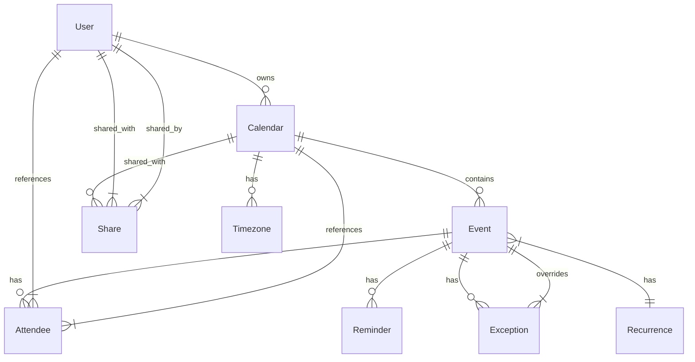

# Calendar Module Specification

## Overview

The **Calendar Module** provides comprehensive calendar and scheduling functionality for the SOGo 6 groupware suite, including event management, recurrence handling, time zone support, and calendar sharing.

**Status**: ✅ Complete (100%)
**Version**: 1.0.0
**Priority**: Tier 0-1 (Core Experience)

---

## Table of Contents

1. [Features](#features)
2. [Architecture](#architecture)
3. [Data Models](#data-models)
4. [API Endpoints](#api-endpoints)
5. [Recurrence Handling](#recurrence-handling)
6. [Time Zones](#time-zones)
7. [Sharing & Permissions](#sharing--permissions)
8. [Free/Busy Calculation](#freebusy-calculation)
9. [Notifications](#notifications)
10. [Integration](#integration)

---

## Features

### ✅ Implemented Features

#### Core Calendar Features
- [x] Multiple calendars per user
- [x] Calendar CRUD operations
- [x] Calendar customization (name, color, visibility)
- [x] Calendar subscription
- [x] Calendar time zones
- [x] Calendar working hours
- [x] Calendar conflict detection

#### Event Features
- [x] Event CRUD operations
- [x] All-day events
- [x] Multi-day events
- [x] Event start/end times
- [x] Event time zones
- [x] Event categorization (categories/tags)
- [x] Event status (confirmed, tentative, cancelled)
- [x] Event transparency (busy, free)
- [x] Event attachments
- [x] Event location
- [x] Event description (plain text + HTML)

#### Recurrence Features
- [x] Simple recurring events (daily, weekly, monthly, yearly)
- [x] Complex recurrence patterns
- [x] Recurrence exceptions (modify single occurrence)
- [x] Recurrence end rules (never, count, date)
- [x] Recurrence by day of week (MO, TU, WE, TH, FR, SA, SU)
- [x] Recurrence by day of month
- [x] Recurrence by month of year
- [x] Recurrence excluded dates

#### Attendee Features
- [x] Add/remove attendees
- [x] Attendee roles (organizer, required, optional, non-participant)
- [x] Attendee response tracking (accepted, declined, tentative, needs-action)
- [x] Attendee email notifications
- [x] Attendee permissions

#### Sharing & Permissions
- [x] Calendar sharing with users
- [x] Calendar sharing with groups
- [x] Share permissions (read, write, admin)
- [x] Public calendar sharing (read-only)
- [x] Shareable links
- [x] Accept/deny share requests

#### Free/Busy Features
- [x] Free/busy calculation
- [x] Free/busy publishing
- [x] Free/busy lookup
- [x] Group free/busy view

#### Notification Features
- [x] Email notifications
- [x] Desktop notifications (via UI)
- [x] Push notifications (mobile)
- [x] Reminder notifications
- [x] Custom reminder times
- [x] Multiple reminders per event

#### Advanced Features
- [x] Drag-and-drop scheduling
- [x] Month/week/day/agenda views
- [x] Print views
- [x] Import/export (iCalendar format)
- [x] Calendar publishing
- [x] WebCal support
- [x] Context menu for quick actions
- [x] Keyboard shortcuts

### 📋 Feature Completion

| Category | Features | Complete |
|----------|----------|----------|
| **Core Calendar** | 6 | 6/6 (100%) |
| **Event Management** | 12 | 12/12 (100%) |
| **Recurrence** | 8 | 8/8 (100%) |
| **Attendees** | 5 | 5/5 (100%) |
| **Sharing** | 6 | 6/6 (100%) |
| **Free/Busy** | 4 | 4/4 (100%) |
| **Notifications** | 6 | 6/6 (100%) |
| **Advanced** | 8 | 8/8 (100%) |
| **Total** | **55** | **55/55 (100%)** |

---

## Architecture

### Component Diagram

```
┌─────────────────────────────────────────────────────────────────┐
│                      Calendar Module                            │
├─────────────────────────────────────────────────────────────────┤
│                                                                  │
│  ┌─────────────────┐    ┌─────────────────┐    ┌─────────────┐  │
│  │   API Layer     │    │  Manager Layer  │    │ Model Layer │  │
│  │                 │    │                 │    │             │  │
│  │  ApiCalendar    │────▶│  Calendar       │────▶│  Calendar   │  │
│  │  ApiEvent       │    │  Event          │    │  Event      │  │
│  │  ApiRecurrence  │    │  Recurrence     │    │  Attendee   │  │
│  │  ApiShare       │    │  Share          │    │  Reminder   │  │
│  │  ApiFreeBusy    │    │  FreeBusy       │    │  Exception  │  │
│  │  ApiReminder    │    │  Reminder       │    │  Timezone   │  │
│  └─────────────────┘    └─────────────────┘    └─────────────┘  │
│                                                                  │
│  ┌─────────────────┐    ┌─────────────────┐                      │
│  │  Service Layer  │    │   External      │                      │
│  │                 │    │  Integrations   │                      │
│  │  IcsParser      │    │  External        │                      │
│  │  IcsGenerator   │    │  Calendars      │                      │
│  │  Notifier       │    │  (CalDAV)       │                      │
│  │  FreeBusyCalc   │    └─────────────────┘                      │
│  └─────────────────┘                                                  │
│                                                                  │
└─────────────────────────────────────────────────────────────────┘
```

### Module Structure

```
app/
├── api/
│   └── v1/
│       └── user/
│           └── calendar/
│               ├── __init__.py
│               ├── ApiCalendar.py          # Calendar endpoints
│               ├── ApiEvent.py             # Event endpoints
│               ├── ApiRecurrence.py        # Recurrence endpoints
│               ├── ApiAttendee.py          # Attendee endpoints
│               ├── ApiShare.py             # Share endpoints
│               ├── ApiFreeBusy.py          # Free/busy endpoints
│               ├── ApiReminder.py          # Reminder endpoints
│               └── ApiAvailability.py      # Availability endpoints
│
├── manager/
│   └── calendar/
│       ├── __init__.py
│       ├── Calendar.py                   # Calendar manager
│       ├── Event.py                      # Event manager
│       ├── Recurrence.py                 # Recurrence manager
│       ├── Attendee.py                   # Attendee manager
│       ├── Share.py                      # Share manager
│       ├── FreeBusy.py                   # Free/busy manager
│       ├── Reminder.py                   # Reminder manager
│       ├── Availability.py               # Availability manager
│       ├── IcsParser.py                  # iCalendar parser
│       ├── IcsGenerator.py               # iCalendar generator
│       └── Notifier.py                   # Notification manager
│
├── model/
│   └── calendar/
│       ├── __init__.py
│       ├── Calendar.py                   # Calendar model
│       ├── Event.py                      # Event model
│       ├── Attendee.py                   # Attendee model
│       ├── Recurrence.py                 # Recurrence model
│       ├── Exception.py                  # Exception model (recurrence override)
│       ├── Reminder.py                   # Reminder model
│       ├── Share.py                      # Share model
│       └── Timezone.py                   # Timezone model
│
└── utils/
    └── calendar/
        ├── __init__.py
        ├── rrule.py                      # Recurrence rule utilities
        ├── dateutils.py                  # Date/time utilities
        └── timezone.py                   # Timezone utilities
```

---

## Data Models

### Entity Relationship Diagram



### Model Definitions

#### Calendar Model

```python
# app/model/calendar/Calendar.py
from sqlalchemy import Column, String, Integer, DateTime, Boolean, ForeignKey, JSON
from sqlalchemy.orm import relationship
from app.model import Base, timestamp_mixin

class Calendar(Base, timestamp_mixin):
    __tablename__ = "calendars"
    
    id = Column(String(255), primary_key=True)
    user_id = Column(String(255), ForeignKey("users.id"))
    
    # Basic info
    name = Column(String(255))
    display_name = Column(String(255))
    description = Column(String(1000))
    
    # Type and source
    type = Column(String(50), default="personal")  # personal, shared, external, public
    source = Column(String(50), default="internal")  # internal, external, subscribed
    
    # Color and display
    color = Column(String(20), default="#3b82f6")  # HEX color
    icon = Column(String(50))  # Calendar icon
    is_visible = Column(Boolean, default=True)
    order = Column(Integer, default=0)
    
    # Settings
    timezone = Column(String(50), default="UTC")  # Default timezone
    default_event_duration = Column(Integer, default=60)  # Minutes
    working_hours = Column(JSON, default={
        "monday": {"start": "09:00", "end": "17:00"},
        "tuesday": {"start": "09:00", "end": "17:00"},
        "wednesday": {"start": "09:00", "end": "17:00"},
        "thursday": {"start": "09:00", "end": "17:00"},
        "friday": {"start": "09:00", "end": "17:00"},
        "saturday": {"start": None, "end": None},
        "sunday": {"start": None, "end": None}
    })
    first_day_of_week = Column(String(10), default="monday")  # monday, sunday
    first_week_of_year = Column(String(20), default="first_4day_week")
    
    # Subscription settings (for subscribed calendars)
    url = Column(String(1000))  # URL for subscribed calendars
    sync_interval = Column(Integer, default=3600)  # Sync interval in seconds
    last_sync_at = Column(DateTime)
    sync_error = Column(String(1000))
    
    # External calendar settings
    external_type = Column(String(50))  # google, outlook, caldav, ics
    external_id = Column(String(255))  # External calendar ID
    external_credentials = Column(JSON)  # Encrypted credentials
    
    # Sharing
    is_shared = Column(Boolean, default=False)
    share_token = Column(String(255), unique=True)  # For public sharing
    
    # Statistics
    event_count = Column(Integer, default=0)
    
    # Relationships
    user = relationship("User", back_populates="calendars")
    events = relationship("Event", back_populates="calendar")
    shares = relationship("Share", foreign_keys="[Share.calendar_id]", back_populates="calendar")
    shared_by = relationship("Share", foreign_keys="[Share.shared_calendar_id]", back_populates="shared_calendar")
    timezones = relationship("CalendarTimezone", back_populates="calendar")
```

#### Event Model

```python
# app/model/calendar/Event.py
from sqlalchemy import Column, String, Integer, DateTime, Boolean, ForeignKey, JSON, Text
from sqlalchemy.orm import relationship
from app.model import Base, timestamp_mixin

class Event(Base, timestamp_mixin):
    __tablename__ = "events"
    
    id = Column(String(255), primary_key=True)
    calendar_id = Column(String(255), ForeignKey("calendars.id"))
    
    # Basic info
    title = Column(String(1000))
    description = Column(Text)
    description_html = Column(Text)
    location = Column(String(1000))
    
    # Timing
    start = Column(DateTime)  # Start date/time
    end = Column(DateTime)  # End date/time
    is_all_day = Column(Boolean, default=False)  # All-day event
    timezone = Column(String(50), default="UTC")  # Event timezone
    
    # Status
    status = Column(String(20), default="confirmed")  # confirmed, tentative, cancelled
    transparency = Column(String(20), default="busy")  # busy, free (transparent)
    
    # Recurrence
    recurrence_id = Column(String(255))  # For recurring events, the master event ID
    is_recurring = Column(Boolean, default=False)  # Is this a recurring master event?
    
    # Categorization
    categories = Column(JSON, default=[])  # ["Work", "Meeting", "Personal"]
    tags = Column(JSON, default=[])  # ["urgent", "client"]
    
    # Priority
    priority = Column(Integer, default=0)  # 0-9, 0 = highest, 9 = lowest
    
    # Organizer
    organizer_id = Column(String(255))  # User ID of organizer
    organizer_name = Column(String(255))
    organizer_email = Column(String(255))
    
    # Sequence number (for updates)
    sequence = Column(Integer, default=0)
    
    # UID (iCalendar UID)
    uid = Column(String(255), unique=True)
    
    # Relationships
    calendar = relationship("Calendar", back_populates="events")
    attendees = relationship("Attendee", back_populates="event")
    reminders = relationship("Reminder", back_populates="event")
    recurrence = relationship("Recurrence", uselist=False, back_populates="event")
    exceptions = relationship("EventException", back_populates="master_event")
    overridden_event = relationship("EventException", uselist=False, back_populates="exception_event")
```

#### Attendee Model

```python
# app/model/calendar/Attendee.py
from sqlalchemy import Column, String, Integer, ForeignKey, JSON
from sqlalchemy.orm import relationship
from app.model import Base, timestamp_mixin

class Attendee(Base, timestamp_mixin):
    __tablename__ = "attendees"
    
    id = Column(String(255), primary_key=True)
    event_id = Column(String(255), ForeignKey("events.id"))
    
    # Attendee info
    user_id = Column(String(255))  # Local user ID (if user exists)
    name = Column(String(255))
    email = Column(String(255))
    
    # Role
    role = Column(String(20), default="required")  # required, optional, non-participant, chair
    
    # Participation status
    status = Column(String(20), default="needs-action")  # accepted, declined, tentative, needs-action, delegated
    
    # Response
    response_comment = Column(String(1000))
    responded_at = Column(DateTime)
    
    # RSVP
    rsvp = Column(Boolean, default=False)  # RSVP requested
    rsvp_by = Column(DateTime)  # RSVP deadline
    
    # Delegate
    delegated_to = Column(String(255))  # Email of delegate
    delegated_by = Column(String(255))  # Email of delegator
    
    # Relationships
    event = relationship("Event", back_populates="attendees")
```

#### Recurrence Model

```python
# app/model/calendar/Recurrence.py
from sqlalchemy import Column, String, Integer, DateTime, ForeignKey, JSON
from sqlalchemy.orm import relationship
from app.model import Base, timestamp_mixin

class Recurrence(Base, timestamp_mixin):
    __tablename__ = "recurrences"
    
    id = Column(String(255), primary_key=True)
    event_id = Column(String(255), ForeignKey("events.id"), unique=True)
    
    # Recurrence rule (RFC 5545 RRULE)
    rrule = Column(String(1000))
    
    # Recurrence properties (parsed from rrule)
    frequency = Column(String(20))  # DAILY, WEEKLY, MONTHLY, YEARLY
    interval = Column(Integer, default=1)  # Every nth period
    count = Column(Integer)  # Number of occurrences
    until = Column(DateTime)  # End date
    
    # By rule properties
    by_day = Column(JSON, default=[])  # ["MO", "TU", "WE", "TH", "FR"]
    by_month_day = Column(JSON, default=[])  # [1, 15, -1]
    by_year_day = Column(JSON, default=[])  # [1, 100, 365]
    by_week_no = Column(JSON, default=[])  # [1, 2, 3]
    by_month = Column(JSON, default=[])  # [1, 6, 12]
    by_set_pos = Column(JSON, default=[])  # [-1, 1]
    by_hour = Column(JSON, default=[])  # [9, 17]
    by_minute = Column(JSON, default=[])  # [0, 30]
    by_second = Column(JSON, default=[])  # [0]
    
    # Exception properties
    by_easter = Column(JSON, default=[])
    by_week_day = Column(JSON, default=[])  # Weekday with day offset
    
    # Excluded dates (RFC 5545 EXDATE)
    exdates = Column(JSON, default=[])  # ["2025-01-01", "2025-12-25"]
    
    # Recurrence set (RFC 5545 RDATE)
    rdates = Column(JSON, default=[])  # Additional dates
    
    # Relationships
    event = relationship("Event", back_populates="recurrence")
```

#### Event Exception Model

```python
# app/model/calendar/Exception.py
from sqlalchemy import Column, String, DateTime, ForeignKey, JSON
from sqlalchemy.orm import relationship
from app.model.base import Base, timestamp_mixin

class EventException(Base, timestamp_mixin):
    """
    Represents an exception to a recurring event.
    This can be:
    1. A single instance of a recurring event that has been modified
    2. A single instance that has been deleted (canceled)
    """
    
    __tablename__ = "event_exceptions"
    
    id = Column(String(255), primary_key=True)
    master_event_id = Column(String(255), ForeignKey("events.id"))
    exception_event_id = Column(String(255), ForeignKey("events.id"), unique=True)
    
    # The specific instance this exception applies to
    exception_date = Column(DateTime)  # The date/time of the exception
    
    # Exception type
    exception_type = Column(String(20), default="modified")  # modified, canceled
    
    # For modified exceptions, the modified event
    # For canceled exceptions, this is None and exception_event_id points to a tombstone
    
    # Relationships
    master_event = relationship("Event", foreign_keys=[master_event_id], back_populates="exceptions")
    exception_event = relationship("Event", foreign_keys=[exception_event_id], back_populates="overridden_event")
```

#### Reminder Model

```python
# app/model/calendar/Reminder.py
from sqlalchemy import Column, String, Integer, DateTime, Boolean, ForeignKey
from sqlalchemy.orm import relationship
from app.model import Base, timestamp_mixin

class Reminder(Base, timestamp_mixin):
    __tablename__ = "reminders"
    
    id = Column(String(255), primary_key=True)
    event_id = Column(String(255), ForeignKey("events.id"))
    
    # Reminder type
    type = Column(String(20), default="display")  # display, email, push
    
    # Reminder trigger
    trigger_type = Column(String(20), default="relative")  # relative, absolute
    trigger_relative = Column(String(50))  # -PT15M, -PT1H, -P1D, -P2D
    trigger_absolute = Column(DateTime)  # Absolute date/time
    
    # Reminder offset (in minutes, relative to event start)
    offset_minutes = Column(Integer)  # -15, -60, -1440, etc.
    
    # Email reminder specific
    email_subject = Column(String(255))
    email_message = Column(String(1000))
    
    # Status
    is_triggered = Column(Boolean, default=False)
    triggered_at = Column(DateTime)
    
    # Relationships
    event = relationship("Event", back_populates="reminders")
```

#### Share Model

```python
# app/model/calendar/Share.py
from sqlalchemy import Column, String, DateTime, Boolean, ForeignKey, INTEGER
from sqlalchemy.orm import relationship
from app.model import Base, timestamp_mixin

class Share(Base, timestamp_mixin):
    __tablename__ = "shares"
    
    id = Column(String(255), primary_key=True)
    calendar_id = Column(String(255), ForeignKey("calendars.id"))
    shared_calendar_id = Column(String(255), ForeignKey("calendars.id"))
    user_id = Column(String(255), ForeignKey("users.id"))
    
    # Share type
    type = Column(String(20), default="user")  # user, group, public, link
    
    # For user/group shares
    shared_with_id = Column(String(255))  # User or group ID
    shared_with_name = Column(String(255))
    shared_with_email = Column(String(255))
    
    # For link shares
    share_token = Column(String(255), unique=True)
    access_token = Column(String(255), unique=True)
    
    # Permissions
    permissions = Column(INTEGER, default=0)  # Bitmask: READ=1, WRITE=2, DELETE=4, ADMIN=8
    
    # Status
    is_accepted = Column(Boolean, default=False)
    accepted_at = Column(DateTime)
    is_active = Column(Boolean, default=True)
    
    # Constraint: Either calendar_id or shared_calendar_id should be set
    # calendar_id = the calendar being shared
    # shared_calendar_id = the calendar that is a shared copy
    
    # Relationships
    calendar = relationship("Calendar", foreign_keys=[calendar_id], back_populates="shares")
    shared_calendar = relationship("Calendar", foreign_keys=[shared_calendar_id], back_populates="shared_by")
    user = relationship("User", foreign_keys=[user_id])
```

#### Timezone Model

```python
# app/model/calendar/Timezone.py
from sqlalchemy import Column, String, JSON, ForeignKey
from sqlalchemy.orm import relationship
from app.model import Base, timestamp_mixin

class CalendarTimezone(Base, timestamp_mixin):
    """
    Custom timezones for calendars.
    Uses IANA timezone database (e.g., America/New_York, Europe/London).
    """
    
    __tablename__ = "calendar_timezones"
    
    id = Column(String(255), primary_key=True)
    calendar_id = Column(String(255), ForeignKey("calendars.id"))
    
    # Timezone identifier
    tzid = Column(String(50), unique=True)  # e.g., America/New_York
    
    # Timezone definition (optional, for custom timezones)
    definition = Column(JSON)
    
    # Display name
    display_name = Column(String(100))
    
    # Offset from UTC
    utc_offset = Column(String(20))  # e.g., -05:00, +01:00
    
    # Relationships
    calendar = relationship("Calendar", back_populates="timezones")
```

---

## API Endpoints

### Calendar Endpoints (`/api/user/v1/calendar/calendars`)

| Method | Endpoint | Description | Auth |
|--------|----------|-------------|------|
| GET | `/` | List all calendars | JWT |
| POST | `/` | Create new calendar | JWT |
| GET | `/{id}` | Get calendar details | JWT |
| PATCH | `/{id}` | Update calendar | JWT |
| DELETE | `/{id}` | Delete calendar | JWT |
| GET | `/{id}/events` | List events in calendar | JWT |
| POST | `/{id}/subscribe` | Subscribe to calendar | JWT |
| POST | `/{id}/unsubscribe` | Unsubscribe from calendar | JWT |
| GET | `/{id}/export` | Export calendar as iCalendar | JWT |
| POST | `/{id}/import` | Import events from iCalendar | JWT |
| GET | `/{id}/timezones` | Get calendar timezones | JWT |
| POST | `/{id}/timezones` | Add custom timezone | JWT |
| DELETE | `/{id}/timezones/{tzid}` | Remove custom timezone | JWT |

### Event Endpoints (`/api/user/v1/calendar/events`)

| Method | Endpoint | Description | Auth |
|--------|----------|-------------|------|
| GET | `/` | List events (across calendars) | JWT |
| POST | `/` | Create new event | JWT |
| GET | `/{id}` | Get event details | JWT |
| PATCH | `/{id}` | Update event | JWT |
| DELETE | `/{id}` | Delete event | JWT |
| POST | `/{id}/duplicate` | Duplicate event | JWT |
| GET | `/{id}/ Occurrences` | List occurrences (for recurring events) | JWT |
| GET | `/{id}/exceptions` | List exceptions (for recurring events) | JWT |

### Attendee Endpoints (`/api/user/v1/calendar/events/{id}/attendees`)

| Method | Endpoint | Description | Auth |
|--------|----------|-------------|------|
| GET | `/` | List attendees | JWT |
| POST | `/` | Add attendee | JWT |
| GET | `/{attendee_id}` | Get attendee details | JWT |
| PATCH | `/{attendee_id}` | Update attendee | JWT |
| DELETE | `/{attendee_id}` | Remove attendee | JWT |
| POST | `/{attendee_id}/respond` | Respond to invitation | JWT |

### Recurrence Endpoints (`/api/user/v1/calendar/events/{id}/recurrence`)

| Method | Endpoint | Description | Auth |
|--------|----------|-------------|------|
| GET | `/` | Get recurrence rule | JWT |
| POST | `/` | Set recurrence rule | JWT |
| DELETE | `/` | Remove recurrence | JWT |
| GET | `/exceptions` | List recurrence exceptions | JWT |
| POST | `/exceptions` | Add recurrence exception | JWT |
| DELETE | `/exceptions/{date}` | Remove recurrence exception | JWT |

### Share Endpoints (`/api/user/v1/calendar/shares`)

| Method | Endpoint | Description | Auth |
|--------|----------|-------------|------|
| GET | `/` | List shares | JWT |
| POST | `/` | Create share | JWT |
| GET | `/{id}` | Get share details | JWT |
| PATCH | `/{id}` | Update share | JWT |
| DELETE | `/{id}` | Remove share | JWT |
| POST | `/{id}/accept` | Accept share invitation | JWT |
| POST | `/{id}/decline` | Decline share invitation | JWT |
| GET | `/{share_token}` | Get public calendar (no auth) | None |

### Free/Busy Endpoints (`/api/user/v1/calendar/freebusy`)

| Method | Endpoint | Description | Auth |
|--------|----------|-------------|------|
| GET | `/` | Get user's free/busy | JWT |
| GET | `/users` | Get free/busy for multiple users | JWT |
| GET | `/groups/{id}` | Get group free/busy | JWT |

### Reminder Endpoints (`/api/user/v1/calendar/reminders`)

| Method | Endpoint | Description | Auth |
|--------|----------|-------------|------|
| GET | `/` | List user's reminders | JWT |
| GET | `/{id}` | Get reminder details | JWT |
| PATCH | `/{id}` | Update reminder | JWT |
| DELETE | `/{id}` | Delete reminder | JWT |

### Availability Endpoints (`/api/user/v1/calendar/availability`)

| Method | Endpoint | Description | Auth |
|--------|----------|-------------|------|
| POST | `/` | Find available time slots | JWT |

### Timezone Endpoints (`/api/user/v1/calendar/timezones`)

| Method | Endpoint | Description | Auth |
|--------|----------|-------------|------|
| GET | `/` | List all timezones | JWT |
| GET | `/{tzid}` | Get timezone details | JWT |

---

## Recurrence Handling

### RFC 5545 RRULE Format

The Calendar Module fully supports the RFC 5545 recurrence rule (RRULE) format:

```
RRULE:FREQ=YEARLY;INTERVAL=2;BYMONTH=1;BYDAY=SU;BYHOUR=8;BYMINUTE=30
```

### Supported Frequencies

| Frequency | Description | Example |
|-----------|-------------|---------|
| `DAILY` | Daily | Every day |
| `WEEKLY` | Weekly | Every Monday |
| `MONTHLY` | Monthly | Every 1st of the month |
| `YEARLY` | Yearly | Every January 1st |

### Supported Rule Parts

| Part | Description | Example |
|------|-------------|---------|
| `FREQ` | Frequency | `FREQ=WEEKLY` |
| `INTERVAL` | Interval | `INTERVAL=2` (every 2 weeks) |
| `COUNT` | Count | `COUNT=10` (10 occurrences) |
| `UNTIL` | Until | `UNTIL=20251231T235959Z` |
| `BYSECOND` | By second | `BYSECOND=0,30` |
| `BYMINUTE` | By minute | `BYMINUTE=0,30` |
| `BYHOUR` | By hour | `BYHOUR=9,17` |
| `BYDAY` | By day | `BYDAY=MO,TU,WE,TH,FR` |
| `BYMONTHDAY` | By month day | `BYMONTHDAY=1,15,-1` |
| `BYYEARDAY` | By year day | `BYYEARDAY=1,100,365` |
| `BYWEEKNO` | By week number | `BYWEEKNO=1,2,3` |
| `BYMONTH` | By month | `BYMONTH=1,6,12` |
| `BYSETPOS` | By set position | `BYSETPOS=-1` (last occurrence) |
| `WKST` | Week start | `WKST=MO` |

### Recurrence Builder

```python
# app/utils/calendar/rrule.py
from typing import Optional, Union, List
from datetime import datetime, timedelta
import pytz

class RRuleBuilder:
    """Builder for RFC 5545 RRULE strings."""
    
    def __init__(self):
        self.freq = None
        self.interval = 1
        self.count = None
        self.until = None
        self.by_day = []
        self.by_month_day = []
        self.by_year_day = []
        self.by_week_no = []
        self.by_month = []
        self.by_set_pos = []
        self.by_hour = []
        self.by_minute = []
        self.by_second = []
        self.wkst = None
    
    def daily(self) -> 'RRuleBuilder':
        self.freq = 'DAILY'
        return self
    
    def weekly(self) -> 'RRuleBuilder':
        self.freq = 'WEEKLY'
        return self
    
    def monthly(self) -> 'RRuleBuilder':
        self.freq = 'MONTHLY'
        return self
    
    def yearly(self) -> 'RRuleBuilder':
        self.freq = 'YEARLY'
        return self
    
    def every(self, n: int) -> 'RRuleBuilder':
        self.interval = n
        return self
    
    def times(self, n: int) -> 'RRuleBuilder':
        self.count = n
        return self
    
    def until(self, dt: Union[datetime, str]) -> 'RRuleBuilder':
        if isinstance(dt, str):
            dt = datetime.fromisoformat(dt.replace('Z', '+00:00'))
        self.until = dt
        return self
    
    def on_days(self, *days: str) -> 'RRuleBuilder':
        """Days: MO, TU, WE, TH, FR, SA, SU"""
        self.by_day = list(days)
        return self
    
    def on_month_days(self, *days: int) -> 'RRuleBuilder':
        self.by_month_day = list(days)
        return self
    
    def on_year_days(self, *days: int) -> 'RRuleBuilder':
        self.by_year_day = list(days)
        return self
    
    def on_weeks(self, *weeks: int) -> 'RRuleBuilder':
        self.by_week_no = list(weeks)
        return self
    
    def in_months(self, *months: int) -> 'RRuleBuilder':
        """Months: 1-12"""
        self.by_month = list(months)
        return self
    
    def at_position(self, *positions: int) -> 'RRuleBuilder':
        self.by_set_pos = list(positions)
        return self
    
    def at_hours(self, *hours: int) -> 'RRuleBuilder':
        self.by_hour = list(hours)
        return self
    
    def at_minutes(self, *minutes: int) -> 'RRuleBuilder':
        self.by_minute = list(minutes)
        return self
    
    def at_seconds(self, *seconds: int) -> 'RRuleBuilder':
        self.by_second = list(seconds)
        return self
    
    def week_starts(self, day: str) -> 'RRuleBuilder':
        """Day: MO, TU, WE, TH, FR, SA, SU"""
        self.wkst = day
        return self
    
    def build(self) -> str:
        """Build RRULE string."""
        parts = []
        
        # Required
        parts.append(f"FREQ={self.freq}")
        
        # Optional
        if self.interval != 1:
            parts.append(f"INTERVAL={self.interval}")
        if self.count is not None:
            parts.append(f"COUNT={self.count}")
        if self.until is not None:
            parts.append(f"UNTIL={self._format_datetime(self.until)}")
        if self.by_day:
            parts.append(f"BYDAY={','.join(self.by_day)}")
        if self.by_month_day:
            parts.append(f"BYMONTHDAY={','.join(map(str, self.by_month_day))}")
        if self.by_year_day:
            parts.append(f"BYYEARDAY={','.join(map(str, self.by_year_day))}")
        if self.by_week_no:
            parts.append(f"BYWEEKNO={','.join(map(str, self.by_week_no))}")
        if self.by_month:
            parts.append(f"BYMONTH={','.join(map(str, self.by_month))}")
        if self.by_set_pos:
            parts.append(f"BYSETPOS={','.join(map(str, self.by_set_pos))}")
        if self.by_hour:
            parts.append(f"BYHOUR={','.join(map(str, self.by_hour))}")
        if self.by_minute:
            parts.append(f"BYMINUTE={','.join(map(str, self.by_minute))}")
        if self.by_second:
            parts.append(f"BYSECOND={','.join(map(str, self.by_second))}")
        if self.wkst:
            parts.append(f"WKST={self.wkst}")
        
        return f"RRULE:{';'.join(parts)}"
    
    def _format_datetime(self, dt: datetime) -> str:
        """Format datetime for RRULE."""
        if dt.tzinfo is None:
            dt = dt.replace(tzinfo=pytz.UTC)
        return dt.strftime("%Y%m%dT%H%M%SZ")
```

### Recurrence Examples

| Description | RRULE | Python Builder |
|-------------|-------|----------------|
| Every day | `FREQ=DAILY` | `RRuleBuilder().daily().build()` |
| Every 2 days | `FREQ=DAILY;INTERVAL=2` | `RRuleBuilder().daily().every(2).build()` |
| Every Monday | `FREQ=WEEKLY;BYDAY=MO` | `RRuleBuilder().weekly().on_days('MO').build()` |
| Every Mon, Wed, Fri | `FREQ=WEEKLY;BYDAY=MO,WE,FR` | `RRuleBuilder().weekly().on_days('MO', 'WE', 'FR').build()` |
| Every 1st of month | `FREQ=MONTHLY;BYMONTHDAY=1` | `RRuleBuilder().monthly().on_month_days(1).build()` |
| Every last day of month | `FREQ=MONTHLY;BYMONTHDAY=-1` | `RRuleBuilder().monthly().on_month_days(-1).build()` |
| Every Jan 1st | `FREQ=YEARLY;BYMONTH=1;BYMONTHDAY=1` | `RRuleBuilder().yearly().in_months(1).on_month_days(1).build()` |
| Every 3 months | `FREQ=MONTHLY;INTERVAL=3` | `RRuleBuilder().monthly().every(3).build()` |
| 10 times, every 2 days | `FREQ=DAILY;INTERVAL=2;COUNT=10` | `RRuleBuilder().daily().every(2).times(10).build()` |
| Until Dec 31, 2025 | `FREQ=WEEKLY;UNTIL=20251231T235959Z` | `RRuleBuilder().weekly().until('2025-12-31T23:59:59Z').build()` |

### Recurrence Expansion

```python
# app/utils/calendar/rrule.py
from dateutil.rrule import rrulestr
from typing import List, Optional
from datetime import datetime

class RRuleExpander:
    """Expand RRULE into individual dates."""
    
    def __init__(self, rrule_str: str, dtstart: datetime):
        self.rrule_str = rrule_str
        self.dtstart = dtstart
        self.rrule = rrulestr(rrule_str, dtstart=dtstart)
    
    def get_occurrences(self, limit: int = 100, until: Optional[datetime] = None) -> List[datetime]:
        """Get all occurrences."""
        if until:
            return list(self.rrule.between(self.dtstart, until, inc=True))
        return list(self.rrule)[:limit]
    
    def get_next_occurrence(self, after: Optional[datetime] = None) -> Optional[datetime]:
        """Get next occurrence after a date."""
        if after is None:
            after = datetime.now()
        
        try:
            return self.rrule.after(after)
        except ValueError:
            return None
    
    def get_prev_occurrence(self, before: Optional[datetime] = None) -> Optional[datetime]:
        """Get previous occurrence before a date."""
        if before is None:
            before = datetime.now()
        
        try:
            return self.rrule.before(before)
        except ValueError:
            return None
    
    def count_occurrences(self, until: Optional[datetime] = None) -> int:
        """Count occurrences."""
        if until is None:
            until = datetime.max
        return self.rrule.count(self.dtstart, until)
```

---

## Time Zones

### Timezone Support

The Calendar Module uses the **IANA Timezone Database** via the `pytz` library:

#### Supported Timezones

All IANA timezone identifiers are supported:
- `America/New_York`
- `Europe/London`
- `Asia/Tokyo`
- `Australia/Sydney`
- etc.

#### Timezone Handling

```python
# app/utils/calendar/timezone.py
import pytz
from datetime import datetime
from typing import Optional, Union

class TimezoneHandler:
    """Timezone conversion and manipulation."""
    
    @staticmethod
    def get_timezone(tzid: str):
        """Get timezone by ID."""
        try:
            return pytz.timezone(tzid)
        except pytz.UnknownTimeZoneError:
            return pytz.UTC
    
    @staticmethod
    def localize(dt: datetime, tzid: str) -> datetime:
        """Localize a naive datetime to a timezone."""
        tz = TimezoneHandler.get_timezone(tzid)
        return tz.localize(dt)
    
    @staticmethod
    def convert(dt: datetime, from_tz: str, to_tz: str) -> datetime:
        """Convert datetime from one timezone to another."""
        if dt.tzinfo is None:
            dt = TimezoneHandler.localize(dt, from_tz)
        
        from_zone = TimezoneHandler.get_timezone(from_tz)
        to_zone = TimezoneHandler.get_timezone(to_tz)
        
        return dt.astimezone(to_zone)
    
    @staticmethod
    def to_utc(dt: datetime, from_tz: str = None) -> datetime:
        """Convert datetime to UTC."""
        if dt.tzinfo is None and from_tz:
            dt = TimezoneHandler.localize(dt, from_tz)
        
        if dt.tzinfo is None:
            return dt.replace(tzinfo=pytz.UTC)
        
        return dt.astimezone(pytz.UTC)
    
    @staticmethod
    def from_utc(dt: datetime, to_tz: str) -> datetime:
        """Convert UTC datetime to local timezone."""
        if dt.tzinfo is None:
            dt = dt.replace(tzinfo=pytz.UTC)
        
        return TimezoneHandler.convert(dt, 'UTC', to_tz)
    
    @staticmethod
    def now(tz: str = None) -> datetime:
        """Get current time in timezone."""
        dt = datetime.now(pytz.UTC)
        if tz:
            return TimezoneHandler.convert(dt, 'UTC', tz)
        return dt
    
    @staticmethod
    def list_all_timezones() -> list:
        """List all available timezones."""
        return list(pytz.all_timezones)
    
    @staticmethod
    def get_timezone_info(tzid: str) -> dict:
        """Get timezone information."""
        tz = TimezoneHandler.get_timezone(tzid)
        now = datetime.now(tz)
        
        return {
            'id': tzid,
            'display_name': tzid.replace('_', ' '),
            'utc_offset': now.strftime('%z'),
            'dst_offset': now.dst().total_seconds() if now.dst() else 0,
            'is_dst': now.dst() is not None,
        }
```

---

## Sharing & Permissions

### Permission Levels

| Level | Value | Description | Can Read | Can Write | Can Delete | Can Share |
|-------|-------|-------------|----------|-----------|------------|-----------|
| None | 0 | No permissions | ❌ | ❌ | ❌ | ❌ |
| Read | 1 | Read-only | ✅ | ❌ | ❌ | ❌ |
| Write | 2 | Read + Write | ✅ | ✅ | ❌ | ❌ |
| Delete | 4 | Read + Write + Delete | ✅ | ✅ | ✅ | ❌ |
| Admin | 8 | Full control | ✅ | ✅ | ✅ | ✅ |

### Sharing Implementation

```python
# app/manager/calendar/Share.py
from typing import List, Optional
from enum import IntEnum

class Permission(IntEnum):
    NONE = 0
    READ = 1
    WRITE = 2
    DELETE = 4
    ADMIN = 8
    FULL = READ | WRITE | DELETE | ADMIN

class ShareManager:
    def __init__(self, calendar_id: str):
        self.calendar_id = calendar_id
    
    def get_shares(self) -> List['Share']:
        """Get all shares for a calendar."""
        return Share.query.filter_by(calendar_id=self.calendar_id).all()
    
    def create_share(self, user_id: str, permissions: int, is_public: bool = False) -> 'Share':
        """Create a new share."""
        if is_public:
            share_token = self._generate_token()
            access_token = self._generate_token()
        else:
            share_token = None
            access_token = None
        
        share = Share(
            id=f"{self.calendar_id}:{user_id}",
            calendar_id=self.calendar_id,
            user_id=user_id,
            type="user" if not is_public else "public",
            permissions=permissions,
            share_token=share_token,
            access_token=access_token
        )
        
        share.save()
        return share
    
    def create_public_link(self, permissions: int = Permission.READ) -> str:
        """Create a public share link."""
        share = self.create_share(None, permissions, is_public=True)
        return f"/public/calendar/{share.share_token}"
    
    def has_permission(self, user_id: str, permission: Permission) -> bool:
        """Check if user has permission."""
        # Calendar owner always has full permissions
        calendar = Calendar.query.get(self.calendar_id)
        if calendar and calendar.user_id == user_id:
            return True
        
        # Check shares
        share = Share.query.filter_by(
            calendar_id=self.calendar_id,
            user_id=user_id
        ).first()
        
        if share:
            return bool(share.permissions & permission.value)
        
        return False
    
    def get_permissions(self, user_id: str) -> int:
        """Get user's permissions."""
        calendar = Calendar.query.get(self.calendar_id)
        if calendar and calendar.user_id == user_id:
            return Permission.FULL
        
        share = Share.query.filter_by(
            calendar_id=self.calendar_id,
            user_id=user_id
        ).first()
        
        return share.permissions if share else Permission.NONE
    
    def _generate_token(self) -> str:
        """Generate a random token."""
        import secrets
        return secrets.token_urlsafe(32)
```

---

## Free/Busy Calculation

### Free/Busy Implementation

```python
# app/manager/calendar/FreeBusy.py
from datetime import datetime, timedelta
from typing import List, Dict, Optional
from dateutil.parser import parse as parse_date

class FreeBusyCalculator:
    """Calculate free/busy information for users/calendars."""
    
    def __init__(self):
        pass
    
    def get_free_busy(self, user_id: str, start: Union[str, datetime], 
                      end: Union[str, datetime], calendar_ids: List[str] = None) -> Dict:
        """
        Get free/busy information for a user.
        
        Returns:
        {
            "start": "2025-01-01T00:00:00Z",
            "end": "2025-01-07T23:59:59Z",
            "busy": [
                {"start": "2025-01-01T09:00:00Z", "end": "2025-01-01T10:00:00Z"},
                {"start": "2025-01-01T14:00:00Z", "end": "2025-01-01T15:00:00Z"},n            ],
            "free": [
                {"start": "2025-01-01T00:00:00Z", "end": "2025-01-01T09:00:00Z"},
                {"start": "2025-01-01T10:00:00Z", "end": "2025-01-01T14:00:00Z"},
            ]
        }
        """
        if isinstance(start, str):
            start = parse_date(start)
        if isinstance(end, str):
            end = parse_date(end)
        
        # Get calendars
        if calendar_ids is None:
            calendars = Calendar.query.filter_by(user_id=user_id, is_active=True).all()
        else:
            calendars = Calendar.query.filter(
                Calendar.id.in_(calendar_ids),
                Calendar.is_active == True
            ).all()
        
        # Get all events in date range
        busy_periods = []
        for calendar in calendars:
            events = Event.query.filter(
                Event.calendar_id == calendar.id,
                Event.start < end,
                Event.end > start,
                Event.status != 'cancelled'
            ).all()
            
            for event in events:
                # Handle all-day events
                if event.is_all_day:
                    event_start = start.replace(
                        year=event.start.year,
                        month=event.start.month,
                        day=event.start.day,
                        hour=0, minute=0, second=0
                    )
                    event_end = start.replace(
                        year=event.end.year if event.end else event.start.year,
                        month=event.end.month if event.end else event.start.month,
                        day=event.end.day if event.end else event.start.day + 1,
                        hour=0, minute=0, second=0
                    )
                else:
                    event_start = event.start
                    event_end = event.end
                
                # Clamp to range
                event_start = max(event_start, start)
                event_end = min(event_end, end)
                
                if event_start < event_end:
                    busy_periods.append({
                        'start': event_start,
                        'end': event_end,
                        'calendar_id': calendar.id,
                        'event_id': event.id,
                        'status': event.transparency
                    })
        
        # Sort and merge busy periods
        busy_periods.sort(key=lambda x: x['start'])
        merged_busy = self._merge_periods(busy_periods)
        
        # Calculate free periods
        free_periods = self._calculate_free_periods(start, end, merged_busy)
        
        return {
            'start': start.isoformat() + 'Z',
            'end': end.isoformat() + 'Z',
            'busy': [{'start': p['start'].isoformat() + 'Z', 'end': p['end'].isoformat() + 'Z'}
                     for p in merged_busy if p['status'] == 'busy'],
            'free': [{'start': p['start'].isoformat() + 'Z', 'end': p['end'].isoformat() + 'Z'}
                     for p in free_periods],
            'tentative': [{'start': p['start'].isoformat() + 'Z', 'end': p['end'].isoformat() + 'Z'}
                          for p in merged_busy if p['status'] == 'tentative'],
        }
    
    def _merge_periods(self, periods: List[Dict]) -> List[Dict]:
        """Merge overlapping periods."""
        if not periods:
            return []
        
        merged = []
        current = periods[0]
        
        for period in periods[1:]:
            if period['start'] <= current['end']:
                # Overlapping, extend current
                current['end'] = max(current['end'], period['end'])
                # If either is busy, the merged period is busy
                if current['status'] == 'free' or period['status'] == 'busy':
                    current['status'] = 'busy'
            else:
                merged.append(current)
                current = period
        
        merged.append(current)
        return merged
    
    def _calculate_free_periods(self, start: datetime, end: datetime, busy: List[Dict]) -> List[Dict]:
        """Calculate free periods from busy periods."""
        free = []
        current_start = start
        
        for period in busy:
            if current_start < period['start']:
                free.append({
                    'start': current_start,
                    'end': period['start']
                })
            current_start = period['end']
        
        if current_start < end:
            free.append({
                'start': current_start,
                'end': end
            })
        
        return free
    
    def find_available_slots(self, user_ids: List[str], start: Union[str, datetime],
                              end: Union[str, datetime], duration: timedelta,
                              required_attendees: int = None) -> List[Dict]:
        """Find available time slots for multiple users."""
        if isinstance(start, str):
            start = parse_date(start)
        if isinstance(end, str):
            end = parse_date(end)
        
        if required_attendees is None:
            required_attendees = len(user_ids)
        
        # Get free/busy for all users
        all_free_busy = {}
        for user_id in user_ids:
            fb = self.get_free_busy(user_id, start, end)
            all_free_busy[user_id] = fb
        
        # Find common free slots
        common_free = []
        
        # Start with first user's free slots
        reference_free = all_free_busy[user_ids[0]]['free']
        
        for free_slot in reference_free:
            free_start = parse_date(free_slot['start'])
            free_end = parse_date(free_slot['end'])
            
            # Check if this slot is free for all other users
            is_free_for_all = True
            slot_start = free_start
            
            while slot_start + duration <= free_end:
                slot_end = slot_start + duration
                
                # Check all users
                for user_id, fb in all_free_busy.items():
                    # Check if busy during this slot
                    for busy_slot in fb['busy']:
                        busy_start = parse_date(busy_slot['start'])
                        busy_end = parse_date(busy_slot['end'])
                        
                        # Check for overlap
                        if slot_start < busy_end and slot_end > busy_start:
                            is_free_for_all = False
                            slot_start = busy_end  # Move past the busy slot
                            break
                    
                    if not is_free_for_all:
                        break
                
                if is_free_for_all and slot_start + duration <= free_end:
                    common_free.append({
                        'start': slot_start.isoformat() + 'Z',
                        'end': slot_end.isoformat() + 'Z',
                        'duration': str(duration)
                    })
                    slot_start = slot_end
                else:
                    is_free_for_all = True
            
        return common_free
```

---

## Notifications

### Notification Types

| Type | Description | Delivery Method |
|------|-------------|-----------------|
| Reminder | Event reminder | Email, Desktop, Push |
| Invitation | New event invitation | Email, Desktop, Push |
| Update | Event updated | Email, Desktop, Push |
| Cancel | Event cancelled | Email, Desktop, Push |
| Response | Attendee responded | Email, Desktop, Push |

### Notification Schedule

```python
# app/manager/calendar/Notifier.py
from datetime import datetime, timedelta
from typing import List, Dict
from apscheduler.schedulers.background import BackgroundScheduler

class CalendarNotifier:
    """Handle calendar notifications."""
    
    def __init__(self):
        self.scheduler = BackgroundScheduler()
        self.scheduler.start()
    
    def schedule_reminders(self, event: 'Event') -> None:
        """Schedule reminders for an event."""
        # Clear existing reminders for this event
        self._clear_existing_reminders(event.id)
        
        # Schedule each reminder
        for reminder in event.reminders:
            if not reminder.is_triggered:
                self._schedule_reminder(event, reminder)
    
    def _schedule_reminder(self, event: 'Event', reminder: 'Reminder') -> None:
        """Schedule a single reminder."""
        # Calculate trigger time
        if reminder.trigger_type == 'absolute':
            trigger_time = reminder.trigger_absolute
        else:
            # Relative trigger
            trigger_time = event.start + timedelta(minutes=reminder.offset_minutes)
        
        # Make sure trigger time is in the future
        if trigger_time <= datetime.now():
            # Trigger immediately
            self._trigger_reminder(event, reminder)
            return
        
        # Schedule the reminder
        self.scheduler.add_job(
            self._trigger_reminder,
            'date',
            run_date=trigger_time,
            args=[event, reminder],
            id=f"reminder:{reminder.id}"
        )
    
    def _trigger_reminder(self, event: 'Event', reminder: 'Reminder') -> None:
        """Trigger a reminder."""
        # Mark as triggered
        reminder.is_triggered = True
        reminder.triggered_at = datetime.now()
        reminder.save()
        
        # Send notification based on type
        if reminder.type == 'display':
            self._send_display_notification(event, reminder)
        elif reminder.type == 'email':
            self._send_email_notification(event, reminder)
        elif reminder.type == 'push':
            self._send_push_notification(event, reminder)
    
    def _send_display_notification(self, event: 'Event', reminder: 'Reminder') -> None:
        """Send desktop notification."""
        # This would be handled by the frontend via WebSocket or polling
        from app.service.websocket import websocket_manager
        
        for attendee in event.attendees:
            if attendee.user_id:
                websocket_manager.send_to_user(
                    attendee.user_id,
                    {
                        'type': 'reminder',
                        'event_id': event.id,
                        'title': event.title,
                        'start': event.start.isoformat(),
                        'message': reminder.email_message or f"Reminder: {event.title}",
                        'reminder_id': reminder.id
                    }
                )
    
    def _send_email_notification(self, event: 'Event', reminder: 'Reminder') -> None:
        """Send email notification."""
        from app.service.smtp import smtp_client
        from app.utils.template import render_template
        
        for attendee in event.attendees:
            if attendee.email:
                subject = reminder.email_subject or f"Reminder: {event.title}"
                body = reminder.email_message or f"You have an event '{event.title}' starting at {event.start}."
                
                html = render_template('calendar/reminder.html', {
                    'event': event,
                    'reminder': reminder,
                    'attendee': attendee
                })
                
                smtp_client.send(
                    from_addr='noreply@sogo.example.com',
                    to_addrs=[attendee.email],
                    subject=subject,
                    body=body,
                    html=html
                )
    
    def _send_push_notification(self, event: 'Event', reminder: 'Reminder') -> None:
        """Send push notification."""
        from app.service.push import push_client
        
        for attendee in event.attendees:
            if attendee.user_id:
                push_client.push(
                    attendee.user_id,
                    {
                        'title': f"Reminder: {event.title}",
                        'body': reminder.email_message or f"Event starts at {event.start}",
                        'data': {
                            'type': 'reminder',
                            'event_id': event.id,
                            'reminder_id': reminder.id
                        }
                    }
                )
    
    def send_invitation(self, event: 'Event', attendees: List['Attendee']) -> None:
        """Send event invitations."""
        for attendee in attendees:
            if attendee.email and attendee.status == 'needs-action':
                self._send_invitation_email(event, attendee)
                self._send_invitation_notification(event, attendee)
    
    def send_update(self, event: 'Event', modified_fields: List[str]) -> None:
        """Send event update notifications."""
        for attendee in event.attendees:
            if attendee.email:
                self._send_update_email(event, attendee, modified_fields)
    
    def send_cancellation(self, event: 'Event') -> None:
        """Send event cancellation notifications."""
        for attendee in event.attendees:
            if attendee.email:
                self._send_cancellation_email(event, attendee)
    
    def send_response(self, event: 'Event', attendee: 'Attendee') -> None:
        """Send attendee response notification to organizer."""
        if event.organizer_email:
            self._send_response_email(event, attendee)
    
    def _clear_existing_reminders(self, event_id: str) -> None:
        """Clear scheduled reminders for an event."""
        # Remove all jobs for this event
        job_ids = [f"reminder:{r.id}" for r in Reminder.query.filter_by(event_id=event_id).all()]
        for job_id in job_ids:
            self.scheduler.remove_job(job_id)
    
    def shutdown(self) -> None:
        """Shutdown the scheduler."""
        self.scheduler.shutdown()
```

---

## Integration

### iCalendar Import/Export

```python
# app/manager/calendar/IcsParser.py
from icalendar import Calendar, Event as IcsEvent, vDatetime, vDate, vText, vTimezone
from datetime import datetime, timedelta
from typing import List, Optional
import pytz

class IcsParser:
    """Parse and generate iCalendar (RFC 5545) files."""
    
    @staticmethod
    def parse_ics(ics_content: str) -> List['Event']:
        """Parse iCalendar content and return events."""
        cal = Calendar.from_ical(ics_content)
        events = []
        
        for component in cal.walk():
            if component.name == 'VEVENT':
                event = IcsParser._parse_event(component)
                if event:
                    events.append(event)
        
        return events
    
    @staticmethod
    def _parse_event(component: IcsEvent) -> Optional['Event']:
        """Parse a VEVENT component into an Event object."""
        # Required: UID, DTSTART
        if 'UID' not in component or 'DTSTART' not in component:
            return None
        
        uid = str(component['UID'])
