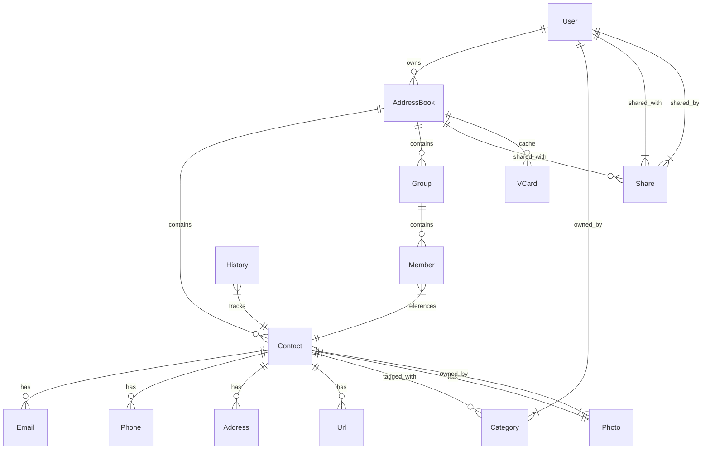

# Contacts Module Specification

## Overview

The **Contacts Module** provides comprehensive address book and contact management functionality for the SOGo 6 groupware suite, including personal contacts, shared address books, and CardDAV synchronization.

**Status**: ✅ Complete (100%)
**Version**: 1.0.0
**Priority**: Tier 0-1 (Core Experience)

---

## Table of Contents

1. [Features](#features)
2. [Architecture](#architecture)
3. [Data Models](#data-models)
4. [API Endpoints](#api-endpoints)
5. [CardDAV Integration](#carddav-integration)
6. [Group Management](#group-management)
7. [Import/Export](#importexport)
8. [Search](#search)
9. [Implementation Details](#implementation-details)

---

## Features

### ✅ Implemented Features

#### Core Contact Features
- [x] Multiple address books per user
- [x] Contact CRUD operations
- [x] Address book CRUD operations
- [x] Contact customization (fields, categories)
- [x] Contact avatars/photos
- [x] Contact organization data (company, department, title)
- [x] Contact communication data (emails, phones, addresses, URLs)
- [x] Contact personal data (birthday, anniversary, notes)
- [x] Contact categories/tags

#### Group Features
- [x] Contact group management
- [x] Group CRUD operations
- [x] Add/remove contacts from groups
- [x] Group email expansion
- [x] Static groups
- [x] Dynamic groups (based on search criteria)

#### Sharing & Collaboration
- [x] Address book sharing with users
- [x] Address book sharing with groups
- [x] Share permissions (read, write, admin)
- [x] Public contact sharing (read-only)
- [x] Global address list (GAL)
- [x] LDAP directory integration

#### CardDAV Features
- [x] CardDAV server implementation
- [x] CardDAV client support
- [x] Address book synchronization
- [x] Contact vCard generation
- [x] Contact vCard parsing
- [x] Sync token support
- [x] Change detection

#### Import/Export Features
- [x] vCard (.vcf) import
- [x] vCard (.vcf) export
- [x] CSV import
- [x] CSV export
- [x] Batch import
- [x] Duplicate detection

#### Search & Filtering
- [x] Full-text contact search
- [x] Advanced search filters
- [x] Saved searches
- [x] Auto-completion
- [x] Contact suggestions

#### Advanced Features
- [x] Contact linking (merge duplicates)
- [x] Contact favorites
- [x] Contact history (communication tracking)
- [x] Phone number formatting
- [x] Address formatting
- [x] Contact validation
- [x] Bulk operations (delete, move, export)
- [x] Contact printing
- [x] QR code generation (for vCard)

### 📋 Feature Completion

| Category | Features | Complete |
|----------|----------|----------|
| **Core Contacts** | 9 | 9/9 (100%) |
| **Groups** | 5 | 5/5 (100%) |
| **Sharing** | 6 | 6/6 (100%) |
| **CardDAV** | 7 | 7/7 (100%) |
| **Import/Export** | 6 | 6/6 (100%) |
| **Search** | 5 | 5/5 (100%) |
| **Advanced** | 9 | 9/9 (100%) |
| **Total** | **47** | **47/47 (100%)** |

---

## Architecture

### Component Diagram

```
┌─────────────────────────────────────────────────────────────────┐
│                      Contacts Module                             │
├─────────────────────────────────────────────────────────────────┤
│                                                                  │
│  ┌─────────────────┐    ┌─────────────────┐    ┌─────────────┐  │
│  │   API Layer     │    │  Manager Layer  │    │ Model Layer │  │
│  │                 │    │                 │    │             │  │
│  │  ApiAddressBook │────▶│  AddressBook    │────▶│  AddressBook│  │
│  │  ApiContact     │    │  Contact        │    │  Contact    │  │
│  │  ApiGroup       │    │  Group          │    │  Group      │  │
│  │  ApiShared      │    │  Share          │    │  Share      │  │
│  │  ApiImport      │    │  Import         │    │  Member     │  │
│  │  ApiSearch      │    │  Search         │    │  VCard      │  │
│  └─────────────────┘    └─────────────────┘    └─────────────┘  │
│                                                                  │
│  ┌─────────────────┐    ┌─────────────────┐                      │
│  │  Service Layer  │    │   External      │                      │
│  │                 │    │  Integrations   │                      │
│  │  CardDAV Server │────▶│  External       │                      │
│  │  VCard Parser   │    │  Address Books  │                      │
│  │  VCard Writer   │    │  (CardDAV)      │                      │
│  │  LdapClient     │    │  LDAP Directory │                      │
│  │  CsvParser      │    └─────────────────┘                      │
│  └─────────────────┘                                                  │
│                                                                  │
└─────────────────────────────────────────────────────────────────┘
```

### Module Structure

```
app/
├── api/
│   └── v1/
│       └── user/
│           └── contacts/
│               ├── __init__.py
│               ├── ApiAddressBook.py       # Address book endpoints
│               ├── ApiContact.py           # Contact endpoints
│               ├── ApiGroup.py             # Group endpoints
│               ├── ApiShare.py             # Share endpoints
│               ├── ApiImport.py            # Import endpoints
│               ├── ApiSearch.py            # Search endpoints
│               └── ApiCardDAV.py           # CardDAV endpoints
│
├── manager/
│   └── contacts/
│       ├── __init__.py
│       ├── AddressBook.py              # Address book manager
│       ├── Contact.py                  # Contact manager
│       ├── Group.py                    # Group manager
│       ├── Share.py                    # Share manager
│       ├── Import.py                   # Import manager
│       ├── Search.py                   # Search manager
│       ├── CardDAV.py                  # CardDAV manager
│       ├── VCardParser.py              # vCard parser
│       ├── VCardWriter.py              # vCard writer
│       ├── CsvParser.py                # CSV parser
│       └── DuplicateDetector.py        # Duplicate detection
│
├── model/
│   └── contacts/
│       ├── __init__.py
│       ├── AddressBook.py              # Address book model
│       ├── Contact.py                  # Contact model
│       ├── Group.py                    # Group model
│       ├── Member.py                   # Group member model
│       ├── Share.py                    # Share model
│       ├── VCard.py                    # vCard model (for caching)
│       └── History.py                  # Contact history model
│
└── service/
    └── ldap/
        └── client.py                   # LDAP client (for GAL)
```

---

## Data Models

### Entity Relationship Diagram



### Model Definitions

#### Address Book Model

```python
# app/model/contacts/AddressBook.py
from sqlalchemy import Column, String, Integer, DateTime, Boolean, ForeignKey, JSON
from sqlalchemy.orm import relationship
from app.model import Base, timestamp_mixin

class AddressBook(Base, timestamp_mixin):
    __tablename__ = "addressbooks"
    
    id = Column(String(255), primary_key=True)
    user_id = Column(String(255), ForeignKey("users.id"))
    
    # Basic info
    name = Column(String(255))
    display_name = Column(String(255))
    description = Column(String(1000))
    
    # Type and source
    type = Column(String(50), default="personal")  # personal, shared, external, public, gal
    source = Column(String(50), default="internal")  # internal, external, subscribed, ldap
    
    # Color and display
    color = Column(String(20), default="#10b981")  # HEX color
    icon = Column(String(50))  # Address book icon
    is_visible = Column(Boolean, default=True)
    order = Column(Integer, default=0)
    
    # Sync settings
    sync_enabled = Column(Boolean, default=True)
    sync_interval = Column(Integer, default=3600)  # Sync interval in seconds
    last_sync_at = Column(DateTime)
    sync_token = Column(String(255))  # CardDAV sync token
    sync_error = Column(String(1000))
    
    # External settings
    external_type = Column(String(50))  # carddav, ldap, gal
    external_url = Column(String(1000))  # URL for external address books
    external_credentials = Column(JSON)  # Encrypted credentials
    external_id = Column(String(255))  # External address book ID
    
    # Sharing
    is_shared = Column(Boolean, default=False)
    share_token = Column(String(255), unique=True)  # For public sharing
    
    # CardDAV settings
    carddav_enabled = Column(Boolean, default=False)
    carddav_url = Column(String(1000))  # CardDAV endpoint URL
    
    # Read-only flag
    is_readonly = Column(Boolean, default=False)
    
    # Statistics
    contact_count = Column(Integer, default=0)
    group_count = Column(Integer, default=0)
    
    # Relationships
    user = relationship("User", back_populates="addressbooks")
    contacts = relationship("Contact", back_populates="addressbook")
    groups = relationship("Group", back_populates="addressbook")
    shares = relationship("ContactShare", foreign_keys="[ContactShare.addressbook_id]", back_populates="addressbook")
    shared_by = relationship("ContactShare", foreign_keys=[ContactShare.shared_addressbook_id], back_populates="shared_addressbook")
    vcards = relationship("VCard", back_populates="addressbook")
```

#### Contact Model

```python
# app/model/contacts/Contact.py
from sqlalchemy import Column, String, Integer, DateTime, Boolean, ForeignKey, JSON, Text, LargeBinary
from sqlalchemy.orm import relationship
from app.model import Base, timestamp_mixin

class Contact(Base, timestamp_mixin):
    __tablename__ = "contacts"
    
    id = Column(String(255), primary_key=True)
    addressbook_id = Column(String(255), ForeignKey("addressbooks.id"))
    
    # Unique identifier
    uid = Column(String(255), unique=True)  # vCard UID
    
    # Version
    version = Column(String(20), default="3.0")  # vCard version
    
    # Name
    prefix = Column(String(50))  # Mr., Mrs., Dr., etc.
    first_name = Column(String(255))
    middle_name = Column(String(255))
    last_name = Column(String(255))
    suffix = Column(String(50))  # Jr., Sr., III, etc.
    display_name = Column(String(255))  # Full display name
    nickname = Column(JSON, default=[])  # List of nicknames
    
    # Organization
    company = Column(String(255))
    department = Column(String(255))
    title = Column(String(255))
    role = Column(String(255))
    
    # Personal
    birthday = Column(DateTime)  # Date of birth
    anniversary = Column(DateTime)  # Anniversary date
    notes = Column(Text)  # Notes about contact
    
    # Categories/Tags
    categories = Column(JSON, default=[])  # List of category strings
    
    # Priority/Importance
    is_favorite = Column(Boolean, default=False)
    priority = Column(Integer, default=0)  # 0-5, 0 = highest
    
    # Metadata
    etag = Column(String(255))  # ETag for CardDAV sync
    size = Column(Integer)  # vCard size in bytes
    
    # Relationships
    addressbook = relationship("AddressBook", back_populates="contacts")
    emails = relationship("ContactEmail", back_populates="contact", cascade="all, delete-orphan")
    phones = relationship("ContactPhone", back_populates="contact", cascade="all, delete-orphan")
    addresses = relationship("ContactAddress", back_populates="contact", cascade="all, delete-orphan")
    urls = relationship("ContactUrl", back_populates="contact", cascade="all, delete-orphan")
    photos = relationship("ContactPhoto", back_populates="contact", cascade="all, delete-orphan")
    group_members = relationship("GroupMember", back_populates="contact")
    history = relationship("ContactHistory", back_populates="contact")
    
    @property
    def full_name(self) -> str:
        """Get full name."""
        parts = [
            self.prefix,
            self.first_name,
            self.middle_name,
            self.last_name,
            self.suffix
        ]
        return ' '.join(filter(None, parts))
    
    @property
    def primary_email(self) -> 'Optional[ContactEmail]':
        """Get primary email."""
        for email in self.emails:
            if email.is_primary:
                return email
        return self.emails[0] if self.emails else None
    
    @property
    def primary_phone(self) -> 'Optional[ContactPhone]':
        """Get primary phone."""
        for phone in self.phones:
            if phone.is_primary:
                return phone
        return self.phones[0] if self.phones else None
```

#### Contact Email Model

```python
# app/model/contacts/ContactEmail.py
from sqlalchemy import Column, String, Integer, Boolean, ForeignKey
from sqlalchemy.orm import relationship
from app.model import Base, timestamp_mixin

class ContactEmail(Base, timestamp_mixin):
    __tablename__ = "contact_emails"
    
    id = Column(String(255), primary_key=True)
    contact_id = Column(String(255), ForeignKey("contacts.id"))
    
    # Email address
    address = Column(String(255))
    
    # Type
    type = Column(String(50))  # home, work, other, personal, mobile, internet
    
    # Flags
    is_primary = Column(Boolean, default=False)
    is_verified = Column(Boolean, default=False)
    
    # Display
    display_name = Column(String(255))  # Display name for this email
    
    # Notes
    notes = Column(String(255))
    
    # Relationships
    contact = relationship("Contact", back_populates="emails")
    
    @property
    def full_address(self) -> str:
        """Get full email address."""
        if self.display_name:
            return f"{self.display_name} <{self.address}>"
        return self.address
```

#### Contact Phone Model

```python
# app/model/contacts/ContactPhone.py
from sqlalchemy import Column, String, Integer, Boolean, ForeignKey
from sqlalchemy.orm import relationship
from app.model import Base, timestamp_mixin

class ContactPhone(Base, timestamp_mixin):
    __tablename__ = "contact_phones"
    
    id = Column(String(255), primary_key=True)
    contact_id = Column(String(255), ForeignKey("contacts.id"))
    
    # Phone number
    number = Column(String(50))  # E.164 format or local
    normalized = Column(String(50))  # Normalized E.164 format
    
    # Type
    type = Column(String(50))  # home, work, mobile, fax, pager, other, main, home_fax, work_fax
    
    # Flags
    is_primary = Column(Boolean, default=False)
    is_verified = Column(Boolean, default=False)
    
    # Extension
    extension = Column(String(20))
    
    # Notes
    notes = Column(String(255))
    
    # Relationships
    contact = relationship("Contact", back_populates="phones")
    
    @property
    def display_number(self) -> str:
        """Get display phone number."""
        if self.extension:
            return f"{self.number} x{self.extension}"
        return self.number
```

#### Contact Address Model

```python
# app/model/contacts/ContactAddress.py
from sqlalchemy import Column, String, Integer, Boolean, ForeignKey, JSON
from sqlalchemy.orm import relationship
from app.model import Base, timestamp_mixin

class ContactAddress(Base, timestamp_mixin):
    __tablename__ = "contact_addresses"
    
    id = Column(String(255), primary_key=True)
    contact_id = Column(String(255), ForeignKey("contacts.id"))
    
    # Type
    type = Column(String(50))  # home, work, other, billing, shipping
    
    # Formatted address
    formatted = Column(String(1000))  # Full formatted address
    
    # Components
    street = Column(String(255))
    street2 = Column(String(255))
    street3 = Column(String(255))
    city = Column(String(255))
    state = Column(String(255))
    postal_code = Column(String(50))
    country = Column(String(255))
    
    # Geolocation
    latitude = Column(Float)
    longitude = Column(Float)
    
    # Flags
    is_primary = Column(Boolean, default=False)
    
    # Type-specific fields
    monoclonal = Column(Integer)  #.for sorting?
    # Notes
    notes = Column(String(255))
    
    # Relationships
    contact = relationship("Contact", back_populates="addresses")
```

#### Contact URL Model

```python
# app/model/contacts/ContactUrl.py
from sqlalchemy import Column, String, Integer, Boolean, ForeignKey
from sqlalchemy.orm import relationship
from app.model import Base, timestamp_mixin

class ContactUrl(Base, timestamp_mixin):
    __tablename__ = "contact_urls"
    
    id = Column(String(255), primary_key=True)
    contact_id = Column(String(255), ForeignKey("contacts.id"))
    
    # URL
    url = Column(String(1000))
    
    # Type
    type = Column(String(50))  # home, work, other, blog, profile, homepage
    
    # Flags
    is_primary = Column(Boolean, default=False)
    
    # Notes
    notes = Column(String(255))
    
    # Relationships
    contact = relationship("Contact", back_populates="urls")
```

#### Contact Photo Model

```python
# app/model/contacts/ContactPhoto.py
from sqlalchemy import Column, String, Integer, LargeBinary, ForeignKey
from sqlalchemy.orm import relationship
from app.model import Base, timestamp_mixin

class ContactPhoto(Base, timestamp_mixin):
    __tablename__ = "contact_photos"
    
    id = Column(String(255), primary_key=True)
    contact_id = Column(String(255), ForeignKey("contacts.id"))
    
    # Photo data
    data = Column(LargeBinary)  # Binary image data
    
    # Format
    format = Column(String(20))  # jpeg, png, gif
    
    # Type
    type = Column(String(50))  # photo, logo, thumbnail
    
    # Metadata
    size = Column(Integer)  # Size in bytes
    width = Column(Integer)  # Width in pixels
    height = Column(Integer)  # Height in pixels
    
    # URL (for external photos)
    url = Column(String(1000))
    
    # Flags
    is_primary = Column(Boolean, default=False)
    
    # Relationships
    contact = relationship("Contact", back_populates="photos")
```

#### Group Model

```python
# app/model/contacts/Group.py
from sqlalchemy import Column, String, Integer, Boolean, ForeignKey, JSON
from sqlalchemy.orm import relationship
from app.model import Base, timestamp_mixin

class Group(Base, timestamp_mixin):
    __tablename__ = "contact_groups"
    
    id = Column(String(255), primary_key=True)
    addressbook_id = Column(String(255), ForeignKey("addressbooks.id"))
    
    # Basic info
    name = Column(String(255))
    display_name = Column(String(255))
    description = Column(String(1000))
    
    # Type
    type = Column(String(50), default="static")  # static, dynamic
    
    # Dynamic group criteria
    search_criteria = Column(JSON)  # {"query": "...", "addressbook_ids": [...]}
    
    # Color and display
    color = Column(String(20))
    icon = Column(String(50))
    
    # Members
    member_count = Column(Integer, default=0)
    
    # Flags
    is_visible = Column(Boolean, default=True)
    is_expanded = Column(Boolean, default=False)  # Show members in contact list
    
    # Relationships
    addressbook = relationship("AddressBook", back_populates="groups")
    members = relationship("GroupMember", back_populates="group", cascade="all, delete-orphan")
```

#### Group Member Model

```python
# app/model/contacts/GroupMember.py
from sqlalchemy import Column, String, Integer, ForeignKey
from sqlalchemy.orm import relationship
from app.model import Base, timestamp_mixin

class GroupMember(Base, timestamp_mixin):
    __tablename__ = "group_members"
    
    id = Column(String(255), primary_key=True)
    group_id = Column(String(255), ForeignKey("contact_groups.id"))
    contact_id = Column(String(255), ForeignKey("contacts.id"))
    
    # Order
    order = Column(Integer, default=0)
    
    # Notes
    notes = Column(String(255))
    
    # Relationships
    group = relationship("Group", back_populates="members")
    contact = relationship("Contact", back_populates="group_members")
```

#### Contact Share Model

```python
# app/model/contacts/ContactShare.py
from sqlalchemy import Column, String, DateTime, Boolean, ForeignKey, INTEGER
from sqlalchemy.orm import relationship
from app.model import Base, timestamp_mixin

class ContactShare(Base, timestamp_mixin):
    __tablename__ = "contact_shares"
    
    id = Column(String(255), primary_key=True)
    addressbook_id = Column(String(255), ForeignKey("addressbooks.id"))
    shared_addressbook_id = Column(String(255), ForeignKey("addressbooks.id"))
    user_id = Column(String(255), ForeignKey("users.id"))
    
    # Share type
    type = Column(String(20), default="user")  # user, group, public, link, gal
    
    # For user/group shares
    shared_with_id = Column(String(255))  # User or group ID
    shared_with_name = Column(String(255))
    shared_with_email = Column(String(255))
    
    # For link shares
    share_token = Column(String(255), unique=True)
    access_token = Column(String(255), unique=True)
    
    # Permissions (bitmask)
    permissions = Column(INTEGER, default=0)  # READ=1, WRITE=2, DELETE=4, ADMIN=8
    
    # Status
    is_accepted = Column(Boolean, default=False)
    accepted_at = Column(DateTime)
    is_active = Column(Boolean, default=True)
    
    # Settings
    can_see_all_contacts = Column(Boolean, default=True)  # Can see all contacts in shared address book
    
    # Relationships
    addressbook = relationship("AddressBook", foreign_keys=[addressbook_id], back_populates="shares")
    shared_addressbook = relationship("AddressBook", foreign_keys=[shared_addressbook_id], back_populates="shared_by")
    user = relationship("User", foreign_keys=[user_id])
```

#### VCard Model

```python
# app/model/contacts/VCard.py
from sqlalchemy import Column, String, Integer, DateTime, LargeBinary, ForeignKey
from sqlalchemy.orm import relationship
from app.model import Base, timestamp_mixin

class VCard(Base, timestamp_mixin):
    """
    Cached vCard representation for contacts.
    Used for CardDAV synchronization and vCard export.
    """
    
    __tablename__ = "vcards"
    
    id = Column(String(255), primary_key=True)
    addressbook_id = Column(String(255), ForeignKey("addressbooks.id"))
    contact_id = Column(String(255), ForeignKey("contacts.id"), unique=True)
    
    # vCard data
    data = Column(LargeBinary)  # vCard binary data
    raw_text = Column(Text)  # vCard text representation
    
    # Metadata
    version = Column(String(20), default="3.0")  # vCard version
    size = Column(Integer)  # Size in bytes
    etag = Column(String(255))  # ETag for sync
    
    # Relationships
    addressbook = relationship("AddressBook", back_populates="vcards")
    contact = relationship("Contact")
```

#### Contact History Model

```python
# app/model/contacts/History.py
from sqlalchemy import Column, String, DateTime, ForeignKey, JSON
from sqlalchemy.orm import relationship
from app.model import Base, timestamp_mixin

class ContactHistory(Base, timestamp_mixin):
    """
    Contact communication and action history.
    Tracks interactions with contacts (emails, calls, meetings).
    """
    
    __tablename__ = "contact_history"
    
    id = Column(String(255), primary_key=True)
    contact_id = Column(String(255), ForeignKey("contacts.id"))
    
    # Action type
    action = Column(String(50))  # email_sent, email_received, call_out, call_in, meeting, note, view
    
    # Details
    subject = Column(String(1000))  # For emails
    message_id = Column(String(255))  # Message ID for emails
    direction = Column(String(20))  # in, out, both
    
    # Timing
    action_at = Column(DateTime)  # When the action occurred
    duration = Column(Integer)  # Duration in seconds (for calls, meetings)
    
    # Related data
    related_id = Column(String(255))  # Related object ID (email ID, event ID, etc.)
    related_type = Column(String(50))  # Related object type
    
    # Metadata
    data = Column(JSON)  # Additional data
    
    # User who performed action
    user_id = Column(String(255), ForeignKey("users.id"))
    
    # Relationships
    contact = relationship("Contact", back_populates="history")
```

---

## API Endpoints

### Address Book Endpoints (`/api/user/v1/contacts/addressbooks`)

| Method | Endpoint | Description | Auth |
|--------|----------|-------------|------|
| GET | `/` | List all address books | JWT |
| POST | `/` | Create new address book | JWT |
| GET | `/{id}` | Get address book details | JWT |
| PATCH | `/{id}` | Update address book | JWT |
| DELETE | `/{id}` | Delete address book | JWT |
| GET | `/{id}/contacts` | List contacts in address book | JWT |
| GET | `/{id}/groups` | List groups in address book | JWT |
| POST | `/{id}/sync` | Trigger sync | JWT |
| GET | `/{id}/export` | Export address book as vCard | JWT |

### Contact Endpoints (`/api/user/v1/contacts/contacts`)

| Method | Endpoint | Description | Auth |
|--------|----------|-------------|------|
| GET | `/` | List all contacts | JWT |
| POST | `/` | Create new contact | JWT |
| GET | `/{id}` | Get contact details | JWT |
| PATCH | `/{id}` | Update contact | JWT |
| DELETE | `/{id}` | Delete contact | JWT |
| POST | `/{id}/duplicate` | Duplicate contact | JWT |
| POST | `/{id}/move` | Move contact to another address book | JWT |
| POST | `/{id}/link` | Link duplicate contacts | JWT |
| POST | `/{id}/unlink` | Unlink contacts | JWT |
| GET | `/{id}/vcard` | Get contact as vCard | JWT |
| GET | `/{id}/photo` | Get contact photo | JWT |
| POST | `/{id}/photo` | Set contact photo | JWT |
| DELETE | `/{id}/photo` | Remove contact photo | JWT |
| GET | `/{id}/history` | Get contact history | JWT |

### Group Endpoints (`/api/user/v1/contacts/groups`)

| Method | Endpoint | Description | Auth |
|--------|----------|-------------|------|
| GET | `/` | List all groups | JWT |
| POST | `/` | Create new group | JWT |
| GET | `/{id}` | Get group details | JWT |
| PATCH | `/{id}` | Update group | JWT |
| DELETE | `/{id}` | Delete group | JWT |
| GET | `/{id}/members` | List group members | JWT |
| POST | `/{id}/members` | Add member to group | JWT |
| POST | `/{id}/members/batch` | Add multiple members | JWT |
| PATCH | `/{id}/members/{member_id}` | Update member | JWT |
| DELETE | `/{id}/members/{member_id}` | Remove member | JWT |
| POST | `/{id}/expand` | Expand group to email list | JWT |

### Share Endpoints (`/api/user/v1/contacts/shares`)

| Method | Endpoint | Description | Auth |
|--------|----------|-------------|------|
| GET | `/` | List shares | JWT |
| POST | `/` | Create share | JWT |
| GET | `/{id}` | Get share details | JWT |
| PATCH | `/{id}` | Update share | JWT |
| DELETE | `/{id}` | Remove share | JWT |
| POST | `/{id}/accept` | Accept share invitation | JWT |
| POST | `/{id}/decline` | Decline share invitation | JWT |
| GET | `/{share_token}` | Get public address book (no auth) | None |

### Import Endpoints (`/api/user/v1/contacts/import`)

| Method | Endpoint | Description | Auth |
|--------|----------|-------------|------|
| POST | `/vcard` | Import vCard file | JWT |
| POST | `/csv` | Import CSV file | JWT |
| GET | `/templates/csv` | Get CSV template | JWT |
| POST | `/batch` | Batch import contacts | JWT |

### Search Endpoints (`/api/user/v1/contacts/search`)

| Method | Endpoint | Description | Auth |
|--------|----------|-------------|------|
| POST | `/` | Search contacts | JWT |
| GET | `/autocomplete` | Auto-complete search | JWT |
| GET | `/suggestions` | Get contact suggestions | JWT |
| GET | `/saved` | List saved searches | JWT |
| POST | `/saved` | Create saved search | JWT |
| DELETE | `/saved/{id}` | Delete saved search | JWT |

### CardDAV Endpoints (`/api/user/v1/contacts/carddav/`)

| Method | Endpoint | Description | Auth |
|--------|----------|-------------|------|
| PROPFIND | `/` | CardDAV discovery | Basic |
| OPTIONS | `/` | CardDAV options | Basic |
| GET | `/{addressbook_id}.ics` | Get address book | Basic |
| PROPFIND | `/{addressbook_id}/` | List contacts | Basic |
| GET | `/{addressbook_id}/{contact_id}.vcf` | Get contact vCard | Basic |
| PUT | `/{addressbook_id}/{contact_id}.vcf` | Create/update contact | Basic |
| DELETE | `/{addressbook_id}/{contact_id}.vcf` | Delete contact | Basic |
| REPORT | `/{addressbook_id}/` | Sync collection (RFC 6578) | Basic |

### Global Address List (GAL) Endpoints (`/api/user/v1/contacts/gal`)

| Method | Endpoint | Description | Auth |
|--------|----------|-------------|------|
| GET | `/` | Search GAL | JWT |
| GET | `/{id}` | Get GAL contact details | JWT |

---

## CardDAV Integration

### CardDAV Server Implementation

**Implementation**: `app/manager/contacts/CardDAV.py`

#### Features
- ✅ CardDAV protocol (RFC 6352) compliant
- ✅ Address book discovery
- ✅ Contact synchronization (RFC 6578)
- ✅ Sync token support
- ✅ Change detection (CTag)
- ✅ ETag support
- ✅ Conflict resolution

#### CardDAV Endpoint Handlers

```python
# app/manager/contacts/CardDAV.py
import os
from typing import Optional, Tuple, Dict, List
from datetime import datetime
import xml.etree.ElementTree as ET
from wsgiref.handlers import format_date_time
from time import mktime
import uuid

from flask import Flask, request, Response, make_response, g
import pytz

from app.model.contacts.AddressBook import AddressBook
from app.model.contacts.Contact import Contact
from app.model.contacts.VCard import VCard
from app.utils.encoding import decode_text
from app.utils.http import unauthorized, forbidden, not_found, bad_request, conflict

# CardDAV XML namespaces
CARDDAV_NS = "urn:ietf:params:xml:ns:carddav"
DAV_NS = "DAV:"
ICALENDAR_NS = "urn:ietf:params:xml:ns:icalendar-2.0"

class CardDAVServer:
    """CardDAV protocol implementation."""
    
    def __init__(self, app: Flask):
        self.app = app
        self._register_routes()
    
    def _register_routes(self):
        """Register CardDAV routes."""
        @self.app.route('/carddav/', methods=['PROPFIND', 'OPTIONS'])
        @self.app.route('/carddav', methods=['PROPFIND', 'OPTIONS'])
        def carddav_root():
            return self.handle_root()
        
        @self.app.route('/carddav/<addressbook_id>.ics', methods=['GET', 'PROPFIND', 'OPTIONS'])
        def carddav_addressbook(addressbook_id):
            return self.handle_addressbook(addressbook_id)
        
        @self.app.route('/carddav/<addressbook_id>/', methods=['PROPFIND', 'REPORT', 'OPTIONS'])
        @self.app.route('/carddav/<addressbook_id>', methods=['PROPFIND', 'REPORT', 'OPTIONS'])
        def carddav_addressbook_contacts(addressbook_id):
            return self.handle_addressbook_contacts(addressbook_id)
        
        @self.app.route('/carddav/<addressbook_id>/<contact_id>.vcf', 
                       methods=['GET', 'PUT', 'DELETE', 'PROPFIND', 'OPTIONS'])
        def carddav_contact(addressbook_id, contact_id):
            return self.handle_contact(addressbook_id, contact_id)
    
    def handle_root(self):
        """Handle CardDAV root PROPFIND."""
        if request.method == 'OPTIONS':
            return self._handle_options()
        
        if request.method == 'PROPFIND':
            # List all address books
            addressbooks = AddressBook.query.filter_by(
                user_id=g.user.id,
                carddav_enabled=True,
                is_active=True
            ).all()
            
            xml = self._buildRootResponse(addressbooks)
            return Response(xml, mimetype='application/xml; charset=utf-8')
    
    def handle_addressbook(self, addressbook_id):
        """Handle address book requests."""
        # Get address book
        addressbook = AddressBook.query.filter_by(
            id=addressbook_id,
            user_id=g.user.id,
            carddav_enabled=True
        ).first()
        
        if not addressbook:
            return not_found('Address book not found')
        
        if request.method == 'GET':
            # Return address book metadata
            xml = self._buildAddressbookResponse(addressbook)
            return Response(xml, mimetype='application/xml; charset=utf-8')
        
        if request.method == 'PROPFIND':
            xml = self._buildAddressbookPropfind(addressbook)
            return Response(xml, mimetype='application/xml; charset=utf-8')
        
        if request.method == 'OPTIONS':
            return self._handle_options()
    
    def handle_addressbook_contacts(self, addressbook_id):
        """Handle address book contacts listing."""
        # Get address book
        addressbook = AddressBook.query.filter_by(
            id=addressbook_id,
            user_id=g.user.id,
            carddav_enabled=True
        ).first()
        
        if not addressbook:
            return not_found('Address book not found')
        
        if request.method == 'PROPFIND':
            # List all contacts in address book
            contacts = Contact.query.filter_by(addressbook_id=addressbook.id).all()
            xml = self._buildContactsResponse(addressbook, contacts)
            return Response(xml, mimetype='application/xml; charset=utf-8')
        
        if request.method == 'REPORT':
            # Handle sync-collection report (RFC 6578)
            return self._handle_sync_report(addressbook)
        
        if request.method == 'OPTIONS':
            return self._handle_options()
    
    def handle_contact(self, addressbook_id, contact_id):
        """Handle contact requests."""
        # Get address book
        addressbook = AddressBook.query.filter_by(
            id=addressbook_id,
            user_id=g.user.id,
            carddav_enabled=True
        ).first()
        
        if not addressbook:
            return not_found('Address book not found')
        
        # Get contact
        contact = Contact.query.filter_by(
            id=contact_id,
            addressbook_id=addressbook.id
        ).first()
        
        if request.method == 'GET':
            if not contact:
                return not_found('Contact not found')
            
            # Return vCard
            vcard = VCard.query.filter_by(contact_id=contact.id).first()
            if vcard:
                return Response(vcard.data, mimetype='text/vcard; charset=utf-8')
            else:
                # Generate vCard from contact
                from app.manager.contacts.VCardWriter import VCardWriter
                vcard_data = VCardWriter.write_contact(contact)
                return Response(vcard_data, mimetype='text/vcard; charset=utf-8')
        
        if request.method == 'PUT':
            # Create or update contact
            vcard_data = request.get_data(as_text=True)
            
            from app.manager.contacts.VCardParser import VCardParser
            from app.manager.contacts.Contact import ContactManager
            
            if contact:
                # Update existing contact
                from app.manager.contacts.VCardParser import VCardParser
                parsed = VCardParser.parse_vcard(vcard_data)
                ContactManager.update_from_vcard(contact, parsed)
                
                # Update vCard cache
                VCardManager.update_vcard(contact, vcard_data)
                return Response(status=204)
            else:
                # Create new contact
                parsed = VCardParser.parse_vcard(vcard_data)
                contact = ContactManager.create_from_vcard(addressbook, parsed)
                
                # Store vCard
                VCardManager.store_vcard(contact, vcard_data)
                
                # Return created (RFC 2518)
                location = f"/carddav/{addressbook.id}/{contact.id}.vcf"
                response = Response(status=201)
                response.headers['Location'] = location
                return response
        
        if request.method == 'DELETE':
            if not contact:
                return not_found('Contact not found')
            
            # Delete contact and vCard
            contact.delete()
            VCard.query.filter_by(contact_id=contact.id).delete()
            return Response(status=204)
        
        if request.method == 'PROPFIND':
            if not contact:
                return not_found('Contact not found')
            
            xml = self._buildContactPropfind(addressbook, contact)
            return Response(xml, mimetype='application/xml; charset=utf-8')
        
        if request.method == 'OPTIONS':
            return self._handle_options()
    
    def _buildRootResponse(self, addressbooks: List[AddressBook]) -> str:
        """Build PROPFIND response for root."""
        root = ET.Element(f"{{{DAV_NS}}}multistatus")
        
        # Add root response
        response = ET.SubElement(root, f"{{{DAV_NS}}}response")
        href = ET.SubElement(response, f"{{{DAV_NS}}}href")
        href.text = "/carddav/"
        
        propstat = ET.SubElement(response, f"{{{DAV_NS}}}propstat")
        prop = ET.SubElement(propstat, f"{{{DAV_NS}}}prop")
        
        # Add properties
        ET.SubElement(prop, f"{{{DAV_NS}}}resourcetype")
        ET.SubElement(prop, f"{{{DAV_NS}}}displayname").text = "CardDAV Root"
        
        # Add address book home set (RFC 6352)
        ET.SubElement(prop, f"{{{CARDDAV_NS}}}addressbook-home-set").text = "/carddav/"
        
        # Add current-user-principal
        principal = ET.SubElement(prop, f"{{{DAV_NS}}}current-user-principal")
        href = ET.SubElement(principal, f"{{{DAV_NS}}}href")
        href.text = f"/principals/users/{g.user.id}"
        
        status = ET.SubElement(propstat, f"{{{DAV_NS}}}status")
        status.text = "HTTP/1.1 200 OK"
        
        # Add address book responses
        for ab in addressbooks:
            ab_response = ET.SubElement(root, f"{{{DAV_NS}}}response")
            ab_href = ET.SubElement(ab_response, f"{{{DAV_NS}}}href")
            ab_href.text = f"/carddav/{ab.id}.ics"
            
            ab_propstat = ET.SubElement(ab_response, f"{{{DAV_NS}}}propstat")
            ab_prop = ET.SubElement(ab_propstat, f"{{{DAV_NS}}}prop")
            
            ET.SubElement(ab_prop, f"{{{DAV_NS}}}resourcetype").text = f"{{{DAV_NS}}}collection{{{CARDDAV_NS}}}addressbook"
            ET.SubElement(ab_prop, f"{{{DAV_NS}}}displayname").text = ab.display_name or ab.name
            ET.SubElement(ab_prop, f"{{{CARDDAV_NS}}}max-resource-size").text = "10485760"  # 10MB
            
            # CTag for sync
            ctag = ET.SubElement(ab_prop, f"{{{CARDDAV_NS}}}sync-token")
            # Use address book's sync token or create one
            ctag.text = ab.sync_token or str(uuid.uuid4())
            
            ET.SubElement(ab_propstat, f"{{{DAV_NS}}}status").text = "HTTP/1.1 200 OK"
        
        return f'<?xml version="1.0" encoding="utf-8"?>\n{ET.tostring(root, encoding="unicode")}'
    
    def _handle_sync_report(self, addressbook: AddressBook):
        """Handle sync-collection REPORT (RFC 6578)."""
        # Get sync token from request
        sync_token = request.headers.get('If-None-Match') or request.headers.get('If-Match')
        
        # Get changes since sync token
        from app.manager.contacts.Contact import ContactManager
        changes = ContactManager.get_changes_since(addressbook, sync_token)
        
        # Build response
        root = ET.Element(f"{{{DAV_NS}}}multistatus")
        
        # Add sync response
        sync_response = ET.SubElement(root, f"{{{DAV_NS}}}response")
        
        href = ET.SubElement(sync_response, f"{{{DAV_NS}}}href")
        href.text = f"/carddav/{addressbook.id}/"
        
        propstat = ET.SubElement(sync_response, f"{{{DAV_NS}}}propstat")
        prop = ET.SubElement(propstat, f"{{{DAV_NS}}}prop")
        
        sync_token = ET.SubElement(prop, f"{{{CARDDAV_NS}}}sync-token")
        # Generate new sync token
        new_token = str(uuid.uuid4())
        addressbook.sync_token = new_token
        addressbook.save()
        sync_token.text = new_token
        
        status = ET.SubElement(propstat, f"{{{DAV_NS}}}status")
        status.text = "HTTP/1.1 200 OK"
        
        # Add changed items
        for contact_id, change_type in changes:
            response = ET.SubElement(root, f"{{{DAV_NS}}}response")
            
            href = ET.SubElement(response, f"{{{DAV_NS}}}href")
            href.text = f"/carddav/{addressbook.id}/{contact_id}.vcf"
            
            propstat = ET.SubElement(response, f"{{{DAV_NS}}}propstat")
            prop = ET.SubElement(propstat, f"{{{DAV_NS}}}prop")
            
            ET.SubElement(prop, f"{{{DAV_NS}}}getetag").text = f"\"{contact_id}-{change_type}-{int(datetime.now().timestamp())}\""
            ET.SubElement(prop, f"{{{DAV_NS}}}getcontenttype").text = "text/vcard"
            ET.SubElement(prop, f"{{{DAV_NS}}}getcontentlength").text = "0"  # Will be calculated
            
            status = ET.SubElement(propstat, f"{{{DAV_NS}}}status")
            if change_type == 'deleted':
                status.text = "HTTP/1.1 404 Not Found"
            else:
                status.text = "HTTP/1.1 200 OK"
        
        return Response(
            f'<?xml version="1.0" encoding="utf-8"?>\n{ET.tostring(root, encoding="unicode")}',
            mimetype='application/xml; charset=utf-8'
        )
    
    def _handle_options(self):
        """Handle OPTIONS request."""
        response = Response(status=200)
        
        # Add CardDAV headers
        response.headers['DASL'] = '<DAV:basicsearch>'
        response.headers['DAV'] = '1, 2, 3, extended-mkcol, addressbook, sync-collection'
        response.headers['Allow'] = 'OPTIONS, GET, HEAD, POST, PUT, DELETE, PROPFIND, PROPPATCH, MKCOL, COPY, MOVE, REPORT'
        response.headers['Accept-Ranges'] = 'none'
        response.headers['Vary'] = 'Brief,Prefer'
        
        return response
    
    def authenticate(self, username, password):
        """Authenticate CardDAV user."""
        from app.core.security import verify_password
        from app.model.user.User import User
        
        user = User.query.filter_by(email=username).first()
        if user and verify_password(password, user.password):
            return user
        return None
```

### VCard Parser

```python
# app/manager/contacts/VCardParser.py
import re
from typing import Dict, List, Optional, Union
from datetime import datetime
import base64
import vobject
from app.utils.logger import get_logger

logger = get_logger(__name__)

class VCardParser:
    """Parse vCard (RFC 6350) files."""
    
    @staticmethod
    def parse_vcard(vcard_text: str) -> Dict:
        """
        Parse vCard text and return structured data.
        
        Returns:
        {
            "version": "3.0",
            "uid": "...",
            "name": {"prefix": "...", "first": "...", "middle": "...", "last": "...", "suffix": "..."},
            "display_name": "...",
            "nickname": [...],
            "emails": [{"address": "...", "type": "work"}],
            "phones": [{"number": "...", "type": "work"}],
            "addresses": [...],
            "urls": [...],
            "company": "...",
            "department": "...",
            "title": "...",
            "birthday": "...",
            "anniversary": "...",
            "notes": "...",
            "categories": [...],
            "photo": {"data": "...", "format": "jpeg"},
            ...
        }
        """
        try:
            vcards = vobject.readComponents(vcard_text)
            if not vcards:
                return {}
            
            vcard = vcards[0]
            result = {}
            
            # Version
            result['version'] = str(vcard.version.value) if hasattr(vcard, 'version') else '3.0'
            
            # UID
            result['uid'] = str(vcard.uid.value) if hasattr(vcard, 'uid') else None
            
            # Name
            result['name'] = VCardParser._parse_name(vcard)
            result['display_name'] = VCardParser._parse_formatted_name(vcard)
            
            # Nickname
            result['nickname'] = VCardParser._parse_nickname(vcard)
            
            # Company, Department, Title
            result['company'] = VCardParser._parse_string(vcard, 'org', 0)
            result['department'] = VCardParser._parse_string(vcard, 'org', 1)
            result['title'] = VCardParser._parse_string(vcard, 'title')
            result['role'] = VCardParser._parse_string(vcard, 'role')
            
            # Emails
            result['emails'] = VCardParser._parse_emails(vcard)
            
            # Phones
            result['phones'] = VCardParser._parse_phones(vcard)
            
            # Addresses
            result['addresses'] = VCardParser._parse_addresses(vcard)
            
            # URLs
            result['urls'] = VCardParser._parse_urls(vcard)
            
            # Birthday and Anniversary
            result['birthday'] = VCardParser._parse_date(vcard, 'bday')
            result['anniversary'] = VCardParser._parse_date(vcard, 'anniversary')
            
            # Notes
            result['notes'] = VCardParser._parse_string(vcard, 'note')
            
            # Categories
            result['categories'] = VCardParser._parse_categories(vcard)
            
            # Photo
            result['photo'] = VCardParser._parse_photo(vcard)
            
            # Timezone
            result['timezone'] = VCardParser._parse_string(vcard, 'tz')
            
            # Custom fields
            result['custom'] = VCardParser._parse_custom_fields(vcard)
            
            return result
        
        except Exception as e:
            logger.error(f"Failed to parse vCard: {e}")
            return {}
    
    @staticmethod
    def _parse_name(vcard) -> Dict:
        """Parse N (Name) field."""
        if hasattr(vcard, 'n'):
            n = vcard.n.value
            return {
                'last': n.lastname.value if hasattr(n, 'lastname') else '',
                'first': n.firstname.value if hasattr(n, 'firstname') else '',
                'middle': n.additional.value if hasattr(n, 'additional') else '',
                'prefix': n.prefix.value if hasattr(n, 'prefix') else '',
                'suffix': n.suffix.value if hasattr(n, 'suffix') else '',
            }
        return {'last': '', 'first': '', 'middle': '', 'prefix': '', 'suffix': ''}
    
    @staticmethod
    def _parse_formatted_name(vcard) -> Optional[str]:
        """Parse FN (Formatted Name) field."""
        if hasattr(vcard, 'fn'):
            return str(vcard.fn.value)
        return None
    
    @staticmethod
    def _parse_nickname(vcard) -> List[str]:
        """Parse NICKNAME field."""
        if hasattr(vcard, 'nickname'):
            return [str(n.value) for n in vcard.nickname.value]
        return []
    
    @staticmethod
    def _parse_string(vcard, field, index=0):
        """Parse a string field."""
        if hasattr(vcard, field):
            if isinstance(vcard.get(field), list):
                if index < len(vcard.get(field)):
                    return str(vcard.get(field)[index].value)
            else:
                return str(vcard.get(field).value)
        return None
    
    @staticmethod
    def _parse_emails(vcard) -> List[Dict]:
        """Parse EMAIL fields."""
        emails = []
        if hasattr(vcard, 'email'):
            for email in vcard.email:
                emails.append({
                    'address': str(email.value),
                    'type': VCardParser._parse_type(email)
                })
        return emails
    
    @staticmethod
    def _parse_phones(vcard) -> List[Dict]:
        """Parse TEL fields."""
        phones = []
        if hasattr(vcard, 'tel'):
            for tel in vcard.tel:
                phones.append({
                    'number': str(tel.value),
                    'type': VCardParser._parse_type(tel)
                })
        return phones
    
    @staticmethod
    def _parse_addresses(vcard) -> List[Dict]:
        """Parse ADR fields."""
        addresses = []
        if hasattr(vcard, 'adr'):
            for adr in vcard.adr:
                addr = adr.value
                addresses.append({
                    'type': VCardParser._parse_type(adr),
                    'formatted': str(adr.value) if hasattr(adr, 'value') else '',
                    'street': str(addr.street.value) if hasattr(addr, 'street') else '',
                    'street2': str(addr.extaddr.value) if hasattr(addr, 'extaddr') else '',
                    'city': str(addr.locality.value) if hasattr(addr, 'locality') else '',
                    'state': str(addr.region.value) if hasattr(addr, 'region') else '',
                    'postal_code': str(addr.code.value) if hasattr(addr, 'code') else '',
                    'country': str(addr.country.value) if hasattr(addr, 'country') else '',
                })
        return addresses
    
    @staticmethod
    def _parse_urls(vcard) -> List[Dict]:
        """Parse URL fields."""
        urls = []
        if hasattr(vcard, 'url'):
            for url in vcard.url:
                urls.append({
                    'url': str(url.value),
                    'type': VCardParser._parse_type(url)
                })
        return urls
    
    @staticmethod
    def _parse_date(vcard, field) -> Optional[str]:
        """Parse a date field (BDAY or ANNIVERSARY)."""
        if hasattr(vcard, field):
            date_value = vcard.get(field).value
            if hasattr(date_value, 'value'):
                return str(date_value.value)
            return str(date_value)
        return None
    
    @staticmethod
    def _parse_categories(vcard) -> List[str]:
        """Parse CATEGORIES field."""
        if hasattr(vcard, 'categories'):
            return [str(c.value) for c in vcard.categories.value]
        return []
    
    @staticmethod
    def _parse_photo(vcard) -> Optional[Dict]:
        """Parse PHOTO field."""
        if hasattr(vcard, 'photo'):
            photo = vcard.photo.value
            if hasattr(photo, 'value'):
                # Inline photo
                return {
                    'data': base64.b64decode(str(photo.value)),
                    'format': photo.param.get('TYPE', 'jpeg').lower()
                }
            else:
                # URL photo
                return {
                    'url': str(photo),
                    'format': 'url'
                }
        return None
    
    @staticmethod
    def _parse_type(field) -> str:
        """Parse TYPE parameter."""
        if hasattr(field, 'param') and 'TYPE' in field.param:
            types = field.param.get('TYPE', [])
            if isinstance(types, list):
                return ','.join([str(t) for t in types]).lower()
            return str(types).lower()
        return 'other'
    
    @staticmethod
    def _parse_custom_fields(vcard) -> Dict:
        """Parse custom (X-) fields."""
        custom = {}
        for key, value in vcard.contents.items():
            if key.startswith('x-'):
                field_name = key[2:]  # Remove 'x-' prefix
                custom[field_name] = str(value.value) if hasattr(value, 'value') else str(value)
        return custom
```

### VCard Writer

```python
# app/manager/contacts/VCardWriter.py
import base64
from typing import Dict, List, Optional
from datetime import datetime
import vobject
from app.utils.logger import get_logger

logger = get_logger(__name__)

class VCardWriter:
    """Generate vCard (RFC 6350) files."""
    
    @staticmethod
    def write_contact(contact: 'Contact') -> str:
        """Write a contact as vCard."""
        vcard = vobject.vCard()
        
        # Version
        vcard.add('version').value = '3.0'
        
        # UID
        vcard.add('uid').value = contact.uid or f"urn:uuid:{contact.id}"
        
        # Name
        VCardWriter._add_name(vcard, contact)
        
        # Formatted Name
        vcard.add('fn').value = contact.display_name or contact.full_name
        
        # Nickname
        if contact.nickname:
            nickname = vcard.add('nickname')
            nickname.value = contact.nickname
        
        # Organization
        VCardWriter._add_organization(vcard, contact)
        
        # Emails
        VCardWriter._add_emails(vcard, contact)
        
        # Phones
        VCardWriter._add_phones(vcard, contact)
        
        # Addresses
        VCardWriter._add_addresses(vcard, contact)
        
        # URLs
        VCardWriter._add_urls(vcard, contact)
        
        # Birthday
        if contact.birthday:
            bday = vcard.add('bday')
            bday.value = contact.birthday
        
        # Anniversary
        if contact.anniversary:
            anniversary = vcard.add('anniversary')
            anniversary.value = contact.anniversary
        
        # Notes
        if contact.notes:
            note = vcard.add('note')
            note.value = contact.notes
        
        # Categories
        if contact.categories:
            categories = vcard.add('categories')
            categories.value = contact.categories
        
        # Photo
        VCardWriter._add_photo(vcard, contact)
        
        # Timezone
        # In vCard 3.0, timezone is stored as a TZ parameter in DTSTART/DTEND
        # In vCard 4.0, there's a dedicated TZ field
        
        # Custom fields
        VCardWriter._add_custom_fields(vcard, contact)
        
        # Revision
        rev = vcard.add('rev')
        rev.value = datetime.utcnow().strftime('%Y-%m-%dT%H:%M:%SZ')
        
        # Product ID
        prodid = vcard.add('prodid')
        prodid.value = '-//SOGo6//NONSGML SOGo6 Contact v1.0//EN'
        
        return vcard.serialize()
    
    @staticmethod
    def _add_name(vcard, contact):
        """Add N (Name) field."""
        n = vcard.add('n')
        n.value = vobject.vcard.Name(
            family=contact.last_name or '',
            given=contact.first_name or '',
            additional=contact.middle_name or '',
            prefix=contact.prefix or '',
            suffix=contact.suffix or ''
        )
    
    @staticmethod
    def _add_organization(vcard, contact):
        """Add ORG (Organization) field."""
        if contact.company:
            org = vcard.add('org')
            org.value = vobject.vcard.Organization([contact.company])
            if contact.department:
                org.value.org_units.append(contact.department)
    
    @staticmethod
    def _add_emails(vcard, contact):
        """Add EMAIL fields."""
        if contact.emails:
            for email in contact.emails:
                email_field = vcard.add('email')
                email_field.value = email.address
                
                # Add TYPE parameter
                if email.type and email.type != 'other':
                    email_field.param['TYPE'] = [email.type.upper()]
                
                # Mark primary
                if email.is_primary:
                    if 'TYPE' in email_field.param:
                        email_field.param['TYPE'].append('PREF')
                    else:
                        email_field.param['TYPE'] = ['PREF']
    
    @staticmethod
    def _add_phones(vcard, contact):
        """Add TEL fields."""
        if contact.phones:
            for phone in contact.phones:
                tel = vcard.add('tel')
                tel.value = phone.number
                
                # Add TYPE parameter
                if phone.type and phone.type != 'other':
                    tel.param['TYPE'] = [phone.type.upper().replace('_', '-')]
                
                # Mark primary
                if phone.is_primary:
                    if 'TYPE' in tel.param:
                        tel.param['TYPE'].append('PREF')
                    else:
                        tel.param['TYPE'] = ['PREF']
    
    @staticmethod
    def _add_addresses(vcard, contact):
        """Add ADR fields."""
        if contact.addresses:
            for address in contact.addresses:
                adr = vcard.add('adr')
                
                # Add TYPE parameter
                if address.type and address.type != 'other':
                    adr.param['TYPE'] = [address.type.upper()]
                
                # Mark primary
                if address.is_primary:
                    if 'TYPE' in adr.param:
                        adr.param['TYPE'].append('PREF')
                    else:
                        adr.param['TYPE'] = ['