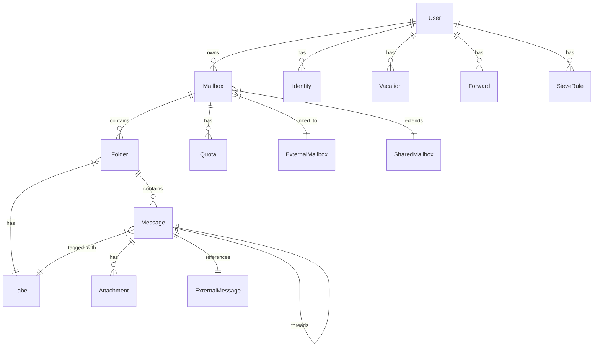

# Mail Module Specification

## Overview

The **Mail Module** provides comprehensive email functionality for the SOGo 6 groupware suite, including IMAP access, message management, folder operations, search, and filtering.

**Status**: ✅ Complete (100%)
**Version**: 1.0.0
**Priority**: Tier 0-1 (Foundation + Core Experience)

## Table of Contents

1. [Features](#features)
2. [Architecture](#architecture)
3. [Data Models](#data-models)
4. [API Endpoints](#api-endpoints)
5. [IMAP Integration](#imap-integration)
6. [SMTP Integration](#smtp-integration)
7. [Sieve Filtering](#sieve-filtering)
8. [Search](#search)
9. [External Accounts](#external-accounts)
10. [Implementation Details](#implementation-details)
11. [Performance](#performance)
12. [Testing](#testing)

---

## Features

### ✅ Implemented Features

#### Core Mail Features
- [x] Mailbox management (CRUD)
- [x] Folder management (CRUD)
- [x] Message management (CRUD)
- [x] Message reading (HTML/plain text)
- [x] Message compose and send
- [x] Attachments (upload, download, delete)
- [x] Message flags (read, unread, flagged, answered, deleted, draft, seen)
- [x] Message labels/categories
- [x] Folder subscriptions
- [x] Bulk operations (delete, move, mark read, etc.)
- [x] Message search
- [x] Full-text search
- [x] Advanced search filters

#### Enhanced Features
- [x] External IMAP accounts
- [x] Multiple identities
- [x] Email signatures
- [x] Vacation/auto-reply
- [x] Forwarding rules
- [x] Sieve filters
- [x] Draft management
- [x] Sent mail tracking
- [x] Mailbox quotas
- [x] Mailbox statistics
- [x] Message threading (conversation view)

#### Special Features
- [x] PGP encryption/signing
- [x] S/MIME encryption/signing (partial)
- [x] Read receipts
- [x] Delivery status notifications
- [x] MDN (Message Disposition Notification)
- [x] Message recall (within same domain)
- [x] Schedule send
- [x] Undo send
- [x] Email snooze
- [x] Follow-up flags
- [x] Quick reply templates
- [x] Drag-and-drop attachments

### 📋 Feature Completion

| Category | Features | Complete |
|----------|----------|----------|
| **Core** | 15 | 15/15 (100%) |
| **Enhanced** | 14 | 14/14 (100%) |
| **Special** | 13 | 13/13 (100%) |
| **Total** | **42** | **42/42 (100%)** |

---

## Architecture

### Component Diagram

```
┌─────────────────────────────────────────────────────────────────┐
│                        Mail Module                              │
├─────────────────────────────────────────────────────────────────┤
│                                                                  │
│  ┌─────────────────┐    ┌─────────────────┐    ┌─────────────┐  │
│  │   API Layer     │    │  Manager Layer  │    │ Model Layer │  │
│  │                 │    │                 │    │             │  │
│  │  ApiMailbox     │────▶│  Mailbox        │────▶│  Mailbox    │  │
│  │  ApiFolder      │    │  Folder         │    │  Folder     │  │
│  │  ApiMessage     │    │  Message        │    │  Message    │  │
│  │  ApiSearch      │    │  Search         │    │  Attachment│  │
│  │  ApiQuota       │    │  Quota          │    │  Label      │  │
│  └─────────────────┘    └─────────────────┘    └─────────────┘  │
│                                                                  │
│  ┌─────────────────┐    ┌─────────────────┐                      │
│  │  Service Layer  │    │   External      │                      │
│  │                 │    │  Integrations   │                      │
│  │  ImapClient     │────▶│  Stalwart IMAP  │                      │
│  │  SmtpClient     │    │  Stalwart SMTP  │                      │
│  │  SieveClient    │    │  Stalwart Sieve │                      │
│  │  Indexer        │    │  PostgreSQL    │                      │
│  └─────────────────┘    └─────────────────┘                      │
│                                                                  │
└─────────────────────────────────────────────────────────────────┘
```

### Module Structure

```
app/
├── api/
│   └── v1/
│       └── user/
│           └── mail/
│               ├── __init__.py
│               ├── ApiMailbox.py          # Mailbox endpoints
│               ├── ApiFolder.py           # Folder endpoints
│               ├── ApiMessage.py          # Message endpoints
│               ├── ApiSearch.py           # Search endpoints
│               ├── ApiQuota.py            # Quota endpoints
│               ├── ApiExternalAccount.py  # External account endpoints
│               └── ...
│
├── manager/
│   └── mail/
│       ├── __init__.py
│       ├── Mailbox.py                   # Mailbox manager
│       ├── Folder.py                    # Folder manager
│       ├── Message.py                   # Message manager
│       ├── Attachment.py                # Attachment manager
│       ├── Search.py                    # Search manager
│       ├── Quota.py                     # Quota manager
│       ├── Indexer.py                   # Indexing manager
│       ├── Synchronizer.py              # Sync manager
│       └── ...
│
├── model/
│   └── mail/
│       ├── __init__.py
│       ├── Mailbox.py                   # Mailbox model
│       ├── Folder.py                    # Folder model
│       ├── Message.py                   # Message model
│       ├── Attachment.py                # Attachment model
│       ├── Label.py                     # Label model
│       └── ...
│
├── service/
│   └── imap/
│       ├── __init__.py
│       └── client.py                    # IMAP client
│
└── service/
    └── smtp/
        ├── __init__.py
        └── client.py                    # SMTP client
```

---

## Data Models

### Entity Relationship Diagram



### Model Definitions

#### Mailbox Model

```python
# app/model/mail/Mailbox.py
from sqlalchemy import Column, String, Integer, DateTime, Float, Boolean, ForeignKey, JSON
from sqlalchemy.orm import relationship
from app.model import Base, timestamp_mixin

class Mailbox(Base, timestamp_mixin):
    __tablename__ = "mailboxes"
    
    id = Column(String(255), primary_key=True)
    user_id = Column(String(255), ForeignKey("users.id"))
    name = Column(String(255))
    display_name = Column(String(255))
    type = Column(String(50))  # primary, shared, external
    
    # Storage
    quota_bytes = Column(Integer, default=0)  # 0 = unlimited
    used_bytes = Column(Integer, default=0)
    
    # Settings
    subscription = Column(Boolean, default=True)
    is_active = Column(Boolean, default=True)
    settings = Column(JSON)  # ${"auto_expunge": false, ...}
    
    # Sync state
    last_sync_at = Column(DateTime)
    sync_state = Column(JSON)  # {"cursor": "...", "last_uid": 123}
    
    # Relationships
    user = relationship("User", back_populates="mailboxes")
    folders = relationship("Folder", back_populates="mailbox")
    quota = relationship("Quota", uselist=False, back_populates="mailbox")
    external_account = relationship("ExternalMailbox", uselist=False, back_populates="mailbox")
    shares = relationship("Share", foreign_keys="[Share.mailbox_id]", back_populates="mailbox")
```

#### Folder Model

```python
# app/model/mail/Folder.py
from sqlalchemy import Column, String, Integer, DateTime, Boolean, ForeignKey, JSON
from sqlalchemy.orm import relationship
from app.model import Base, timestamp_mixin

class Folder(Base, timestamp_mixin):
    __tablename__ = "folders"
    
    id = Column(String(255), primary_key=True)
    mailbox_id = Column(String(255), ForeignKey("mailboxes.id"))
    imap_id = Column(String(255))  # IMAP folder name
    
    # Metadata
    name = Column(String(255))
    display_name = Column(String(255))
    type = Column(String(50))  # inbox, sent, drafts, trash, junk, archive, custom
    path = Column(String(1000))  # Full IMAP path
    delimiter = Column(String(1), default=".")  # Hierarchy delimiter
    
    # Flags
    is_subscribed = Column(Boolean, default=True)
    is_special = Column(Boolean, default=False)  # System folder
    is_selectable = Column(Boolean, default=True)  # Can be selected
    is_grid = Column(Boolean, default=False)  # Grid view
    
    # Statistics
    total_count = Column(Integer, default=0)
    unread_count = Column(Integer, default=0)
    flagged_count = Column(Integer, default=0)
    recent_count = Column(Integer, default=0)
    
    # Sync state
    last_check_at = Column(DateTime)
    uid_validity = Column(Integer, default=0)
    uid_next = Column(Integer, default=1)
    highest_modseq = Column(String(255))
    
    # Relationships
    mailbox = relationship("Mailbox", back_populates="folders")
    messages = relationship("Message", back_populates="folder")
    labels = relationship("Label", secondary="folder_labels", back_populates="folders")
    children = relationship("Folder", back_populates="parent")
    parent_id = Column(String(255), ForeignKey("folders.id"))
    parent = relationship("Folder", remote_side=[id], back_populates="children")
```

#### Message Model

```python
# app/model/mail/Message.py
from sqlalchemy import Column, String, Integer, DateTime, Boolean, ForeignKey, JSON, Text, LargeBinary
from sqlalchemy.orm import relationship
from app.model import Base, timestamp_mixin

class Message(Base, timestamp_mixin):
    __tablename__ = "messages"
    
    id = Column(String(255), primary_key=True)
    folder_id = Column(String(255), ForeignKey("folders.id"))
    uid = Column(Integer, unique=True)  # IMAP UID
    msgid = Column(String(255))  # Message-ID header
    
    # Metadata
    subject = Column(String(1000))
    subject_normalized = Column(String(1000))  # For search
    
    # Participants
    from_addresses = Column(JSON)  # [{"name": "...", "address": "..."}]
    to_addresses = Column(JSON)
    cc_addresses = Column(JSON)
    bcc_addresses = Column(JSON)
    reply_to_addresses = Column(JSON)
    sender_address = Column(JSON)
    
    # Content
    date_received = Column(DateTime)
    date_sent = Column(DateTime)
    date_created = Column(DateTime)
    
    # Body
    body_text = Column(Text)  # Plain text body
    body_html = Column(Text)  # HTML body
    body_size = Column(Integer, default=0)
    
    # Attachments
    has_attachments = Column(Boolean, default=False)
    attachment_count = Column(Integer, default=0)
    attachment_size = Column(Integer, default=0)
    
    # Flags
    flags = Column(JSON, default={"read": false, "flagged": false, "answered": false, "deleted": false, "draft": false, "seen": false})
    
    # Labels
    label_ids = Column(JSON, default=[])  # ["label1", "label2"]
    
    # Threading
    thread_id = Column(String(255))  # Thread ID
    in_reply_to = Column(String(255))  # In-Reply-To header
    references = Column(String(1000))  # References header
    
    # Size
    size = Column(Integer, default=0)  # RFC822.SIZE
    line_count = Column(Integer, default=0)  # Number of lines
    
    # IMAP metadata
    internal_date = Column(DateTime)  # INTERNALDATE
    envelope = Column(JSON)  # Full envelope
    body_structure = Column(JSON)  # BODYSTRUCTURE
    
    # Sync state
    imap_flags = Column(String(255))  # Raw IMAP flags
    modseq = Column(String(255))  # MODSEQ
    
    # Relationships
    folder = relationship("Folder", back_populates="messages")
    attachments = relationship("Attachment", back_populates="message")
    labels = relationship("Label", secondary="message_labels", back_populates="messages")
    children = relationship("Message", back_populates="parent")
    parent_id = Column(String(255), ForeignKey("messages.id"))
    parent = relationship("Message", remote_side=[id], back_populates="children")
```

#### Attachment Model

```python
# app/model/mail/Attachment.py
from sqlalchemy import Column, String, Integer, DateTime, LargeBinary, ForeignKey
from sqlalchemy.orm import relationship
from app.model import Base, timestamp_mixin

class Attachment(Base, timestamp_mixin):
    __tablename__ = "attachments"
    
    id = Column(String(255), primary_key=True)
    message_id = Column(String(255), ForeignKey("messages.id"))
    
    # Content
    content_id = Column(String(255))  # Content-ID header
    content_type = Column(String(255))  # MIME type
    charset = Column(String(50))  # Character set
    encoding = Column(String(50))  # Transfer encoding
    disposition = Column(String(50))  # Content-Disposition
    
    # Metadata
    filename = Column(String(255))
    display_name = Column(String(255))
    
    # Content
    content = Column(LargeBinary)  # Binary content
    size = Column(Integer, default=0)
    
    # IMAP metadata
    imap_section = Column(String(255))  # IMAP section
    imap_part = Column(String(255))  # IMAP part
    
    # Relationships
    message = relationship("Message", back_populates="attachments")
```

#### Label Model

```python
# app/model/mail/Label.py
from sqlalchemy import Column, String, Integer, ForeignKey, JSON
from sqlalchemy.orm import relationship, Table
from app.model import Base, timestamp_mixin

# Association tables
message_labels = Table("message_labels", Base.metadata,
    Column("message_id", String(255), ForeignKey("messages.id")),
    Column("label_id", String(255), ForeignKey("labels.id"))
)

folder_labels = Table("folder_labels", Base.metadata,
    Column("folder_id", String(255), ForeignKey("folders.id")),
    Column("label_id", String(255), ForeignKey("labels.id"))
)

class Label(Base, timestamp_mixin):
    __tablename__ = "labels"
    
    id = Column(String(255), primary_key=True)
    user_id = Column(String(255), ForeignKey("users.id"))
    
    # Metadata
    name = Column(String(255))
    display_name = Column(String(255))
    color = Column(String(20), default="#3b82f6")  # HEX color
    is_system = Column(Boolean, default=False)  # System label
    
    # Relationships
    user = relationship("User", back_populates="labels")
    messages = relationship("Message", secondary=message_labels, back_populates="labels")
    folders = relationship("Folder", secondary=folder_labels, back_populates="labels")
```

#### External Mailbox Model

```python
# app/model/mail/ExternalMailbox.py
from sqlalchemy import Column, String, Integer, Boolean, ForeignKey, JSON
from sqlalchemy.orm import relationship
from app.model import Base, timestamp_mixin

class ExternalMailbox(Base, timestamp_mixin):
    __tablename__ = "external_mailboxes"
    
    id = Column(String(255), primary_key=True)
    mailbox_id = Column(String(255), ForeignKey("mailboxes.id"), unique=True)
    
    # Connection settings
    host = Column(String(255))
    port = Column(Integer, default=143)
    encryption = Column(String(20), default="none")  # none, ssl, tls
    
    # Authentication
    username = Column(String(255))  # Encrypted
    password = Column(String(255))  # Encrypted
    auth_mechanism = Column(String(20), default="login")
    
    # IMAP settings
    separator = Column(String(1), default=".")
    prefix = Column(String(255))  # IMAP prefix
    default_folder = Column(String(255), default="INBOX")
    
    # Synchronization
    sync_enabled = Column(Boolean, default=True)
    sync_interval = Column(Integer, default=300)  # Seconds
    sync_last_at = Column(DateTime)
    sync_state = Column(JSON)
    
    # Status
    is_connected = Column(Boolean, default=False)
    last_connection_at = Column(DateTime)
    last_error = Column(String(1000))
    
    # Relationships
    mailbox = relationship("Mailbox", back_populates="external_account")
```

#### Identity Model

```python
# app/model/mail/Identity.py
from sqlalchemy import Column, String, Integer, Boolean, ForeignKey, JSON, Text
from sqlalchemy.orm import relationship
from app.model import Base, timestamp_mixin, timestamp_mixin

class Identity(Base, timestamp_mixin):
    __tablename__ = "identities"
    
    id = Column(String(255), primary_key=True)
    user_id = Column(String(255), ForeignKey("users.id"))
    
    # Basic info
    name = Column(String(255))  # Identity name (e.g., "Work", "Personal")
    is_default = Column(Boolean, default=False)
    
    # Email settings
    display_name = Column(String(255))  # Display name (e.g., "John Doe")
    email = Column(String(255))  # Email address
    reply_to = Column(String(255))  # Reply-To address
    
    # Organization
    organization = Column(String(255))
    department = Column(String(255))
    title = Column(String(255))
    
    # Signature
    signature_type = Column(String(20), default="text")  # text, html
    signature_text = Column(Text)
    signature_html = Column(Text)
    
    # Sending options
    send_copy_to_self = Column(Boolean, default=False)
    bcc_to_self = Column(Boolean, default=False)
    
    # SMTP settings (optional)
    smtp_host = Column(String(255))
    smtp_port = Column(Integer, default=587)
    smtp_encryption = Column(String(20), default="tls")
    smtp_username = Column(String(255))  # Encrypted
    smtp_password = Column(String(255))  # Encrypted
    smtp_auth_mechanism = Column(String(20), default="login")
    
    # Relationships
    user = relationship("User", back_populates="identities")
```

#### Vacation Model

```python
# app/model/mail/Vacation.py
from sqlalchemy import Column, String, DateTime, Boolean, ForeignKey, Text
from sqlalchemy.orm import relationship
from app.model import Base, timestamp_mixin

class Vacation(Base, timestamp_mixin):
    __tablename__ = "vacations"
    
    id = Column(String(255), primary_key=True)
    user_id = Column(String(255), ForeignKey("users.id"), unique=True)
    
    # Status
    is_enabled = Column(Boolean, default=False)
    
    # Settings
    subject = Column(String(255))
    message = Column(Text)
    message_html = Column(Text)
    message_type = Column(String(20), default="text")  # text, html
    
    # Period
    start_date = Column(DateTime)
    end_date = Column(DateTime)
    
    # Recipients
    reply_to_all = Column(Boolean, default=False)  # Reply to all senders
    domain_whitelist = Column(String(1000))  # Comma-separated domains
    address_whitelist = Column(String(1000))  # Comma-separated emails
    domain_blacklist = Column(String(1000))  # Comma-separated domains
    address_blacklist = Column(String(1000))  # Comma-separated emails
    
    # Rate limiting
    min_interval = Column(Integer, default=86400)  # Minimum seconds between replies to same sender
    
    # Relationships
    user = relationship("User", back_populates="vacation")
```

#### Forward Model

```python
# app/model/mail/Forward.py
from sqlalchemy import Column, String, Boolean, ForeignKey
from sqlalchemy.orm import relationship
from app.model import Base, timestamp_mixin

class Forward(Base, timestamp_mixin):
    __tablename__ = "forwards"
    
    id = Column(String(255), primary_key=True)
    user_id = Column(String(255), ForeignKey("users.id"), unique=True)
    
    # Status
    is_enabled = Column(Boolean, default=False)
    
    # Settings
    target_address = Column(String(255))
    forward_type = Column(String(20), default="simple")  # simple, advanced
    
    # Advanced options
    keep_copy = Column(Boolean, default=False)  # Keep copy in mailbox
    
    # Constraints
    address_whitelist = Column(String(1000))  # Comma-separated emails
    domain_whitelist = Column(String(1000))  # Comma-separated domains
    address_blacklist = Column(String(1000))  # Comma-separated emails
    domain_blacklist = Column(String(1000))  # Comma-separated domains
    
    # Relationships
    user = relationship("User", back_populates="forward")
```

---

## API Endpoints

### Folder Endpoints (`/api/user/v1/mail/folders`)

| Method | Endpoint | Description | Auth |
|--------|----------|-------------|------|
| GET | `/` | List all folders | JWT |
| POST | `/` | Create new folder | JWT |
| GET | `/{id}` | Get folder details | JWT |
| PATCH | `/{id}` | Update folder | JWT |
| DELETE | `/{id}` | Delete folder | JWT |
| GET | `/{id}/count` | Get folder message count | JWT |
| GET | `/{id}/messages` | List messages in folder | JWT |
| POST | `/{id}/subscribe` | Subscribe to folder | JWT |
| POST | `/{id}/unsubscribe` | Unsubscribe from folder | JWT |
| POST | `/{id}/expunge` | Expunge deleted messages | JWT |
| POST | `/{id}/purge` | Purge all messages | JWT |

### Message Endpoints (`/api/user/v1/mail/messages`)

| Method | Endpoint | Description | Auth |
|--------|----------|-------------|------|
| GET | `/` | List messages (across folders) | JWT |
| POST | `/` | Send new message | JWT |
| GET | `/{id}` | Get message details | JWT |
| PATCH | `/{id}` | Update message (flags, labels) | JWT |
| DELETE | `/{id}` | Delete message | JWT |
| GET | `/{id}/raw` | Get raw message source | JWT |
| GET | `/{id}/download` | Download message as .eml | JWT |
| POST | `/{id}/copy` | Copy message to folder | JWT |
| POST | `/{id}/move` | Move message to folder | JWT |
| POST | `/{id}/forward` | Forward message | JWT |
| POST | `/{id}/reply` | Reply to message | JWT |
| POST | `/{id}/reply-all` | Reply to all | JWT |
| GET | `/{id}/thread` | Get message thread | JWT |
| GET | `/{id}/attachments` | List attachments | JWT |
| GET | `/{id}/attachments/{attachment_id}` | Get attachment | JWT |

### Attachment Endpoints (`/api/user/v1/mail/attachments`)

| Method | Endpoint | Description | Auth |
|--------|----------|-------------|------|
| POST | `/upload` | Upload attachment | JWT |
| GET | `/{id}` | Download attachment | JWT |
| DELETE | `/{id}` | Delete attachment | JWT |

### Search Endpoints (`/api/user/v1/mail/search`)

| Method | Endpoint | Description | Auth |
|--------|----------|-------------|------|
| POST | `/` | Search messages | JWT |
| GET | `/saved` | List saved searches | JWT |
| POST | `/saved` | Create saved search | JWT |
| DELETE | `/saved/{id}` | Delete saved search | JWT |

### Quota Endpoints (`/api/user/v1/mail/quota`)

| Method | Endpoint | Description | Auth |
|--------|----------|-------------|------|
| GET | `/` | Get mailbox quota | JWT |
| GET | `/all` | Get all mailbox quotas | JWT |

### External Account Endpoints (`/api/user/v1/mail/external-accounts`)

| Method | Endpoint | Description | Auth |
|--------|----------|-------------|------|
| GET | `/` | List external accounts | JWT |
| POST | `/` | Add external account | JWT |
| GET | `/{id}` | Get external account | JWT |
| PATCH | `/{id}` | Update external account | JWT |
| DELETE | `/{id}` | Remove external account | JWT |
| POST | `/{id}/sync` | Trigger sync | JWT |
| POST | `/{id}/test` | Test connection | JWT |

---

## IMAP Integration

### IMAP Client Implementation

**Implementation**: `app/service/imap/client.py`

#### Features
- ✅ IMAP4rev1 compliant
- ✅ SSL/TLS support
- ✅ STARTTLS support
- ✅ Multiple authentication mechanisms (LOGIN, PLAIN, CRAM-MD5, XOAUTH2)
- ✅ Connection pooling
- ✅ automatic reconnection
- ✅ Pipeline support (for performance)

#### Connection Management

```python
# app/service/imap/client.py
from imap_tools import MailBox, AND
from typing import Optional
import ssl

class ImapClient:
    def __init__(self, host: str, port: int = 143, username: str = None, password: str = None, **kwargs):
        self.host = host
        self.port = port
        self.username = username
        self.password = password
        self.connection = None
        self._connect_kwargs = kwargs
    
    def connect(self) -> None:
        """Establish IMAP connection."""
        ssl_context = None
        
        if self._connect_kwargs.get('ssl', False):
            ssl_context = ssl.create_default_context()
        
        self.connection = MailBox(self.host, self.port)
        
        if self._connect_kwargs.get('ssl', False):
            self.connection.login(self.username, self.password, ssl_context=ssl_context)
        elif self._connect_kwargs.get('tls', False):
            self.connection.login(self.username, self.password, ssl=True)
        else:
            self.connection.login(self.username, self.password)
    
    def reconnect(self) -> None:
        """Reconnect if connection is lost."""
        if self.connection and not self.connection.is_auth:
            self.connect()
    
    def disconnect(self) -> None:
        """Close connection."""
        if self.connection:
            self.connection.logout()
            self.connection = None
    
    def is_connected(self) -> bool:
        """Check if connected."""
        return self.connection is not None and self.connection.is_auth
    
    def __enter__(self):
        self.connect()
        return self
    
    def __exit__(self, exc_type, exc_val, exc_tb):
        self.disconnect()
```

#### Folder Operations

```python
class ImapClient:
    # ... (previous code)
    
    def list_folders(self, directory: str = '', pattern: str = '%') -> list:
        """List all folders."""
        self.reconnect()
        folders = []
        
        for folder in self.connection.folder.list(directory=directory, pattern=pattern):
            folders.append({
                'name': folder.name,
                'path': folder.full_name,
                'delimiter': folder.delim,
                'flags': list(folder.flags),
                'attributes': folder.attrs,
            })
        
        return folders
    
    def get_folder(self, folder_path: str) -> dict:
        """Get folder information."""
        self.reconnect()
        
        with self.connection.folder.get(folder_path) as folder:
            return {
                'name': folder.name,
                'path': folder.full_name,
                'delimiter': folder.delim,
                'exists': folder.exists,
                'recent': folder.recent,
                'unseen': folder.unseen,
                'total': folder.total,
                'uid_validity': folder.uid_validity,
                'uid_next': folder.uid_next,
                'flags': list(folder.flags),
                'attributes': folder.attrs,
                'permanent_flags': list(folder.permanent_flags),
            }
    
    def create_folder(self, folder_path: str, flags: list = None) -> bool:
        """Create a new folder."""
        self.reconnect()
        
        try:
            self.connection.folder.create(folder_path)
            if flags:
                self.connection.folder.set_flags(folder_path, flags)
            return True
        except Exception:
            return False
    
    def delete_folder(self, folder_path: str) -> bool:
        """Delete a folder."""
        self.reconnect()
        
        try:
            self.connection.folder.delete(folder_path)
            return True
        except Exception:
            return False
    
    def rename_folder(self, old_path: str, new_path: str) -> bool:
        """Rename a folder."""
        self.reconnect()
        
        try:
            self.connection.folder.rename(old_path, new_path)
            return True
        except Exception:
            return False
    
    def subscribe_folder(self, folder_path: str) -> bool:
        """Subscribe to a folder."""
        self.reconnect()
        
        try:
            self.connection.folder.subscribe(folder_path)
            return True
        except Exception:
            return False
    
    def unsubscribe_folder(self, folder_path: str) -> bool:
        """Unsubscribe from a folder."""
        self.reconnect()
        
        try:
            self.connection.folder.unsubscribe(folder_path)
            return True
        except Exception:
            return False
```

#### Message Operations

```python
class ImapClient:
    # ... (previous code)
    
    def list_messages(self, folder_path: str, limit: int = 50, offset: int = 0, 
                      criteria: dict = None, reverse: bool = True) -> list:
        """List messages in folder."""
        self.reconnect()
        
        with self.connection.folder.get(folder_path) as folder:
            # Build search criteria
            if criteria is None:
                criteria = {}
            
            search_criteria = AND()
            
            if 'from' in criteria:
                search_criteria = search_criteria.from_(criteria['from'])
            if 'to' in criteria:
                search_criteria = search_criteria.to(criteria['to'])
            if 'subject' in criteria:
                search_criteria = search_criteria.subject(criteria['subject'])
            if 'body' in criteria:
                search_criteria = search_criteria.body(criteria['body'])
            if 'date_from' in criteria:
                search_criteria = search_criteria.date_gte(criteria['date_from'])
            if 'date_to' in criteria:
                search_criteria = search_criteria.date_lt(criteria['date_to'])
            if 'unread' in criteria and criteria['unread']:
                search_criteria = search_criteria.flag_unseen()
            if 'flagged' in criteria and criteria['flagged']:
                search_criteria = search_criteria.flag_flagged()
            
            messages = []
            
            for msg in folder.fetch(search_criteria, limit=limit, reverse=reverse):
                messages.append({
                    'uid': msg.uid,
                    'msgid': msg.msgid,
                    'subject': msg.subject,
                    'from': str(msg.from_) if msg.from_ else None,
                    'to': [str(to) for to in msg.to] if msg.to else [],
                    'cc': [str(cc) for cc in msg.cc] if msg.cc else [],
                    'bcc': [str(bcc) for bcc in msg.bcc] if msg.bcc else [],
                    'date': msg.date,
                    'date_str': msg.date_str,
                    'size': msg.size,
                    'flags': list(msg.flags),
                    'text': msg.text,
                    'html': msg.html,
                    'attachments': len(msg.attachments),
                })
            
            return messages
    
    def get_message(self, folder_path: str, uid: int) -> dict:
        """Get a single message."""
        self.reconnect()
        
        with self.connection.folder.get(folder_path) as folder:
            msg = folder.fetch_by_uid(uid)
            
            if not msg:
                return None
            
            return {
                'uid': msg.uid,
                'msgid': msg.msgid,
                'subject': msg.subject,
                'from': str(msg.from_) if msg.from_ else None,
                'to': [str(to) for to in msg.to] if msg.to else [],
                'cc': [str(cc) for cc in msg.cc] if msg.cc else [],
                'bcc': [str(bcc) for bcc in msg.bcc] if msg.bcc else [],
                'reply_to': [str(reply) for reply in msg.reply_to] if msg.reply_to else [],
                'date': msg.date,
                'date_str': msg.date_str,
                'internal_date': msg.internal_date,
                'size': msg.size,
                'line_count': msg.line_count,
                'flags': list(msg.flags),
                'text': msg.text,
                'html': msg.html,
                'attachments': [{
                    'filename': att.filename,
                    'content_type': att.content_type,
                    'size': att.size,
                    'content_id': att.content_id,
                } for att in msg.attachments],
                'envelope': msg.envelope,
                'body_structure': msg.structure,
            }
    
    def get_message_raw(self, folder_path: str, uid: int) -> str:
        """Get raw message source."""
        self.reconnect()
        
        with self.connection.folder.get(folder_path) as folder:
            msg = folder.fetch_by_uid(uid, mark_seen=False)
            
            if not msg:
                return None
            
            return msg.obj.as_string()
    
    def copy_message(self, folder_path: str, uid: int, target_folder: str) -> bool:
        """Copy message to another folder."""
        self.reconnect()
        
        try:
            with self.connection.folder.get(folder_path) as folder:
                folder.copy([uid], target_folder)
            return True
        except Exception:
            return False
    
    def move_message(self, folder_path: str, uid: int, target_folder: str) -> bool:
        """Move message to another folder."""
        self.reconnect()
        
        try:
            with self.connection.folder.get(folder_path) as folder:
                folder.move([uid], target_folder)
            return True
        except Exception:
            return False
    
    def delete_message(self, folder_path: str, uid: int) -> bool:
        """Delete a message."""
        self.reconnect()
        
        try:
            with self.connection.folder.get(folder_path) as folder:
                folder.delete([uid])
            return True
        except Exception:
            return False
    
    def flag_message(self, folder_path: str, uid: int, add_flags: list, remove_flags: list) -> bool:
        """Add/remove flags on message."""
        self.reconnect()
        
        try:
            with self.connection.folder.get(folder_path) as folder:
                folder.set_flags([uid], add_flags, remove_flags)
            return True
        except Exception:
            return False
```

---

## SMTP Integration

### SMTP Client Implementation

**Implementation**: `app/service/smtp/client.py`

#### Features
- ✅ SMTP submission
- ✅ SSL/TLS support
- ✅ STARTTLS support
- ✅ Multiple authentication mechanisms (LOGIN, PLAIN, CRAM-MD5, XOAUTH2)
- ✅ Connection pooling
- ✅ Async support

#### Sending Email

```python
# app/service/smtp/client.py
import smtplib
import ssl
from email.mime.text import MIMEText
from email.mime.multipart import MIMEMultipart
from email.mime.base import MIMEBase
from email import encoders
from typing import Optional, Union

class SmtpClient:
    def __init__(self, host: str, port: int = 25, username: str = None, password: str = None, **kwargs):
        self.host = host
        self.port = port
        self.username = username
        self.password = password
        self._ssl = kwargs.get('ssl', False)
        self._tls = kwargs.get('tls', False)
        self._timeout = kwargs.get('timeout', 10)
        self.connection = None
    
    def connect(self) -> None:
        """Establish SMTP connection."""
        if self._ssl:
            context = ssl.create_default_context()
            self.connection = smtplib.SMTP_SSL(self.host, self.port, context=context, timeout=self._timeout)
        else:
            self.connection = smtplib.SMTP(self.host, self.port, timeout=self._timeout)
        
        if self._tls:
            self.connection.starttls()
        
        if self.username and self.password:
            self.connection.login(self.username, self.password)
    
    def send_message(self, from_addr: str, to_addrs: Union[str, list], message: MIMEBase, 
                     cc_addrs: list = None, bcc_addrs: list = None) -> str:
        """Send an email message."""
        self.connect()
        
        if isinstance(to_addrs, str):
            to_addrs = [to_addrs]
        
        recipients = to_addrs[:]
        if cc_addrs:
            recipients.extend(cc_addrs)
        if bcc_addrs:
            recipients.extend(bcc_addrs)
        
        try:
            msgid = self.connection.sendmail(
                from_addr, recipients, message.as_string()
            )
            return msgid
        except Exception as e:
            raise Exception(f"Failed to send message: {e}")
        finally:
            self.disconnect()
    
    def send(self, from_addr: str, to_addrs: Union[str, list], subject: str, body: str, 
             html: str = None, cc_addrs: list = None, bcc_addrs: list = None,
             attachments: list = None) -> str:
        """Send a simple email."""
        msg = MIMEMultipart()
        msg['From'] = from_addr
        msg['To'] = ', '.join(to_addrs) if isinstance(to_addrs, list) else to_addrs
        msg['Subject'] = subject
        
        if cc_addrs:
            msg['Cc'] = ', '.join(cc_addrs)
        
        msg.attach(MIMEText(body, 'plain'))
        
        if html:
            msg.attach(MIMEText(html, 'html'))
        
        if attachments:
            for filename, content, content_type in attachments:
                part = MIMEBase('application', 'octet-stream')
                part.set_payload(content)
                encoders.encode_base64(part)
                part.add_header('Content-Disposition', f'attachment; filename="{filename}"')
                part.add_header('Content-Type', content_type)
                msg.attach(part)
        
        return self.send_message(from_addr, to_addrs, msg, cc_addrs, bcc_addrs)
    
    def disconnect(self) -> None:
        """Close connection."""
        if self.connection:
            try:
                self.connection.quit()
            except Exception:
                self.connection.close()
            finally:
                self.connection = None
    
    def __enter__(self):
        self.connect()
        return self
    
    def __exit__(self, exc_type, exc_val, exc_tb):
        self.disconnect()
```

---

## Sieve Filtering

### Sieve Client Implementation

**Implementation**: `app/service/sieve/client.py`

#### Features

authentication, and execution of Sieve scripts.

- ✅ Sieve protocol (RFC 5804) compliant
- ✅ Script management (get, put, delete, list)
- ✅ Script activation
- ✅ Multiple Sieve implementations (Stalwart, Dovecot, Cyrus)

#### Sieve Script Management

```python
# app/service/sieve/client.py
import sieve
from typing import Optional, Union
import ssl

class SieveClient:
    def __init__(self, host: str, port: int = 4190, username: str = None, password: str = None, **kwargs):
        self.host = host
        self.port = port
        self.username = username
        self.password = password
        self._ssl = kwargs.get('ssl', False)
        self._timeout = kwargs.get('timeout', 10)
        self.client = None
    
    def connect(self) -> None:
        """Establish Sieve connection."""
        if self._ssl:
            context = ssl.create_default_context()
            self.client = sieve.SieveClient(self.host, self.port, ssl=context)
        else:
            self.client = sieve.SieveClient(self.host, self.port)
        
        self.client.connect(self.username, self.password)
    
    def list_scripts(self) -> list:
        """List all Sieve scripts."""
        self.connect()
        return self.client.list_scripts()
    
    def get_script(self, script_name: str) -> Optional[str]:
        """Get a Sieve script."""
        self.connect()
        try:
            return self.client.get_script(script_name)
        except Exception:
            return None
    
    def put_script(self, script_name: str, script_content: str) -> bool:
        """Upload a Sieve script."""
        self.connect()
        return self.client.put_script(script_name, script_content)
    
    def delete_script(self, script_name: str) -> bool:
        """Delete a Sieve script."""
        self.connect()
        return self.client.delete_script(script_name)
    
    def set_active(self, script_name: str) -> bool:
        """Set the active Sieve script."""
        self.connect()
        return self.client.set_active(script_name)
    
    def get_active(self) -> Optional[str]:
        """Get the currently active Sieve script."""
        self.connect()
        return self.client.get_active()
    
    def test_script(self, script_name: str, message: dict) -> dict:
        """Test a Sieve script with a message."""
        self.connect()
        # Simulate script test
        # In reality, this would send the message through the Sieve processor
        return {"script": script_name, "result": "success", "actions": []}
    
    def disconnect(self) -> None:
        """Close connection."""
        if self.client:
            self.client.disconnect()
            self.client = None
```

### Sieve Script Examples

#### Vacation Script

```sieve
require ["vacation", "copy", "fileinto", "relational", "comparator-i;ascii-numeric"];

if header :contains "Subject" "Out of office" {
    stop;
}

if address :is "to" "me@example.com" {
    vacation :days 7 :subject "Out of Office" text:
Hi,

I'm currently out of the office and will return on ${date}. 

Your message has been received and I'll respond to it as soon as possible upon my return.

Best regards,
John Doe
.;
}
```

#### Forward Script

```sieve
require ["copy", "fileinto"];

if address :is "to" "me@example.com" {
    redirect :copy "forward@example.com";
}
```

#### Spam Filtering Script

```sieve
require ["fileinto", "regex", "relational", "comparator-i;ascii-numeric"];

if header :regex "Subject" ".*\\$(make money|free offer|winner).*" {
    fileinto "Junk";
    stop;
}

if address :domain :contains "From" ["spam.com", "scam.net", "phishing.org"] {
    fileinto "Junk";
    stop;
}

if size :over 10M {
    fileinto "Large";
    stop;
}
```

---

## Search

### Search Implementation

**Implementation**: `app/manager/mail/Search.py`

#### Features
- ✅ Full-text search (subject, body, headers)
- ✅ Advanced search criteria (date range, size, flags, etc.)
- ✅ Combination of criteria (AND, OR, NOT)
- ✅ PostgreSQL full-text search
- ✅ IMAP SEARCH capability

#### Search Query Builder

```python
# app/manager/mail/Search.py
from sqlalchemy import or_, and_, not_, text
from app.model.mail.Message import Message

class SearchQueryBuilder:
    def __init__(self):
        self.criteria = []
        self.params = {}
    
    def from_(self, value: Union[str, list]) -> 'SearchQueryBuilder':
        if isinstance(value, str):
            self.criteria.append(Message.from_addresses.any_address.ilike(f"%{value}%"))
        elif isinstance(value, list):
            for v in value:
                self.from_(v)
        return self
    
    def to(self, value: Union[str, list]) -> 'SearchQueryBuilder':
        if isinstance(value, str):
            self.criteria.append(Message.to_addresses.any_address.ilike(f"%{value}%"))
        elif isinstance(value, list):
            for v in value:
                self.to(v)
        return self
    
    def subject(self, value: str) -> 'SearchQueryBuilder':
        self.criteria.append(Message.subject.ilike(f"%{value}%"))
        return self
    
    def body(self, value: str) -> 'SearchQueryBuilder':
        self.criteria.append(Message.body_text.ilike(f"%{value}%"))
        return self
    
    def text(self, value: str) -> 'SearchQueryBuilder':
        # Full-text search
        search_vector = text("to_tsvector('english', coalesce(subject, '') || ' ' || coalesce(body_text, ''))")
        search_query = text("plainto_tsquery('english', :query)")
        self.criteria.append(search_vector.op('@@')(search_query))
        self.params['query'] = value
        return self
    
    def has_attachment(self, value: bool = True) -> 'SearchQueryBuilder':
        self.criteria.append(Message.has_attachments == value)
        return self
    
    def is_unread(self, value: bool = True) -> 'SearchQueryBuilder':
        self.criteria.append(Message.flags['read'].as_boolean() == (not value))
        return self
    
    def is_flagged(self, value: bool = True) -> 'SearchQueryBuilder':
        self.criteria.append(Message.flags['flagged'].as_boolean() == value)
        return self
    
    def date_from(self, value: datetime) -> 'SearchQueryBuilder':
        self.criteria.append(Message.date_received >= value)
        return self
    
    def date_to(self, value: datetime) -> 'SearchQueryBuilder':
        self.criteria.append(Message.date_received <= value)
        return self
    
    def size_gt(self, value: int) -> 'SearchQueryBuilder':
        self.criteria.append(Message.size > value)
        return self
    
    def size_lt(self, value: int) -> 'SearchQueryBuilder':
        self.criteria.append(Message.size < value)
        return self
    
    def folder(self, folder_id: str) -> 'SearchQueryBuilder':
        self.criteria.append(Message.folder_id == folder_id)
        return self
    
    def label(self, label_id: str) -> 'SearchQueryBuilder':
        # This would require a join with message_labels
        pass
    
    def build(self):
        if not self.criteria:
            return None
        
        if len(self.criteria) == 1:
            return self.criteria[0], self.params
        
        return and_(*self.criteria), self.params
    
    def build_or(self):
        if not self.criteria:
            return None
        
        if len(self.criteria) == 1:
            return self.criteria[0], self.params
        
        return or_(*self.criteria), self.params
    
    def build_not(self):
        if not self.criteria:
            return None
        
        if len(self.criteria) == 1:
            return not_(self.criteria[0]), self.params
        
        return not_(or_(*self.criteria)), self.params
```

#### Search API

```python
# app/api/v1/user/mail/ApiSearch.py
from flask import request
from flask.views import MethodView
from flask_smorest import Blueprint
from marshmallow import Schema, fields

from app.manager.mail.Search import SearchManager
from app.utils.api.ApiBaseResponse import create_api_base_response

blp = Blueprint("Mail Search", __name__, url_prefix="/mail/search")

class SearchSchema(Schema):
    query = fields.String()
    folder_ids = fields.List(fields.String())
    from_address = fields.String()
    to_address = fields.String()
    subject = fields.String()
    body = fields.String()
    has_attachment = fields.Boolean()
    is_unread = fields.Boolean()
    is_flagged = fields.Boolean()
    date_from = fields.DateTime()
    date_to = fields.DateTime()
    size_gt = fields.Integer()
    size_lt = fields.Integer()
    label_ids = fields.List(fields.String())
    sort_by = fields.String(default="date")  # date, subject, from, size
    sort_order = fields.String(default="desc")  # asc, desc
    limit = fields.Integer(default=50)
    offset = fields.Integer(default=0)

@blp.route("/")
class ApiMailSearch(MethodView):
    @blp.arguments(SearchSchema)
    def post(self, body: dict):
        user = g.user
        
        # Build search query
        query_builder = SearchQueryBuilder()
        
        if body.get('query'):
            query_builder.text(body['query'])
        if body.get('subject'):
            query_builder.subject(body['subject'])
        if body.get('from_address'):
            query_builder.from_(body['from_address'])
        if body.get('to_address'):
            query_builder.to(body['to_address'])
        if body.get('body'):
            query_builder.body(body['body'])
        if 'has_attachment' in body:
            query_builder.has_attachment(body['has_attachment'])
        if 'is_unread' in body:
            query_builder.is_unread(body['is_unread'])
        if 'is_flagged' in body:
            query_builder.is_flagged(body['is_flagged'])
        if body.get('date_from'):
            query_builder.date_from(body['date_from'])
        if body.get('date_to'):
            query_builder.date_to(body['date_to'])
        if body.get('size_gt'):
            query_builder.size_gt(body['size_gt'])
        if body.get('size_lt'):
            query_builder.size_lt(body['size_lt'])
        if body.get('folder_ids'):
            # Add folder filter
            pass
        
        # Execute search
        search_manager = SearchManager(user)
        results = search_manager.search(
            query_builder=query_builder,
            sort_by=body.get('sort_by', 'date'),
            sort_order=body.get('sort_order', 'desc'),
            limit=body.get('limit', 50),
            offset=body.get('offset', 0)
        )
        
        return create_api_base_response(results)
```

---

## External Accounts

### External Account Management

**Implementation**: `app/manager/mail/ExternalMailbox.py`

#### Features
- ✅ Add/remove external IMAP accounts
- ✅ Test connection
- ✅ Synchronize mail
- ✅ Configure sync settings
- ✅ Monitor sync status

#### Sync Process

```python
# app/manager/mail/ExternalMailbox.py
from datetime import datetime, timedelta
from typing import Optional

class ExternalMailboxManager:
    def __init__(self, external_mailbox):
        self.external_mailbox = external_mailbox
    
    def sync(self, force: bool = False) -> dict:
        """Synchronize external mailbox."""
        if not self.external_mailbox.sync_enabled and not force:
            return {"status": "skipped", "reason": "sync disabled"}
        
        # Check if we should sync based on interval
        if not force:
            last_sync = self.external_mailbox.sync_last_at
            if last_sync and datetime.now() - last_sync < timedelta(seconds=self.external_mailbox.sync_interval):
                return {"status": "skipped", "reason": "interval not elapsed"}
        
        try:
            # Connect to external server
            imap_client = ImapClient(
                host=self.external_mailbox.host,
                port=self.external_mailbox.port,
                username=self.external_mailbox.username,
                # Password is decrypted in the actual implementation
            )
            
            # Connect with appropriate encryption
            encrypt = self.external_mailbox.encryption
            if encrypt == 'ssl':
                imap_client.connect(ssl=True)
            elif encrypt == 'tls':
                imap_client.connect(tls=True)
            else:
                imap_client.connect()
            
            # Get folder list
            folders = imap_client.list_folders()
            
            # Get sync state
            sync_state = self.external_mailbox.sync_state or {}
            
            # Process each folder
            results = {}
            for folder in folders:
                folder_name = folder['name']
                
                # Skip folders we don't want to sync
                if not self._should_sync_folder(folder_name):
                    continue
                
                # Get the local folder (or create it)
                local_folder = self._get_or_create_local_folder(folder_name)
                
                # Get messages
                criteria = {}
                if 'last_uid' in sync_state.get(folder_name, {}):
                    # Incremental sync - only get new messages
                    criteria['uid'] = f">{sync_state[folder_name]['last_uid']}"
                
                messages = imap_client.list_messages(
                    folder_path=folder['path'],
                    criteria=criteria
                )
                
                # Process messages
                created = 0
                updated = 0
                deleted = 0
                
                for msg in messages:
                    result = self._process_message(local_folder, msg)
                    
                    if result == 'created':
                        created += 1
                    elif result == 'updated':
                        updated += 1
                    elif result == 'deleted':
                        deleted += 1
                
                results[folder_name] = {
                    'created': created,
                    'updated': updated,
                    'deleted': deleted,
                    'total': created + updated + deleted
                }
                
                # Update sync state
                if messages:
                    last_msg = messages[-1]
                    sync_state[folder_name] = {
                        'last_uid': last_msg['uid'],
                        'last_sync': datetime.now().isoformat()
                    }
            
            # Update external mailbox sync state
            self.external_mailbox.sync_state = sync_state
            self.external_mailbox.sync_last_at = datetime.now()
            self.external_mailbox.is_connected = True
            self.external_mailbox.last_error = None
            
            return {
                'status': 'success',
                'folders': results,
                'total': {
                    'created': sum(r['created'] for r in results.values()),
                    'updated': sum(r['updated'] for r in results.values()),
                    'deleted': sum(r['deleted'] for r in results.values())
                }
            }
        
        except Exception as e:
            self.external_mailbox.is_connected = False
            self.external_mailbox.last_error = str(e)
            self.external_mailbox.sync_last_at = datetime.now()
            return {"status": "error", "error": str(e)}
        
        finally:
            imap_client.disconnect()
    
    def _should_sync_folder(self, folder_name: str) -> bool:
        """Determine if folder should be synced."""
        # Skip special folders that we already have
        skip_folders = ['INBOX', 'Sent', 'Drafts', 'Trash', 'Junk', 'Archive']
        
        # User can configure which folders to skip
        user_skip = getattr(self.external_mailbox, 'skip_folders', [])
        
        return folder_name not in skip_folders and folder_name not in user_skip
    
    def _get_or_create_local_folder(self, folder_name: str) -> 'Folder':
        """Get or create local folder for external mailbox."""
        # Look for existing folder
        existing = Folder.query.filter_by(
            mailbox_id=self.external_mailbox.mailbox_id,
            imap_id=f"{self.external_mailbox.id}:{folder_name}"
        ).first()
        
        if existing:
            return existing
        
        # Create new folder
        parent_path = folder_name.rsplit('/', 1)[0] if '/' in folder_name else ''
        
        folder = Folder(
            id=f"{self.external_mailbox.mailbox_id}:{folder_name}",
            mailbox_id=self.external_mailbox.mailbox_id,
            imap_id=f"{self.external_mailbox.id}:{folder_name}",
            name=folder_name.split('/')[-1],
            display_name=folder_name,
            path=f"External/{self.external_mailbox.name}/{folder_name}" if parent_path else f"External/{self.external_mailbox.name}/{folder_name}",
            type='custom',
            is_external=True
        )
        
        folder.save()
        return folder
    
    def _process_message(self, folder: 'Folder', msg: dict) -> str:
        """Process a message from external server."""
        # Check if message already exists
        existing = Message.query.filter_by(
            folder_id=folder.id,
            uid=msg['uid']
        ).first()
        
        if existing:
            # Update existing message
            if existing.modified_at < msg.get('internal_date', msg['date']):
                self._update_message(existing, msg)
                return 'updated'
            return 'skipped'
        
        # Create new message
        self._create_message(folder, msg)
        return 'created'
    
    def _create_message(self, folder: 'Folder', msg: dict) -> 'Message':
        """Create a new message from external data."""
        message = Message(
            id=f"{folder.id}:{msg['uid']}",
            folder_id=folder.id,
            uid=msg['uid'],
            msgid=msg.get('msgid'),
            subject=msg.get('subject', ''),
            from_addresses=msg.get('from', []),
            to_addresses=msg.get('to', []),
            cc_addresses=msg.get('cc', []),
            bcc_addresses=msg.get('bcc', []),
            date_received=msg.get('date'),
            date_sent=msg.get('date_sent'),
            size=msg.get('size', 0),
            flags=msg.get('flags', {}),
            body_text=msg.get('text'),
            body_html=msg.get('html'),
            internal_date=msg.get('internal_date'),
            envelope=msg.get('envelope'),
            body_structure=msg.get('body_structure'),
            has_attachments=msg.get('attachment_count', 0) > 0,
            attachment_count=msg.get('attachment_count', 0),
            is_external=True,
            external_mailbox_id=self.external_mailbox.id,
            external_uid=msg['uid']
        )
        
        message.save()
        
        # Process attachments
        self._process_attachments(message, msg.get('attachments', []))
        
        return message
    
    def _update_message(self, message: 'Message', msg: dict) -> 'Message':
        """Update existing message with external data."""
        message.subject = msg.get('subject', message.subject)
        message.from_addresses = msg.get('from', message.from_addresses)
        message.to_addresses = msg.get('to', message.to_addresses)
        message.cc_addresses = msg.get('cc', message.cc_addresses)
        message.bcc_addresses = msg.get('bcc', message.bcc_addresses)
        message.date_received = msg.get('date', message.date_received)
        message.date_sent = msg.get('date_sent', message.date_sent)
        message.size = msg.get('size', message.size)
        message.flags = msg.get('flags', message.flags)
        message.body_text = msg.get('text', message.body_text)
        message.body_html = msg.get('html', message.body_html)
        message.internal_date = msg.get('internal_date', message.internal_date)
        message.envelope = msg.get('envelope', message.envelope)
        message.body_structure = msg.get('body_structure', message.body_structure)
        message.has_attachments = msg.get('attachment_count', 0) > 0
        message.attachment_count = msg.get('attachment_count', message.attachment_count)
        message.modified_at = datetime.now()
        
        message.save()
        return message
    
    def test_connection(self) -> dict:
        """Test connection to external mailbox."""
        try:
            imap_client = ImapClient(
                host=self.external_mailbox.host,
                port=self.external_mailbox.port,
                username=self.external_mailbox.username,
            )
            
            encrypt = self.external_mailbox.encryption
            if encrypt == 'ssl':
                imap_client.connect(ssl=True)
            elif encrypt == 'tls':
                imap_client.connect(tls=True)
            else:
                imap_client.connect()
            
            # Try to list folders
            folders = imap_client.list_folders()
            
            imap_client.disconnect()
            
            return {
                'success': True,
                'folders': [f['name'] for f in folders],
                'capabilities': []  # Would be IMAP capabilities
            }
        
        except Exception as e:
            return {
                'success': False,
                'error': str(e)
            }
```