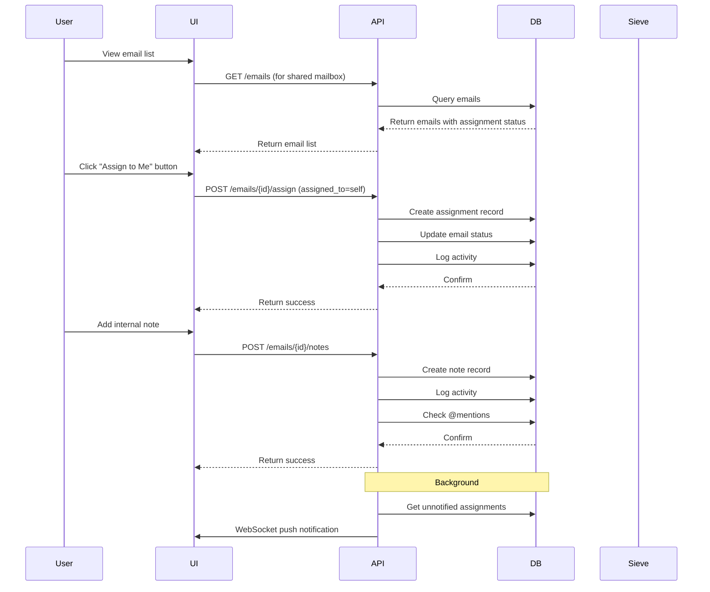

# Shared Mailboxes Specification

## Overview

This specification defines the **Shared Mailboxes** feature for SOGo 6, providing team-based email management where multiple users can collaborate on a single mailbox (e.g., support@example.com, info@example.com). This feature is already partially implemented with API endpoints but needs comprehensive documentation and potential enhancements.

**Status**: ⚠️ Partially Implemented (API: ✅ | UI: ❌ | Advanced Features: ❌)
**Version**: 1.0.0
**Priority**: Tier 0 (Foundation)
**Effort**: Medium (3-4 weeks for completion)
**Dependencies**:
- User management system (✅ Complete)
- ACL/permission system (✅ Complete)
- Mail module (✅ Complete)

---

## Table of Contents

1. [Background](#background)
2. [Goals](#goals)
3. [Features](#features)
4. [Architecture](#architecture)
5. [API Design](#api-design)
6. [Data Models](#data-models)
7. [Implementation Details](#implementation-details)
8. [Client Integration](#client-integration)
9. [Implementation Plan](#implementation-plan)
10. [Testing](#testing)

---

## Background

### Current State

The SOGo 6 project currently has:

**Backend (✅ Implemented):**
- `ApiSharedMailbox.py`: REST API for shared mailbox management
- `ModuleSharedMailbox.py`: Business logic
- Database tables: `shared_mailboxes`, `shared_mailbox_members`
- Error codes: `ERROR_SHARED_MAILBOX_*`

**Frontend (❌ Not Yet Implemented):**
- No UI for shared mailbox management in admin panel
- No UI for users to view/access shared mailboxes
- No integration with mail client

**Gaps:**
- Missing admin UI for shared mailbox management
- Missing user-facing UI for accessing shared mailboxes
- Missing advanced features (internal notes, assignments, etc.)
- Missing integration with IMAP (for desktop client access)

### Use Cases

1. **Support Team**: Multiple agents handle support@example.com
2. **Sales Team**: Team members collaborate on sales@company.com
3. **General Inbox**: info@company.com accessible by multiple staff
4. **Departmental**: accounting@, hr@, etc.

---

## Goals

### Primary Goals

1. **Complete Admin UI**: Web interface for creating and managing shared mailboxes
2. **User Access**: UI for users to view and switch between shared mailboxes
3. **Collaboration Features**: Assignment, internal notes, collision detection
4. **IMAP Access**: Allow desktop clients to access shared mailboxes
5. **API Completion**: Fill any gaps in the existing API

### Secondary Goals

1. **Email Templates**: Shared templates for shared mailboxes
2. **Auto-Responder**: Per-shared-mailbox vacation messages
3. **Signature**: Shared mailbox-specific signatures
4. **Audit Log**: Track who sent/received emails from shared mailbox
5. **Statistics**: Usage analytics per shared mailbox

---

## Features

### Core Features (Must Have)

#### Mailbox Management
- [x] Create shared mailbox (✅ Implemented)
- [x] Update shared mailbox (✅ Implemented)
- [x] Delete shared mailbox (✅ Implemented)
- [x] List all shared mailboxes (✅ Implemented)
- [x] Get shared mailbox details (✅ Implemented)
- [ ] Search shared mailboxes (❌ Not Yet)
- [ ] Import/export shared mailbox configuration (❌ Not Yet)

#### Member Management
- [x] Add member to shared mailbox (✅ Implemented)
- [x] Remove member from shared mailbox (✅ Implemented)
- [x] List members of shared mailbox (✅ Implemented)
- [ ] Set member permissions/roles (❌ Not Yet)
- [ ] Bulk add/remove members (❌ Not Yet)

#### Access Control
- [x] Basic read/write access (✅ Implemented via membership)
- [ ] Permission levels (read-only, read-write, admin) (❌ Not Yet)
- [ ] Role-based access (moderator, member, observer) (❌ Not Yet)
- [ ] IP restrictions for shared mailboxes (❌ Not Yet)

#### User Experience
- [ ] List shared mailboxes user has access to (❌ Not Yet)
- [ ] Switch between personal and shared mailboxes in UI (❌ Not Yet)
- [ ] Visual indicator for shared mailbox in mail client (❌ Not Yet)
- [ ] Composite view (all mailboxes in one) (❌ Not Yet)

### Collaboration Features

#### Assignment
- [ ] Assign email to specific team member (❌ Not Yet)
- [ ] View assigned/assigned-to-me emails (❌ Not Yet)
- [ ] Assignment history (❌ Not Yet)
- [ ] Auto-assignment rules (round-robin, least busy, etc.) (❌ Not Yet)

#### Internal Notes
- [ ] Add internal notes to emails (❌ Not Yet)
- [ ] View internal notes from other team members (❌ Not Yet)
- [ ] Edit/delete own notes (❌ Not Yet)
- [ ] Thread notes (per conversation) (❌ Not Yet)
- [ ] @mentions in notes (❌ Not Yet)

#### Collision Detection
- [ ] Detect when multiple users are viewing same email (❌ Not Yet)
- [ ] Prevent concurrent editing conflicts (❌ Not Yet)
- [ ] Show who is currently viewing an email (❌ Not Yet)
- [ ] Locking mechanism for editing (❌ Not Yet)

### Advanced Features (Nice to Have)

#### Email Handling
- [ ] Shared mailbox-specific filters (❌ Not Yet)
- [ ] Shared mailbox-specific signatures (❌ Not Yet)
- [ ] Shared mailbox-specific templates (❌ Not Yet)
- [ ] Auto-responders per shared mailbox (❌ Not Yet)
- [ ] Email forwarding rules per shared mailbox (❌ Not Yet)

#### Analytics
- [ ] Message count per shared mailbox (❌ Not Yet)
- [ ] Response time tracking (❌ Not Yet)
- [ ] User activity in shared mailbox (❌ Not Yet)
- [ ] Busy periods analysis (❌ Not Yet)
- [ ] Export analytics to CSV (❌ Not Yet)

#### Integration
- [ ] IMAP access to shared mailboxes (❌ Not Yet)
- [ ] CalDAV for shared calendars (❌ Not Yet)
- [ ] CardDAV for shared contacts (❌ Not Yet)
- [ ] Webhook notifications for new emails (❌ Not Yet)
- [ ] Integration with ticketing systems (❌ Not Yet)

---

## Architecture

### System Architecture

```
┌─────────────────────────────────────────────────────────────────┐
│                    User Interfaces                                │
├─────────────────────────────────────────────────────────────────┤
│  ┌───────────────────┐  ┌───────────────────┐                     │
│  │   Admin Panel     │  │   Mail Client     │                     │
│  │   (Web)           │  │   (Web/Desktop)   │                     │
│  │                   │  │                   │                     │
│  │  - Create/Manage  │  │  - Switch         │                     │
│  │    Shared Mailboxes│  │    Mailboxes      │                     │
│  │  - Member Mgmt     │  │  - Compose from   │                     │
│  │  - Permissions     │  │    Shared MB      │                     │
│  │  - Analytics       │  │  - View Internal  │                     │
│  └───────────────────┘  │    Notes          │                     │
│                           └───────────────────┘                     │
└─────────────────────────────────────────────────────────────────┘
                              │
                              ▼
┌─────────────────────────────────────────────────────────────────┐
│                    Backend Services                               │
├─────────────────────────────────────────────────────────────────┤
│  ┌─────────────────────────────────────────────────────────────┐ │
│  │                    API Layer                                  │ │
│  │  ┌──────────────┐  ┌──────────────┐  ┌──────────────┐     │ │
│  │  │ Admin API    │  │ User API     │  │ Mail API     │     │ │
│  │  │ (Existing)   │  │ (Extended)   │  │ (Extended)   │     │ │
│  │  └──────┬───────┘  └──────┬───────┘  └──────┬───────┘     │ │
│  │         │                  │                  │            │ │
│  └─────────┼──────────────────┼──────────────────┼────────────┘ │
│            │                  │                  │              │
│            ▼                  ▼                  ▼              │
│  ┌─────────────────────────────────────────────────────────────┐ │
│  │                    Service Layer                             │ │
│  │  ┌──────────────────────┐  ┌──────────────────────┐        │ │
│  │  │ SharedMailboxService │  │ CollaborationService │        │ │
│  │  │                      │  │                      │        │ │
│  │  │  - CRUD Operations   │  │  - Assignment Logic  │        │ │
│  │  │  - Member Management │  │  - Internal Notes    │        │ │
│  │  │  - Access Control    │  │  - Collision Detect  │        │ │
│  │  │  - Analytics         │  │  - Activity Tracking │        │ │
│  │  └──────────────────────┘  └──────────────────────┘        │ │
│  └─────────────────────────────────────────────────────────────┘ │
└─────────────────────────────────────────────────────────────────┘
                              │
                              ▼
┌─────────────────────────────────────────────────────────────────┐
│                    Data Layer                                    │
├─────────────────────────────────────────────────────────────────┤
│  ┌──────────────┐  ┌──────────────┐  ┌──────────────┐      │
│  │ PostgreSQL   │  │ Redis        │  │ OpenLDAP     │      │
│  │              │  │              │  │              │      │
│  │ - shared_    │  │ - Session    │  │ - Users      │      │
│  │   mailboxes  │  │   Tracking   │  │ - Groups     │      │
│  │ - shared_mb_ │  │ - Locking    │  │              │      │
│  │   members    │  │              │  │              │      │
│  │ - shared_mb_ │  │              │  │              │      │
│  │   notes      │  │              │  │              │      │
│  │ - ...        │  │              │  │              │      │
│  └──────────────┘  └──────────────┘  └──────────────┘      │
└─────────────────────────────────────────────────────────────────┘
```

### Component Directory Structure

```
# Backend
sogo6-server/
├── app/
│   ├── api/
│   │   └── v1/
│   │       ├── admin/
│   │       │   ├── ApiSharedMailbox.py       # Existing - to be enhanced
│   │       │   └── schemas/
│   │       │       └── shared_mailbox.py     # Existing schemas
│   │       └── user/
│   │           └── ApiSharedMailboxAccess.py # NEW: User-facing API
│   ├── module/
│   │   └── admin/
│   │       └── ModuleSharedMailbox.py        # Existing - to be enhanced
│   ├── service/
│   │   ├── SharedMailboxService.py           # NEW: Service layer
│   │   └── CollaborationService.py           # NEW: Collaboration features
│   └── model/
│       └── admin/
│           ├── SharedMailbox.py              # Existing model
│           ├── SharedMailboxMember.py        # Existing model
│           └── SharedMailboxNote.py          # NEW: Internal notes

# Frontend (sogo6-ui)
└── src/
    ├── features/
    │   ├── admin/
    │   │   └── shared-mailboxes/              # NEW: Admin UI
    │   │       ├── index.tsx
    │   │       ├── components/
    │   │       │   ├── SharedMailboxList.tsx
    │   │       │   ├── SharedMailboxForm.tsx
    │   │       │   ├── MemberManagement.tsx
    │   │       │   └── AnalyticsDashboard.tsx
    │   │       └── store/
    │   │           └── shared-mailbox-api.ts
    │   └── mails/
    │       ├── components/
    │       │   └── MailboxSwitcher.tsx       # NEW: Mailbox switcher
    │       └── store/
    │           └── shared-mailbox-access-api.ts # NEW
    └── app/
        └── [locale]/(loggedin)/admin/
            └── shared-mailboxes/              # NEW: Admin route
                └── page.tsx
```

---

## API Design

### Existing API (Admin)

The existing API in `ApiSharedMailbox.py` provides:

| Method | Endpoint | Description | Status |
|--------|----------|-------------|--------|
| GET | `/admin/v1/shared-mailboxes` | List all shared mailboxes | ✅ Implemented |
| POST | `/admin/v1/shared-mailboxes` | Create new shared mailbox | ✅ Implemented |
| GET | `/admin/v1/shared-mailboxes/{mailbox_id}` | Get shared mailbox | ✅ Implemented |
| PUT | `/admin/v1/shared-mailboxes/{mailbox_id}` | Update shared mailbox | ✅ Implemented |
| DELETE | `/admin/v1/shared-mailboxes/{mailbox_id}` | Delete shared mailbox | ✅ Implemented |
| POST | `/admin/v1/shared-mailboxes/{mailbox_id}/members` | Add member | ✅ Implemented |
| DELETE | `/admin/v1/shared-mailboxes/{mailbox_id}/members/{user_id}` | Remove member | ✅ Implemented |
| GET | `/admin/v1/shared-mailboxes/{mailbox_id}/members` | List members | ✅ Implemented |

### Extended API (Admin)

**NEW Endpoints for Admin:**

| Method | Endpoint | Description |
|--------|----------|-------------|
| GET | `/admin/v1/shared-mailboxes` | Enhanced list with pagination/filtering |
| GET | `/admin/v1/shared-mailboxes/{mailbox_id}/analytics` | Get mailbox analytics |
| POST | `/admin/v1/shared-mailboxes/{mailbox_id}/notes` | Add internal note |
| GET | `/admin/v1/shared-mailboxes/{mailbox_id}/notes` | List internal notes |
| POST | `/admin/v1/shared-mailboxes/bulk-create` | Bulk create shared mailboxes |
| POST | `/admin/v1/shared-mailboxes/import` | Import shared mailboxes from CSV |
| GET | `/admin/v1/shared-mailboxes/export` | Export shared mailboxes to CSV |

### User API (NEW)

**Endpoints for Users:**

| Method | Endpoint | Description |
|--------|----------|-------------|
| GET | `/user/v1/shared-mailboxes` | List mailboxes user has access to |
| GET | `/user/v1/shared-mailboxes/{mailbox_id}` | Get shared mailbox details (user view) |
| GET | `/user/v1/shared-mailboxes/{mailbox_id}/emails` | List emails in shared mailbox |
| POST | `/user/v1/shared-mailboxes/{mailbox_id}/emails/{email_id}/assign` | Assign email to user |
| POST | `/user/v1/shared-mailboxes/{mailbox_id}/emails/{email_id}/notes` | Add note to email |
| GET | `/user/v1/shared-mailboxes/{mailbox_id}/emails/{email_id}/notes` | Get notes for email |
| GET | `/user/v1/shared-mailboxes/{mailbox_id}/activity` | Get user activity in mailbox |

### Request/Response Schemas

#### Shared Mailbox Schema

```python
# sogo6-server/app/api/v1/admin/schemas/shared_mailbox.py

from marshmallow import Schema, fields, validate
from typing import List, Optional

class SharedMailboxCreateSchema(Schema):
    """Schema for creating a shared mailbox."""
    email = fields.Email(required=True, metadata={"example": "support@example.com"})
    name = fields.String(required=True, metadata={"example": "Customer Support"})
    description = fields.String(load_default="", metadata={"example": "Main support mailbox"})
    is_active = fields.Boolean(load_default=True)
    
    # Quota settings
    quota_enabled = fields.Boolean(load_default=False)
    quota_max_size = fields.Integer(load_default=None, validate=validate.Range(min=1))
    quota_max_emails = fields.Integer(load_default=None, validate=validate.Range(min=1))
    
    # Auto-responders
    auto_respond_enabled = fields.Boolean(load_default=False)
    auto_respond_subject = fields.String(load_default=None)
    auto_respond_message = fields.String(load_default=None)
    
    # Forwarding
    forward_to = fields.List(fields.Email(), load_default=None)
    forward_keep_copy = fields.Boolean(load_default=True)
    
    # Signatures
    signature_enabled = fields.Boolean(load_default=False)
    signature_html = fields.String(load_default=None)
    signature_plain = fields.String(load_default=None)


class SharedMailboxUpdateSchema(Schema):
    """Schema for updating a shared mailbox."""
    name = fields.String()
    description = fields.String()
    is_active = fields.Boolean()
    
    quota_enabled = fields.Boolean()
    quota_max_size = fields.Integer(validate=validate.Range(min=1))
    quota_max_emails = fields.Integer(validate=validate.Range(min=1))
    
    auto_respond_enabled = fields.Boolean()
    auto_respond_subject = fields.String()
    auto_respond_message = fields.String()
    
    forward_to = fields.List(fields.Email())
    forward_keep_copy = fields.Boolean()
    
    signature_enabled = fields.Boolean()
    signature_html = fields.String()
    signature_plain = fields.String()


class SharedMailboxResponseSchema(Schema):
    """Schema for shared mailbox response."""
    id = fields.String()
    email = fields.Email()
    name = fields.String()
    description = fields.String()
    is_active = fields.Boolean()
    created_at = fields.DateTime(format='iso')
    updated_at = fields.DateTime(format='iso')
    
    # Stats
    email_count = fields.Integer()
    unread_count = fields.Integer()
    
    # Settings
    quota_enabled = fields.Boolean()
    quota_max_size = fields.Integer()
    quota_max_emails = fields.Integer()
    quota_used_size = fields.Integer()
    quota_used_emails = fields.Integer()
    
    auto_respond_enabled = fields.Boolean()
    forward_to = fields.List(fields.Email())
    forward_keep_copy = fields.Boolean()
    signature_enabled = fields.Boolean()


class SharedMailboxMemberSchema(Schema):
    """Schema for shared mailbox member."""
    user_uid = fields.Email(required=True)
    role = fields.String(
        load_default="member",
        validate=validate.OneOf(["member", "moderator", "admin"])
    )
    permissions = fields.List(
        fields.String(),
        load_default=None,
        metadata={"description": "List of permissions if custom"}
    )
    added_at = fields.DateTime(format='iso', dump_only=True)
    last_activity_at = fields.DateTime(format='iso', dump_only=True)


class InternalNoteSchema(Schema):
    """Schema for internal notes."""
    email_id = fields.String(required=False)  # null for mailbox-level notes
    content = fields.String(required=True)
    is_private = fields.Boolean(load_default=False)  # Only visible to author
    mentions = fields.List(fields.Email(), load_default=None)  # @mentions


class AssignmentSchema(Schema):
    """Schema for assigning emails."""
    email_id = fields.String(required=True)
    assigned_to = fields.Email(required=True)
    notify = fields.Boolean(load_default=True)  # Send notification
    reason = fields.String(load_default=None)


class AnalyticsSchema(Schema):
    """Schema for analytics response."""
    email_count = fields.Integer()
    unread_count = fields.Integer()
    
    # Time-based
    emails_received_today = fields.Integer()
    emails_received_this_week = fields.Integer()
    emails_received_this_month = fields.Integer()
    
    # Member activity
    active_members = fields.Integer()
    most_active_member = fields.String()  # user_uid
    
    # Response times
    avg_response_time_hours = fields.Float()
    median_response_time_hours = fields.Float()
    
    # Trends
    trend_7d = fields.Float()  # -100 to +100
    trend_30d = fields.Float()
```

### Example Requests/Responses

**Create Shared Mailbox:**
```http
POST /api/admin/v1/shared-mailboxes HTTP/1.1
Authorization: Bearer <admin_token>
Content-Type: application/json

{
  "email": "support@example.com",
  "name": "Customer Support",
  "description": "Main support mailbox for all customer inquiries",
  "auto_respond_enabled": true,
  "auto_respond_subject": "Thank you for your inquiry",
  "auto_respond_message": "We have received your message and will respond within 24 hours.",
  "signature_enabled": true,
  "signature_plain": "Best regards,\nSupport Team\nExample Company"
}
```

**Response:**
```json
{
  "error_code": "S000000",
  "error_msg": "No Error",
  "data": {
    "mailbox": {
      "id": "550e8400-e29b-41d4-a716-446655440000",
      "email": "support@example.com",
      "name": "Customer Support",
      "description": "Main support mailbox for all customer inquiries",
      "is_active": true,
      "created_at": "2025-01-01T12:00:00Z",
      "updated_at": "2025-01-01T12:00:00Z",
      "email_count": 0,
      "unread_count": 0
    }
  }
}
```

**Add Member:**
```http
POST /api/admin/v1/shared-mailboxes/550e8400-e29b-41d4-a716-446655440000/members HTTP/1.1
Authorization: Bearer <admin_token>
Content-Type: application/json

{
  "user_uid": "alice@example.com",
  "role": "moderator"
}
```

**List User's Shared Mailboxes:**
```http
GET /api/user/v1/shared-mailboxes HTTP/1.1
Authorization: Bearer <user_token>
```

**Response:**
```json
{
  "error_code": "S000000",
  "error_msg": "No Error",
  "data": {
    "mailboxes": [
      {
        "id": "550e8400-e29b-41d4-a716-446655440000",
        "email": "support@example.com",
        "name": "Customer Support",
        "role": "moderator",
        "unread_count": 5,
        "last_activity_at": "2025-01-01T10:00:00Z"
      }
    ],
    "total_count": 1
  }
}
```

**Add Internal Note:**
```http
POST /api/user/v1/shared-mailboxes/550e8400-e29b-41d4-a716-446655440000/emails/123/notes HTTP/1.1
Authorization: Bearer <user_token>
Content-Type: application/json

{
  "content": "This customer needs urgent follow-up. @bob please handle.",
  "mentions": ["bob@example.com"]
}
```

---

## Data Models

### Database Schema

```sql
-- Existing tables (from current implementation)
CREATE TABLE shared_mailboxes (
    id SERIAL PRIMARY KEY,
    email VARCHAR(255) NOT NULL UNIQUE,
    name VARCHAR(255) NOT NULL,
    description TEXT,
    is_active BOOLEAN NOT NULL DEFAULT TRUE,
    created_at TIMESTAMP WITH TIME ZONE NOT NULL DEFAULT NOW(),
    updated_at TIMESTAMP WITH TIME ZONE NOT NULL DEFAULT NOW()
);

CREATE TABLE shared_mailbox_members (
    id SERIAL PRIMARY KEY,
    mailbox_id INTEGER NOT NULL REFERENCES shared_mailboxes(id) ON DELETE CASCADE,
    user_uid VARCHAR(255) NOT NULL,  -- References users.email
    added_at TIMESTAMP WITH TIME ZONE NOT NULL DEFAULT NOW(),
    UNIQUE(mailbox_id, user_uid)
);

-- NEW tables for collaboration features
CREATE TABLE shared_mailbox_settings (
    id SERIAL PRIMARY KEY,
    mailbox_id INTEGER NOT NULL REFERENCES shared_mailboxes(id) ON DELETE CASCADE,
    
    -- Quota
    quota_enabled BOOLEAN NOT NULL DEFAULT FALSE,
    quota_max_size BIGINT,  -- in bytes
    quota_max_emails INTEGER,
    quota_used_size BIGINT NOT NULL DEFAULT 0,
    quota_used_emails INTEGER NOT NULL DEFAULT 0,
    
    -- Auto-responder
    auto_respond_enabled BOOLEAN NOT NULL DEFAULT FALSE,
    auto_respond_subject VARCHAR(255),
    auto_respond_message TEXT,
    
    -- Forwarding
    forward_to TEXT[],  -- Array of emails
    forward_keep_copy BOOLEAN NOT NULL DEFAULT TRUE,
    
    -- Signatures
    signature_enabled BOOLEAN NOT NULL DEFAULT FALSE,
    signature_html TEXT,
    signature_plain TEXT,
    
    UNIQUE(mailbox_id)
);

CREATE TABLE shared_mailbox_notes (
    id SERIAL PRIMARY KEY,
    mailbox_id INTEGER NOT NULL REFERENCES shared_mailboxes(id) ON DELETE CASCADE,
    email_id VARCHAR(255),  -- Reference to emails in main mailbox
    user_uid VARCHAR(255) NOT NULL,  -- Author
    content TEXT NOT NULL,
    is_private BOOLEAN NOT NULL DEFAULT FALSE,
    created_at TIMESTAMP WITH TIME ZONE NOT NULL DEFAULT NOW(),
    updated_at TIMESTAMP WITH TIME ZONE NOT NULL DEFAULT NOW(),
    deleted_at TIMESTAMP WITH TIME ZONE
);

CREATE TABLE shared_mailbox_assignments (
    id SERIAL PRIMARY KEY,
    mailbox_id INTEGER NOT NULL REFERENCES shared_mailboxes(id) ON DELETE CASCADE,
    email_id VARCHAR(255) NOT NULL,  -- Reference to emails
    assigned_to VARCHAR(255) NOT NULL,  -- User who was assigned
    assigned_by VARCHAR(255) NOT NULL,  -- User who did the assignment
    reason TEXT,
    notified BOOLEAN NOT NULL DEFAULT FALSE,
    completed BOOLEAN NOT NULL DEFAULT FALSE,
    completed_at TIMESTAMP WITH TIME ZONE,
    created_at TIMESTAMP WITH TIME ZONE NOT NULL DEFAULT NOW()
);

CREATE TABLE shared_mailbox_activity (
    id SERIAL PRIMARY KEY,
    mailbox_id INTEGER NOT NULL REFERENCES shared_mailboxes(id) ON DELETE CASCADE,
    user_uid VARCHAR(255) NOT NULL,
    action VARCHAR(50) NOT NULL,  -- 'read', 'sent', 'deleted', 'assigned', 'noted'
    email_id VARCHAR(255),  -- May be null for non-email actions
    metadata JSONB,  -- Additional data
    ip_address INET,
    user_agent TEXT,
    created_at TIMESTAMP WITH TIME ZONE NOT NULL DEFAULT NOW()
);

-- Indexes for performance
CREATE INDEX idx_shared_mailbox_members_mailbox ON shared_mailbox_members(mailbox_id);
CREATE INDEX idx_shared_mailbox_members_user ON shared_mailbox_members(user_uid);
CREATE INDEX idx_shared_mailbox_notes_mailbox ON shared_mailbox_notes(mailbox_id);
CREATE INDEX idx_shared_mailbox_notes_email ON shared_mailbox_notes(email_id);
CREATE INDEX idx_shared_mailbox_notes_user ON shared_mailbox_notes(user_uid);
CREATE INDEX idx_shared_mailbox_assignments_mailbox ON shared_mailbox_assignments(mailbox_id);
CREATE INDEX idx_shared_mailbox_assignments_email ON shared_mailbox_assignments(email_id);
CREATE INDEX idx_shared_mailbox_assignments_assigned ON shared_mailbox_assignments(assigned_to);
CREATE INDEX idx_shared_mailbox_activity_mailbox ON shared_mailbox_activity(mailbox_id);
CREATE INDEX idx_shared_mailbox_activity_user ON shared_mailbox_activity(user_uid);
CREATE INDEX idx_shared_mailbox_activity_created ON shared_mailbox_activity(created_at);
```

### Model Classes

```python
# sogo6-server/app/module/admin/SharedMailbox.py

from __future__ import annotations
from typing import Optional, List
from dataclasses import dataclass
from datetime import datetime

from app.module.admin.ModuleSharedMailbox import ModuleSharedMailbox


@dataclass
class SharedMailbox:
    """Represents a shared mailbox."""
    id: str
    email: str
    name: str
    description: str
    is_active: bool
    created_at: datetime
    updated_at: datetime
    
    # Stats
    email_count: Optional[int] = 0
    unread_count: Optional[int] = 0
    
    # Settings
    settings: Optional['SharedMailboxSettings'] = None
    
    class Method:
        def get_members(self, module: ModuleSharedMailbox) -> List['SharedMailboxMember']:
            """Get all members of this shared mailbox."""
            return module.get_members(self.id)
        
        def has_member(self, user_uid: str, module: ModuleSharedMailbox) -> bool:
            """Check if a user is a member of this shared mailbox."""
            return module.user_is_member(self.id, user_uid)
        
        def get_member_role(self, user_uid: str, module: ModuleSharedMailbox) -> Optional[str]:
            """Get a member's role in this shared mailbox."""
            return module.get_member_role(self.id, user_uid)


@dataclass
class SharedMailboxMember:
    """Represents a member of a shared mailbox."""
    id: str
    mailbox_id: str
    user_uid: str
    role: str  # 'member', 'moderator', 'admin'
    added_at: datetime
    last_activity_at: Optional[datetime] = None


@dataclass
class SharedMailboxSettings:
    """Settings for a shared mailbox."""
    mailbox_id: str
    
    # Quota
    quota_enabled: bool = False
    quota_max_size: Optional[int] = None
    quota_max_emails: Optional[int] = None
    quota_used_size: int = 0
    quota_used_emails: int = 0
    
    # Auto-responder
    auto_respond_enabled: bool = False
    auto_respond_subject: Optional[str] = None
    auto_respond_message: Optional[str] = None
    
    # Forwarding
    forward_to: List[str] = None
    forward_keep_copy: bool = True
    
    # Signatures
    signature_enabled: bool = False
    signature_html: Optional[str] = None
    signature_plain: Optional[str] = None


@dataclass
class SharedMailboxNote:
    """Represents an internal note in a shared mailbox."""
    id: str
    mailbox_id: str
    email_id: Optional[str]
    user_uid: str
    content: str
    is_private: bool = False
    created_at: datetime
    updated_at: datetime
    deleted_at: Optional[datetime] = None


@dataclass
class SharedMailboxAssignment:
    """Represents an email assignment in a shared mailbox."""
    id: str
    mailbox_id: str
    email_id: str
    assigned_to: str
    assigned_by: str
    reason: Optional[str]
    notified: bool = False
    completed: bool = False
    completed_at: Optional[datetime] = None
    created_at: datetime


@dataclass
class SharedMailboxActivity:
    """Represents activity in a shared mailbox."""
    id: str
    mailbox_id: str
    user_uid: str
    action: str  # 'read', 'sent', 'deleted', 'assigned', 'noted'
    email_id: Optional[str]
    metadata: dict
    ip_address: Optional[str]
    user_agent: Optional[str]
    created_at: datetime
```

---

## Implementation Details

### Existing Implementation

The existing `ModuleSharedMailbox.py` and `ApiSharedMailbox.py` provide a solid foundation:

**ModuleSharedMailbox.py:**
- `get_all()`: List all shared mailboxes
- `get(mailbox_id)`: Get single mailbox
- `create(email, name, description, member_uids)`: Create mailbox
- `update(mailbox_id, data)`: Update mailbox
- `delete(mailbox_id)`: Delete mailbox
- `add_member(mailbox_id, user_uid)`: Add member
- `remove_member(mailbox_id, user_uid)`: Remove member
- `get_members(mailbox_id)`: List members

**ApiSharedMailbox.py:**
- Flask Blueprint with all CRUD endpoints
- Marshmallow schemas for validation
- Integration with authentication

### Missing Implementation

1. **User-Facing API**: Endpoints for regular users to access shared mailboxes
2. **Frontend UI**: Admin and user interfaces
3. **Collaboration Features**: Assignment, notes, activity tracking
4. **IMAP Integration**: Allow IMAP clients to access shared mailboxes
5. **Quota Enforcement**: Track and enforce storage limits
6. **Auto-Responder**: Per-mailbox vacation messages
7. **Analytics**: Calculate and store usage statistics

---

## Client Integration

### Web Client (SOGo6 UI)

**Shared Mailbox Switcher:**
- Dropdown to switch between personal and shared mailboxes
- Shows unread count for each mailbox
- Indicates which mailbox is currently active
- Allows composing from shared mailbox

**Compose from Shared Mailbox:**
- Option to select "From" address as shared mailbox
- Shared mailbox signature automatically applied
- Reply-To set to shared mailbox email

**Email List with Collaboration Features:**
- Assignment indicator (who email is assigned to)
- Note indicator (has internal notes)
- Hover to see note preview
- Quick actions: Assign to me, Add note

**Email Detail with Collaboration:**
- Internal notes panel
- Assignment status and history
- Activity feed (who read/sent/replied)
- Option to assign to other team member

### Desktop Client (IMAP)

**IMAP Access:**
- Shared mailboxes appear as separate folders
- Namespace: `[SHARED]/Support/` or `Shared/Support/`
- Full read/write access based on permissions
- Shared folders synced like regular folders

**Thunderbird Integration:**
- Auto-discovery via autoconfig XML
- Manual setup: Server: imap.example.com, Username: user+support@example.com
- Sentinel-based access control

### Mobile Client

**Native App:**
- Shared mailboxes in account list
- Switch between mailboxes with swipe gesture
- Collaboration features available
- Push notifications for new emails in shared mailboxes

---

## Implementation Plan

### Phase 1: Complete Backend (Weeks 1-2)
**Goal**: Finish backend implementation

- [ ] **Task 1.1**: Create user-facing API (`ApiSharedMailboxAccess.py`)
- [ ] **Task 1.2**: Implement collaboration service (`CollaborationService.py`)
- [ ] **Task 1.3**: Add database tables for collaboration features
- [ ] **Task 1.4**: Implement quota tracking and enforcement
- [ ] **Task 1.5**: Implement auto-responder per mailbox
- [ ] **Task 1.6**: Add activity tracking
- [ ] **Task 1.7**: Create comprehensive API tests
- [ ] **Task 1.8**: Performance optimization for large mailboxes

**Deliverables:**
- Complete backend API
- All collaboration features working
- Test coverage >80%

### Phase 2: Admin UI (Weeks 3-4)
**Goal**: Build admin interface for managing shared mailboxes

- [ ] **Task 2.1**: Create shared mailbox list page
- [ ] **Task 2.2**: Create create/edit form for shared mailboxes
- [ ] **Task 2.3**: Create member management interface
- [ ] **Task 2.4**: Create analytics dashboard
- [ ] **Task 2.5**: Add import/export functionality
- [ ] **Task 2.6**: Add search and filtering
- [ ] **Task 2.7**: Create frontend tests
- [ ] **Task 2.8**: Internationalization

**Deliverables:**
- Complete admin UI
- All CRUD operations working
- Analytics visualization
- Responsive design

### Phase 3: User UI (Weeks 4-5)
**Goal**: Build user-facing features

- [ ] **Task 3.1**: Create mailbox switcher component
- [ ] **Task 3.2**: Integrate with compose form (From address)
- [ ] **Task 3.3**: Add collaboration features to email list
- [ ] **Task 3.4**: Add internal notes to email detail
- [ ] **Task 3.5**: Add assignment functionality
- [ ] **Task 3.6**: Add activity feed
- [ ] **Task 3.7**: Create frontend tests
- [ ] **Task 3.8**: Add keyboard shortcuts

**Deliverables:**
- Shared mailbox access in mail client
- Collaboration features integrated
- Smooth user experience

### Phase 4: IMAP Integration (Week 5-6)
**Goal**: Enable IMAP access to shared mailboxes

- [ ] **Task 4.1**: Implement IMAP namespace for shared mailboxes
- [ ] **Task 4.2**: Add authentication for shared mailbox access
- [ ] **Task 4.3**: Configure Dovecot/Stalwart for shared folders
- [ ] **Task 4.4**: Test with Thunderbird and other clients
- [ ] **Task 4.5**: Add autoconfig XML generation
- [ ] **Task 4.6**: Documentation for IMAP setup

**Deliverables:**
- Working IMAP access
- Autoconfig setup
- Client configuration guide

### Phase 5: Polish & Testing (Week 6)
**Goal**: Production readiness

- [ ] **Task 5.1**: End-to-end testing
- [ ] **Task 5.2**: Performance testing with 100+ shared mailboxes
- [ ] **Task 5.3**: Accessibility compliance (WCAG 2.1)
- [ ] **Task 5.4**: Security review
- [ ] **Task 5.5**: Documentation
- [ ] **Task 5.6**: User training materials

**Deliverables:**
- Fully tested shared mailboxes
- Production-ready code
- Complete documentation

---

## Testing

### Test Strategy

| Test Type | Coverage | Tools | Status |
|-----------|----------|-------|--------|
| Backend Unit Tests | 95%+ | pytest | ❌ To Do |
| Backend Integration Tests | All endpoints | pytest + httpx | ❌ To Do |
| Frontend Unit Tests | All components | Jest | ❌ To Do |
| Frontend Integration Tests | User flows | Cypress | ❌ To Do |
| End-to-End Tests | Complete workflows | Cypress | ❌ To Do |
| IMAP Tests | Thunderbird, Apple Mail | Manual | ❌ To Do |
| Performance Tests | 100+ mailboxes, 10K+ emails | k6, locust | ❌ To Do |
| Security Tests | Auth, permissions, input validation | OWASP ZAP | ❌ To Do |

### Example Tests

**Backend Test:**
```python
# tests/test_api/test_shared_mailbox_access.py
import pytest
from app.api.v1.user.ApiSharedMailboxAccess import blp as access_api

@pytest.fixture
def user_client(app):
    """Test client authenticated as regular user."""
    client = app.test_client()
    # Authenticate as user
    yield client

class TestSharedMailboxAccess:
    def test_list_accessible_mailboxes(self, user_client):
        """Test listing mailboxes user has access to."""
        response = user_client.get('/api/user/v1/shared-mailboxes')
        assert response.status_code == 200
        data = response.get_json()
        assert data['error_code'] == 'S000000'
        assert isinstance(data['data']['mailboxes'], list)
    
    def test_get_mailbox_details(self, user_client):
        """Test getting shared mailbox details."""
        response = user_client.get(
            '/api/user/v1/shared-mailboxes/550e8400-e29b-41d4-a716-446655440000'
        )
        assert response.status_code == 200
        data = response.get_json()
        assert data['error_code'] == 'S000000'
        assert data['data']['mailbox']['email'] == 'support@example.com'
    
    def test_add_note(self, user_client):
        """Test adding internal note."""
        note_data = {
            'email_id': '123',
            'content': 'Test note',
            'mentions': ['bob@example.com']
        }
        response = user_client.post(
            '/api/user/v1/shared-mailboxes/550e8400-e29b-41d4-a716-446655440000/emails/123/notes',
            json=note_data
        )
        assert response.status_code == 201
        data = response.get_json()
        assert data['error_code'] == 'S000000'
        assert data['data']['note']['content'] == 'Test note'
```

**Frontend Test:**
```typescript
// tests/features/admin/shared-mailboxes/shared-mailbox-list.test.tsx
import { render, screen, fireEvent } from '@testing-library/react';
import { SharedMailboxList } from '@/features/admin/shared-mailboxes/components/SharedMailboxList';
import { useSharedMailboxesQuery } from '@/features/admin/shared-mailboxes/store/shared-mailbox-api';

// Mock the API hook
jest.mock('@/features/admin/shared-mailboxes/store/shared-mailbox-api');

describe('SharedMailboxList', () => {
  const mockMailboxes = [
    {
      id: '1',
      email: 'support@example.com',
      name: 'Customer Support',
      is_active: true,
      email_count: 100,
      unread_count: 5
    }
  ];

  beforeEach(() => {
    (useSharedMailboxesQuery as jest.Mock).mockReturnValue({
      data: { mailboxes: mockMailboxes, total_count: 1 },
      isLoading: false,
      error: null
    });
  });

  it('renders shared mailbox list', () => {
    render(<SharedMailboxList />);
    expect(screen.getByText('Customer Support')).toBeInTheDocument();
    expect(screen.getByText('support@example.com')).toBeInTheDocument();
    expect(screen.getByText('100')).toBeInTheDocument();  // email count
    expect(screen.getByText('5')).toBeInTheDocument();    // unread count
  });

  it('shows loading state', () => {
    (useSharedMailboxesQuery as jest.Mock).mockReturnValue({
      data: null,
      isLoading: true,
      error: null
    });
    render(<SharedMailboxList />);
    expect(screen.getByTestId('loading-skeleton')).toBeInTheDocument();
  });
});
```

---

## Configuration

### Environment Variables

```bash
# Shared Mailbox Settings
SOGO_SHARED_MAILBOX_MAX_PER_DOMAIN=50
SOGO_SHARED_MAILBOX_MAX_MEMBERS=100
SOGO_SHARED_MAILBOX_DEFAULT_QUOTA_SIZE=5368709120  # 5GB
SOGO_SHARED_MAILBOX_DEFAULT_QUOTA_EMAILS=100000
SOGO_SHARED_MAILBOX_ENABLE_AUDIT_LOG=true
SOGO_SHARED_MAILBOX_ENABLE_ACTIVITY_TRACKING=true

# IMAP Settings
SOGO_SHARED_MAILBOX_IMAP_ENABLED=true
SOGO_SHARED_MAILBOX_IMAP_NAMESPACE=[SHARED]
SOGO_SHARED_MAILBOX_IMAP_SENTINEL=+shared

# Auto-responder Settings
SOGO_SHARED_MAILBOX_AUTO_RESPOND_MAX=10  # Max auto-responders per mailbox
SOGO_SHARED_MAILBOX_AUTO_RESPOND_INTERVAL=86400  # 24 hours between auto-replies
```

### Feature Flags

```python
# In settings.py
SHARED_MAILBOX_FEATURES = {
    "collaboration": True,      # Assignment, notes, activity
    "imap": True,               # IMAP access
    "auto_respond": True,       # Per-mailbox auto-responders
    "quota": True,              # Storage quotas
    "analytics": True,          # Usage statistics
    "audit": True,              # Audit logging
}
```

---

## Deployment

### Migration Steps

1. **Database Migration:**
   ```bash
   # Add new tables for collaboration features
   flask db migrate -m "Add shared mailbox collaboration features"
   flask db upgrade
   ```

2. **API Configuration:**
   ```python
   # In app/api/v1/admin/__init__.py
   from .ApiSharedMailbox import blp as admin_shared_mailbox_api
   
   # In app/api/v1/user/__init__.py  (NEW)
   from .ApiSharedMailboxAccess import blp as user_shared_mailbox_api
   ```

3. **IMAP Configuration (Stalwart/Dovecot):**
   ```yaml
   # In Stalwart configuration
   imap:
     shared:
       enabled: true
       namespace: "[SHARED]/"
       sentinel: "+shared"
   
   # Or in Dovecot
   namespace inbox {
     prefix = ""
   }
   
   namespace shared {
     separator = "/"
     prefix = "[SHARED]/"
     location = maildir:%%h/shared/%%u
     subscriptions = yes
   }
   ```

4. **Feature Rollout:**
   ```bash
   # Enable feature gradually
   export SOGO_SHARED_MAILBOX_FEATURE_FLAG=true
   
   # Monitor usage
   docker-compose logs -f | grep shared
   
   # Check metrics
   curl http://localhost:9090/metrics | grep shared_mailbox
   ```

---

## Success Criteria

- [ ] **Functional**: All API endpoints work correctly
- [ ] **User-Friendly**: Intuitive interfaces for admin and users
- [ ] **Collaborative**: Assignment, notes, and activity tracking work
- [ ] **Compatible**: IMAP access works with major email clients
- [ ] **Performant**: Handles 100+ shared mailboxes with 10K+ emails
- [ ] **Secure**: Proper authentication, authorization, and auditing
- [ ] **Reliable**: No data loss, handles edge cases gracefully
- [ ] **Accessible**: WCAG 2.1 AA compliant
- [ ] **Tested**: >90% test coverage
- [ ] **Documented**: Complete API and user documentation

---

## References

### Existing Code
- [ApiSharedMailbox.py](../app/api/v1/admin/ApiSharedMailbox.py) - Existing admin API
- [ModuleSharedMailbox.py](../app/module/admin/ModuleSharedMailbox.py) - Existing business logic
- [Errors](../app/utils/errors.py) - Error codes (search for `SHARED_MAILBOX`)

### Related Features
- User management system
- ACL/permission system
- Mail module
- Audit logging

### IMAP Standards
- [RFC 3501 - IMAP Protocol](https://tools.ietf.org/html/rfc3501)
- [RFC 2342 - IMAP Namespace](https://tools.ietf.org/html/rfc2342)
- [Shared Folder Extensions](https://wiki.dovecot.org/SharedFolders)

### Collaboration Inspiration
- Gmail's delegated access
- Outlook's shared mailboxes
- Help Scout's team inbox
- Zendesk's ticket assignment

---

## Appendix

### Permission Model

```
┌─────────────────────┐─────────────┐─────────────────────────────┐
│       Role           │   Actions   │         Description          │
├─────────────────────┼─────────────┼─────────────────────────────┤
│ owner (implicit)     │ all         │ Domain admin created mailbox │
│ admin                │ all         │ Can manage mailbox settings  │
├─────────────────────┼─────────────┼─────────────────────────────┤
│ moderator            │ manage      │ Add/remove members           │
│                      │ assign      │ Assign emails to members     │
│                      │ note        │ Add/edit/delete any notes   │
│                      │ read/write  │ Full email access            │
├─────────────────────┼─────────────┼─────────────────────────────┤
│ member               │ note        │ Add/edit/delete own notes   │
│                      │ read/write  │ Full email access            │
│                      │ assign self │ Assign emails to self        │
├─────────────────────┼─────────────┼─────────────────────────────┤
│ viewer               │ read        │ Read-only access             │
└─────────────────────┴─────────────┴─────────────────────────────┘

Permissions:
- read: View emails in shared mailbox
- write: Send/reply from shared mailbox, modify labels/flags
- manage: Add/remove members, change mailbox settings
- assign: Assign emails to team members
- note: Add/edit/delete notes (own or all)
- delete: Delete emails permanently
```

### Assignment Workflow



### IMAP Namespace Example

```
# Without shared mailboxes:
INBOX
  └── Sent
  └── Drafts
  └── Trash
  └── Archive

# With shared mailboxes:
INBOX
  └── Sent
  └── Drafts
  └── Trash
  └── Archive
[SHARED]
  └── support@example.com
  │     ├── INBOX
  │     ├── Sent
  │     ├── Drafts
  │     └── Trash
  └── sales@example.com
        ├── INBOX
        ├── Sent
        └── Pipeline
```

### Auto-config XML Example

```xml
<?xml version="1.0" encoding="UTF-8"?>
<clientConfig version="1.1">
  <emailProvider id="example.com">
    <domain>example.com</domain>
    <displayName>SOGo6 Mail</displayName>
    <displayShortName>SOGo6</displayShortName>
    
    <incomingServer type="imap">
      <hostname>imap.example.com</hostname>
      <port>993</port>
      <socketType>SSL</socketType>
      <authentication>password-cleartext</authentication>
      <username>%EMAILADDRESS%</username>
    </incomingServer>
    
    <!-- Shared mailbox access -->
    <incomingServer type="imap" forShared="true">
      <hostname>imap.example.com</hostname>
      <port>993</port>
      <socketType>SSL</socketType>
      <authentication>password-cleartext</authentication>
      <username>%EMAILADDRESS%+shared</username>
      <namespace type="shared" prefix="[SHARED]/"/>
    </incomingServer>
    
    <outgoingServer type="smtp">
      <hostname>smtp.example.com</hostname>
      <port>587</port>
      <socketType>STARTTLS</socketType>
      <authentication>password-cleartext</authentication>
      <username>%EMAILADDRESS%</username>
    </outgoingServer>
  </emailProvider>
</clientConfig>
```

---

## Revision History

| Version | Date | Author | Changes |
|---------|------|--------|---------|
| 1.0.0 | 2025-08-20 | Tobias Weiss | Initial specification |

---

**Document Status**: 📋 Draft / Specified  
**Author**: Tobias Weiss (@tobias-weiss-ai-xr)  
**Created**: 2025-08-20  
**Last Modified**: 2025-08-20  
**Target Implementation**: Q3-Q4 2025  
**Estimated Total Effort**: 3-4 weeks for completion  
**Prerequisites**: Existing API (✅ Complete)
